# 01 - Unified Modeling Language (UML) Overview

> **Formal Definition:** UML (Unified Modeling Language) is a standardized visual modeling language used to visualize, specify, construct, and document the **structural (static)** and **behavioral (dynamic)** aspects of software systems.

---

## 💡 Real-Life Analogy

### 🏛 The Architectural Blueprint
Imagine building a modern skyscraper:
- Before pouring concrete or laying bricks, architects create **blueprints** showing room layouts, load-bearing pillars, electrical wiring, and plumbing pipes.
- Without blueprints, construction leads to severe structural flaws, wasted budgets, and miscommunication between engineering teams.

**UML diagrams are the blueprints of software engineering.** They allow developers to map out architectures, catch design flaws, and align team expectations before or alongside writing code.

---

## 🗺 UML Diagram Taxonomy (14 Core Diagrams)

UML diagrams are divided into two fundamental categories:

```mermaid
graph TD
    UML["UML Diagrams (14 Types)"]
    
    UML --> Structural["1. Structural Diagrams (Static Aspect)"]
    UML --> Behavioral["2. Behavioral Diagrams (Dynamic Aspect)"]

    Structural --> CD["Class Diagram (⭐ Essential for LLD)"]
    Structural --> OD["Object Diagram"]
    Structural --> CPD["Component Diagram"]
    Structural --> CSD["Composite Structure Diagram"]
    Structural --> DD["Deployment Diagram"]
    Structural --> PD["Package Diagram"]
    Structural --> PFD["Profile Diagram"]

    Behavioral --> UCD["Use Case Diagram"]
    Behavioral --> AD["Activity Diagram"]
    Behavioral --> SD["Sequence Diagram (⭐ High Value in LLD)"]
    Behavioral --> CMD["Communication Diagram"]
    Behavioral --> SMD["State Machine Diagram (⭐ Useful for State Pattern)"]
    Behavioral --> IOD["Interaction Overview Diagram"]
    Behavioral --> TD["Timing Diagram"]
```

---

## 🏗 1. Structural Diagrams (Static View)

Structural diagrams capture the **static elements** of a system—what exists, how components are organized, and how data is structured (independent of execution time).

| # | Diagram | Description | LLD Relevance |
|---|---|---|---|
| 1 | **Class Diagram** | Visualizes classes, interfaces, attributes, methods, and relationships (inheritance, association, composition, aggregation). | ⭐⭐⭐ **Crucial:** The backbone of Low-Level Design interviews and OOP architecture. |
| 2 | **Object Diagram** | Snapshot of specific object instances and their runtime state at a particular moment. | ⭐⭐ Useful for inspecting runtime object graphs. |
| 3 | **Component Diagram** | Depicts high-level software modules, libraries, and interface dependencies. | ⭐ Useful for package and module boundaries. |
| 4 | **Composite Structure Diagram** | Explores the internal structure, ports, and connectors of a complex classifier/class. | ⭐ Helpful for nested architectural components. |
| 5 | **Deployment Diagram** | Maps software artifacts to physical hardware nodes, containers, or servers. | ⭐ More relevant in High-Level Design (HLD) / DevOps. |
| 6 | **Package Diagram** | Organizes related classes into logical namespaces/packages to manage dependencies. | ⭐⭐ Helpful for structuring clean architecture layers. |
| 7 | **Profile Diagram** | Customizes UML for specific platforms (e.g. Java EE, Spring, Real-time) via stereotypes and tagged values. | ⭐ Rarely needed in standard LLD interviews. |

---

## ⚡ 2. Behavioral Diagrams (Dynamic View)

Behavioral diagrams model what happens **during runtime**—how objects collaborate, exchange messages, process data, and respond to events over time.

| # | Diagram | Description | LLD Relevance |
|---|---|---|---|
| 1 | **Use Case Diagram** | Outlines high-level actor interactions and system functional requirements. | ⭐ Good for requirements gathering & scope. |
| 2 | **Activity Diagram** | Step-by-step workflow / flowchart depicting control flow and decision branches. | ⭐⭐ Excellent for complex business workflows (e.g. checkout pipeline). |
| 3 | **Sequence Diagram** | Chronological order of messages exchanged between objects over time. | ⭐⭐⭐ **Crucial:** Great for tracing method calls and concurrency in LLD. |
| 4 | **Communication Diagram** | Focuses on structural object connections with numbered message flows. | ⭐ Alternative perspective to Sequence Diagrams. |
| 5 | **State Machine Diagram** | Models lifecycle state transitions driven by events (e.g. Order: `CREATED` $\rightarrow$ `PAID` $\rightarrow$ `SHIPPED`). | ⭐⭐⭐ **Crucial:** Direct visual mapping for the **State Design Pattern**. |
| 6 | **Interaction Overview Diagram** | High-level synthesis combining activity nodes with embedded sequence interactions. | ⭐ Used for macro-level interaction orchestration. |
| 7 | **Timing Diagram** | Analyzes state changes relative to explicit time constraints. | ⭐ Used primarily in hard real-time and embedded systems. |

---

## 🎯 Why Class Diagrams Dominate LLD

In Low-Level Design (LLD), the primary objective is to define **maintainable, extensible, and clean object-oriented architectures**.
- The **Class Diagram** provides the single most expressive notation for:
  - Class attributes & visibility (`+ public`, `- private`, `# protected`).
  - Methods and return types.
  - Relationships: **Inheritance (`--|>`)**, **Realization (`..|>`)**, **Association (`-->`)**, **Aggregation (`o--`)**, and **Composition (`*--`)**.
- Sequence and State Machine diagrams frequently accompany Class Diagrams to explain complex method call flows and lifecycle state transitions.

---

### 🎯 Quick Summary

* **Core Idea:** UML is a standardized graphical blueprint language for visualizing both static structure and dynamic behavior in software systems.
* **Diagram Demonstrates:** Categorization of UML's 14 diagrams into Structural (what the system is made of) and Behavioral (how the system behaves over time).
* **LLD Takeaway:** Focus mastery on **Class Diagrams** (for OOP structure & relationships), supplemented by **Sequence** and **State Machine** diagrams for runtime flows.
* **Memorable Rule:** *"UML diagrams are the architectural blueprints of software—design the structure before writing the code."*
