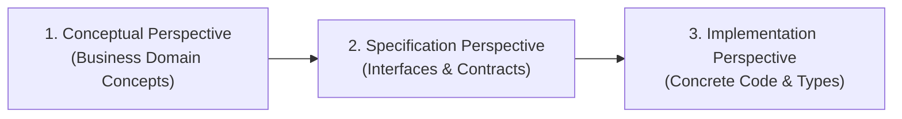
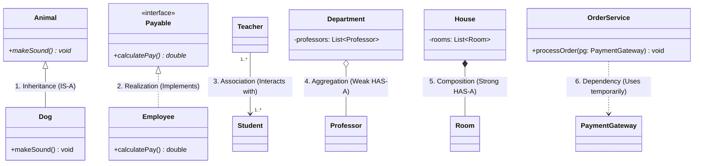

# 02 - UML Class Diagrams & Relationships

> **Definition:** A UML Class Diagram is a static structural diagram that describes the structure of a system by showing its **classes, interfaces, attributes, operations (methods)**, and the **relationships** among objects.

---

## 📐 1. UML Class Notation & Anatomy

A standard UML class is depicted as a box with **3 compartments**:

```
┌──────────────────────────────────────────────────────────┐
│                      ClassName                           │  ← Top: Class Name
├──────────────────────────────────────────────────────────┤
│ - privateField: String                                   │
│ # protectedField: double                                 │  ← Middle: Attributes
│ + publicField: int = 10                                  │
├──────────────────────────────────────────────────────────┤
│ + publicMethod(param: String): boolean                   │
│ - privateHelper(): void                                  │  ← Bottom: Operations / Methods
│ # protectedAction(id: int): void                         │
└──────────────────────────────────────────────────────────┘
```

### 🔒 Visibility Markers
| Symbol | Marker | Access Level | Description |
|:---:|:---|:---|:---|
| `+` | **Public** | `public` | Accessible from any class in any package. |
| `-` | **Private** | `private` | Accessible only within the declaring class. |
| `#` | **Protected** | `protected` | Accessible within the class, package, and subclasses. |
| `~` | **Package** | *(default)* | Accessible only within classes in the same package. |

---

## 📝 2. Syntax for Attributes & Operations

### Attribute Syntax:
$$\text{visibility } \text{name : Type } [\text{multiplicity}] = \text{DefaultValue}$$
* **Example Java:** `public int age = 21;`
* **UML Representation:** `+ age: int = 21`

### Method / Operation Syntax:
$$\text{visibility } \text{name(param1: Type1, param2: Type2) : ReturnType}$$
* **Example Java:** `private boolean isAdult(int age) { return age >= 18; }`
* **UML Representation:** `- isAdult(age: int): boolean`

---

## 🏷️ 3. Special Classifier Types

### 1. `<<interface>>`
Defines a contract with abstract method signatures (no implementation).
```java
public interface Payable {
    double calculatePay();
}
```

### 2. `<<abstract>>`
Cannot be instantiated directly; contains both concrete and abstract methods. Class name is in *italics*.
```java
public abstract class Animal {
    public abstract void makeSound();
}
```

### 3. `<<enumeration>>`
A fixed set of named constants / literals.
```java
public enum OrderStatus {
    PENDING, COMPLETED, CANCELLED
}
```

---

## 🔍 4. The Three Perspectives of Class Diagrams



1. **Conceptual Perspective (Domain Modeling):** Focuses on business concepts (Customer, Order, Invoice) and real-world relationships. Omits data types and method signatures. Target audience: *Domain Experts, Business Analysts*.
2. **Specification Perspective (Architectural Design):** Emphasizes public interfaces, abstract contracts, and class boundaries without implementation details. Target audience: *Software Architects, Tech Leads*.
3. **Implementation Perspective (Code Blueprints):** Full visibility markers, precise data types, return types, constructors, and relationship notations. Target audience: *Developers, Engineers*.

---

## 🔗 5. The 6 Core Class Relationships



---

## 📊 Complete Relationship Comparison Table

| # | Relationship | OOP Concept | Lifecycle Coupling | UML Arrow / Line | Java Implementation Example |
|---|---|---|---|---|---|
| 1 | **Inheritance** | `IS-A` | Permanent / Rigid | Solid line with hollow triangle `──▷` | `class Dog extends Animal` |
| 2 | **Realization** | `IMPLEMENTS` | Contract adherence | Dashed line with hollow triangle `╌╌▷` | `class Employee implements Payable` |
| 3 | **Association** | `USE-A` / Linked | Independent | Solid line with arrow `──>` | `class Teacher { Student[] students; }` |
| 4 | **Aggregation** | `HAS-A` (Weak) | Independent (Part outlives Whole) | Hollow diamond `◇──` | `class Department { List<Professor> profs; }` (profs passed in externally) |
| 5 | **Composition** | `HAS-A` (Strong) | Dependent (Part dies with Whole) | Filled diamond `◆──` | `class House { List<Room> rooms = new ArrayList<>(); }` (created internally) |
| 6 | **Dependency** | `USES-TEMPORARILY` | Transient (Method scope) | Dashed line with arrow `╌╌>` | `void checkout(PaymentGateway pg)` (passed as method argument) |

---

### 🎯 Quick Summary

* **Core Idea:** UML Class Diagrams model the static architecture of a system through classes, attributes, methods, visibilities, and 6 core relationships.
* **Code Demonstrates:** Java implementations mapping every UML relationship: Inheritance (`extends`), Realization (`implements`), Association, Aggregation (loose references), Composition (lifecycle-bound objects), and Dependency (method params).
* **LLD Takeaway:** Master distinguishing **Aggregation** (loose whole-part) from **Composition** (lifecycle-bound whole-part) and **Dependency** (transient method-level usage).
* **Memorable Rule:** *"Composition owns lifecycle; Aggregation shares references; Dependency only borrows for a method call."*
