# 01 - Introduction to Design Patterns (GoF Overview)

> **Definition:** Design patterns are standardized, time-tested, reusable solutions to common recurring problems in software design and architecture. They are abstract architectural blueprints, not pre-written code templates.

---

## 📚 1. Origin: The Gang of Four (GoF)

In 1994, **Erich Gamma, Richard Helm, Ralph Johnson, and John Vlissides** (collectively known as the *Gang of Four* or *GoF*) published the landmark book:
> *"Design Patterns: Elements of Reusable Object-Oriented Software"*

They cataloged **23 classic design patterns** grouped into **three foundational categories**:

```mermaid
graph TD
    DP["GoF Design Patterns (23 Patterns)"]
    
    DP --> CP["1. Creational Patterns (5)<br/>Object Instantiation & Lifecycle"]
    DP --> SP["2. Structural Patterns (7)<br/>Class & Object Composition"]
    DP --> BP["3. Behavioral Patterns (11)<br/>Object Communication & Responsibility"]

    CP --> CP1["Singleton"]
    CP --> CP2["Factory Method"]
    CP --> CP3["Abstract Factory"]
    CP --> CP4["Builder"]
    CP --> CP5["Prototype"]

    SP --> SP1["Adapter"]
    SP --> SP2["Bridge"]
    SP --> SP3["Composite"]
    SP --> SP4["Decorator"]
    SP --> SP5["Facade"]
    SP --> SP6["Flyweight"]
    SP --> SP7["Proxy"]

    BP --> BP1["Strategy"]
    BP --> BP2["Observer"]
    BP --> BP3["Command"]
    BP --> BP4["Mediator"]
    BP --> BP5["State"]
    BP --> BP6["Chain of Responsibility"]
    BP --> BP7["Template Method"]
    BP --> BP8["Iterator"]
    BP --> BP9["Visitor"]
    BP --> BP10["Memento"]
    BP --> BP11["Interpreter"]
```

---

## 🏗️ 2. The 3 Categories of Design Patterns

### 1. Creational Patterns (Object Creation Mechanisms)
* **Goal:** Abstract the instantiation process to decouple systems from how objects are created, composed, and represented.
* **Analogy (Vending Machine):** You press a button for "Orange Juice" and receive the beverage without needing to know whether the machine mixes a concentrate, pours from a container, or dispenses fresh juice.
* **Patterns (5):** `Singleton`, `Factory Method`, `Abstract Factory`, `Builder`, `Prototype`.

---

### 2. Structural Patterns (Object Composition & Interfaces)
* **Goal:** Assemble classes and objects into larger, flexible structures while resolving incompatible interfaces.
* **Analogy (USB-C to Micro-USB Adapter):** When plugging a modern USB-C cable into a legacy micro-USB device, you attach an adapter to bridge the interface mismatch without altering either device's hardware.
* **Patterns (7):** `Adapter`, `Bridge`, `Composite`, `Decorator`, `Facade`, `Flyweight`, `Proxy`.

---

### 3. Behavioral Patterns (Object Interaction & Responsibilities)
* **Goal:** Manage communication, control flow, algorithms, and delegation of responsibilities between collaborating objects while ensuring loose coupling.
* **Analogy (Restaurant Waiter / Mediator):** You give your order to the waiter; the waiter communicates with the kitchen. Customers never talk directly to line cooks, keeping interactions decoupled and orderly.
* **Patterns (11):** `Strategy`, `Observer`, `Command`, `Mediator`, `State`, `Chain of Responsibility`, `Template Method`, `Iterator`, `Visitor`, `Memento`, `Interpreter`.

---

## 📊 Summary Comparison of Pattern Categories

| Category | Primary Focus | Solves the Problem Of... | Key Questions to Ask |
|---|---|---|---|
| **Creational** | *Object Creation* | *"How should I instantiate objects flexibly without hardcoding constructors?"* | Who creates the object? When? How many instances? |
| **Structural** | *Object Structure & Composition* | *"How do I connect incompatible classes or build flexible object trees?"* | How are classes assembled? Are interfaces compatible? |
| **Behavioral** | *Object Communication* | *"How do objects collaborate and distribute duties without tight coupling?"* | Who executes which action? How do state changes propagate? |

---

## ⚠️ When (and When NOT) to Use Design Patterns

- ✅ **Use When:** You recognize an established architectural problem (e.g. dynamic algorithm swapping $\rightarrow$ Strategy; complex multi-step object creation $\rightarrow$ Builder; event broadcasting $\rightarrow$ Observer).
- ❌ **Do NOT Use Preemptively:** Avoid forcing patterns where simple, direct code works. Design patterns add indirection and abstraction; applying them without a genuine problem leads to unnecessary complexity (anti-pattern: *Patternitis*).

---

### 🎯 Quick Summary

* **Core Idea:** Design patterns are proven architectural blueprints for solving recurring object-oriented software design challenges.
* **Code Demonstrates:** A unified Java demonstration comparing the 3 GoF categories: Creational (Beverage Factory), Structural (Charger Adapter), and Behavioral (Payment Strategy).
* **LLD Takeaway:** Categorize problems into object creation (Creational), structural composition (Structural), or runtime interaction (Behavioral) before picking a pattern.
* **Memorable Rule:** *"Don't reinvent the wheel; apply design patterns when recurring problems arise, but never force them where simple code suffices."*
