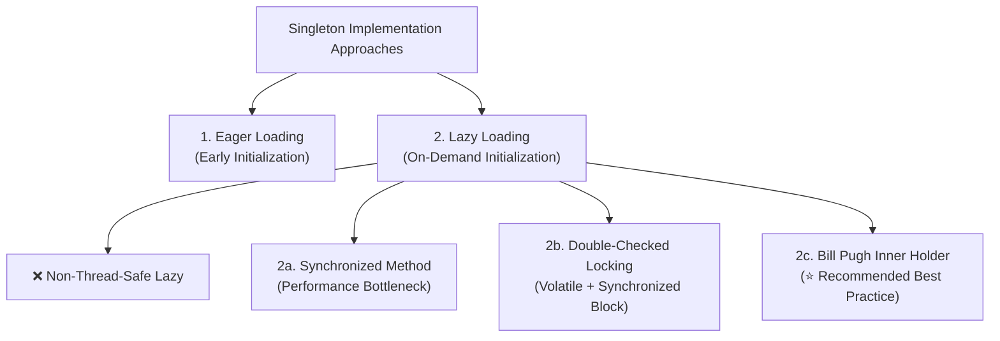

# 02 - Singleton Design Pattern

> **Definition:** The Singleton Pattern ensures that a class has **only one instance** throughout the application lifecycle and provides a **global point of access** to that instance.

---

## 💡 Real-Life Analogy

### 🖨️ OS Print Spooler
In a large office, dozens of employees send documents to a single physical printer simultaneously:
- If each computer communicated with the printer hardware directly and independently, print streams would interleave, jam, or crash.
- Instead, the operating system routes all print requests through a single **Print Spooler** service.
- The spooler queues jobs sequentially, manages buffer memory, and sends pages cleanly one by one.

Similarly, in backend software, shared resources like **Database Connection Pools, Central Loggers, and Configuration Registries** require a single authoritative coordinator.

---

## ⚙️ Anatomy of a Singleton

A standard Singleton requires 3 foundational elements:
1. **Private Constructor:** Disallows direct instantiation (`new ClassName()`) from outside.
2. **Private Static Variable:** Holds the single unique instance.
3. **Public Static Getter (`getInstance()`):** Exposes the global access point to callers.

---

## 🛠️ Approaches to Implementing Singleton in Java



---

### 1. Eager Loading (Early Initialization)
* **Mechanism:** Instance is created as soon as the class is loaded into memory by the JVM.
* **Analogy:** A **Fire Extinguisher**—installed upfront whether a fire occurs or not.
```java
class EagerSingleton {
    private static final EagerSingleton INSTANCE = new EagerSingleton();
    private EagerSingleton() {}
    public static EagerSingleton getInstance() { return INSTANCE; }
}
```
* **Trade-off:** Thread-safe by default, but wastes memory if never accessed.

---

### 2. ❌ Non-Thread-Safe Lazy Loading
* **Mechanism:** Checks `if (instance == null)` before creating.
* **Flaw:** Two concurrent threads can simultaneously pass the null check, creating **two distinct instances** and violating the Singleton contract.

---

### 3. Synchronized Method
* **Mechanism:** Adds `synchronized` to `getInstance()`.
```java
public static synchronized Singleton getInstance() {
    if (instance == null) instance = new Singleton();
    return instance;
}
```
* **Trade-off:** Thread-safe, but creates a **100x performance penalty** in concurrent environments because every read operation acquires a lock.

---

### 4. Double-Checked Locking (DCL)
* **Mechanism:** Synchronizes *only during first-time creation* and uses `volatile` to prevent instruction reordering.
```java
class DclSingleton {
    private static volatile DclSingleton instance;
    private DclSingleton() {}

    public static DclSingleton getInstance() {
        if (instance == null) {                         // 1st Check (No Lock)
            synchronized (DclSingleton.class) {
                if (instance == null) {                 // 2nd Check (With Lock)
                    instance = new DclSingleton();
                }
            }
        }
        return instance;
    }
}
```
> [!IMPORTANT]
> **Why `volatile` is mandatory:** Without `volatile`, JVM instruction reordering can assign the memory address before constructor execution finishes, exposing a half-initialized object to other threads!

---

### 5. Bill Pugh Singleton (Static Inner Holder — Recommended)
* **Mechanism:** Leverages Java's ClassLoader mechanism. The static inner class `Holder` is not loaded into memory until `getInstance()` is called for the first time.
```java
class BillPughSingleton {
    private BillPughSingleton() {}

    private static class Holder {
        private static final BillPughSingleton INSTANCE = new BillPughSingleton();
    }

    public static BillPughSingleton getInstance() {
        return Holder.INSTANCE;
    }
}
```
* **Pros:** Thread-safe, lazily loaded, zero synchronization overhead, elegant and clean.

---

## 📊 Summary Comparison of Implementations

| Approach | Lazy Loaded? | Thread-Safe? | Performance | Complexity | Recommended? |
|---|:---:|:---:|:---:|:---:|:---:|
| **Eager Loading** | ❌ No | ✅ Yes | ⚡ Fast | Low | For lightweight singletons |
| **Simple Lazy** | ✅ Yes | ❌ No | ⚡ Fast | Low | ❌ Never in multi-threaded apps |
| **Synchronized Method** | ✅ Yes | ✅ Yes | 🐢 Slow (Lock contention) | Low | ❌ Avoid in high concurrency |
| **Double-Checked Locking** | ✅ Yes | ✅ Yes | ⚡ Fast | Medium | ✅ Good for explicit control |
| **Bill Pugh (Inner Holder)** | ✅ Yes | ✅ Yes | ⚡ Fast | Low-Medium | ⭐ **Best Practice** |
| **Enum Singleton** | ❌ No | ✅ Yes | ⚡ Fast | Lowest | ⭐ **Best for Serialization/Reflection safety** |

---

## ⚖️ Pros & Cons of the Singleton Pattern

### ✅ Advantages
1. **Guarantees Single Instance:** Prevents resource exhaustion (e.g. max DB connections).
2. **Centralized Global State:** Standardized access point for shared configurations and logging.
3. **Memory Optimization:** Bill Pugh and DCL defer creation until runtime necessity.

### ⚠️ Trade-offs & Criticisms
1. **Hard to Unit Test:** Global state introduces hidden dependencies between test suites; cannot easily mock without DI frameworks.
2. **Violates Single Responsibility Principle (SRP):** Manages its own lifecycle *and* business logic.
3. **Hidden Dependencies:** Callers invoke `Singleton.getInstance()` directly instead of declaring explicit dependencies in constructors.

---

### 🎯 Quick Summary

* **Core Idea:** Restrict class instantiation to a single unique object with a controlled global access point.
* **Code Demonstrates:** 5 Singleton approaches in Java (Eager, Synchronized, Double-Checked Locking with `volatile`, and Bill Pugh Inner Holder).
* **LLD Takeaway:** Use the **Bill Pugh Inner Holder** for lazy thread-safe singletons without synchronization overhead, or rely on Dependency Injection containers (e.g. Spring `@Bean`).
* **Memorable Rule:** *"Private constructor, static holder, synchronized or classloader-guaranteed single creation."*
