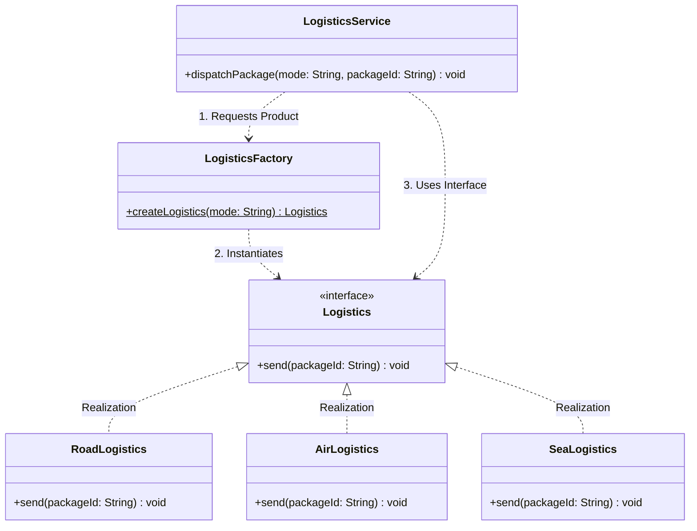

# 03 - Factory Design Pattern

> **Definition:** The Factory Pattern is a creational design pattern that provides an interface/method for creating objects in a superclass, but allows subclasses or factory methods to alter the type of objects that will be created.

Rather than calling constructors directly (`new ConcreteProduct()`), client code asks a factory method to instantiate and return the appropriate product based on runtime inputs.

---

## 💡 Real-Life Analogy

### 🍕 Ordering Pizza
When you visit a pizza restaurant:
- You don't walk into the kitchen, measure flour, chop cheese, and bake the crust yourself.
- You tell the cashier: *"One Margherita Pizza, please."*
- The **Kitchen (Factory)** encapsulates the ingredient sourcing, temperature settings, and preparation steps, handing you the finished pizza.

In software, the **client** requests an object by type or parameter, and the **Factory** encapsulates instantiation complexity.

---

## 🏗️ Structure & UML Class Diagram



---

## ❌ Bad Design (Violating Factory Pattern & OCP)

Embedding concrete constructor calls directly inside business methods:

```java
class BadLogisticsService {
    public void dispatch(String mode, String packageId) {
        // ❌ Business logic tightly coupled to concrete constructors
        Logistics transport;
        if ("Air".equalsIgnoreCase(mode)) {
            transport = new AirLogistics();
        } else if ("Road".equalsIgnoreCase(mode)) {
            transport = new RoadLogistics();
        } else {
            throw new IllegalArgumentException("Unknown transport: " + mode);
        }

        transport.send(packageId);
    }
}
```

### Why this is bad:
- ⚠️ **Tight Coupling:** `LogisticsService` is coupled to concrete classes (`AirLogistics`, `RoadLogistics`).
- ⚠️ **Violates OCP:** Adding `SeaLogistics` or `DroneLogistics` requires modifying the core `dispatch` business method.
- ⚠️ **Code Duplication:** If another service (e.g. `ReturnOrderService`) needs transport, the same `if-else` instantiation block is duplicated.

---

## ✅ Good Design (Adhering to Factory Pattern)

### 1. Product Interface & Concrete Implementations
```java
interface Logistics {
    void send(String packageId);
}

class RoadLogistics implements Logistics {
    @Override
    public void send(String packageId) {
        System.out.println("🚚 [Road] Transporting package #" + packageId + " via highway truck.");
    }
}

class AirLogistics implements Logistics {
    @Override
    public void send(String packageId) {
        System.out.println("✈️ [Air] Transporting package #" + packageId + " via cargo plane.");
    }
}
```

### 2. Centralized Factory
```java
class LogisticsFactory {
    public static Logistics createLogistics(String mode) {
        if ("Road".equalsIgnoreCase(mode)) {
            return new RoadLogistics();
        } else if ("Air".equalsIgnoreCase(mode)) {
            return new AirLogistics();
        } else if ("Sea".equalsIgnoreCase(mode)) {
            return new SeaLogistics();
        }
        throw new IllegalArgumentException("Unsupported logistics mode: " + mode);
    }
}
```

### 3. Decoupled Business Service
```java
class LogisticsService {
    public void dispatchPackage(String mode, String packageId) {
        // Obtains product through factory; depends only on Logistics interface
        Logistics logistics = LogisticsFactory.createLogistics(mode);
        logistics.send(packageId);
    }
}
```

---

## ⚖️ Pros & Cons of Factory Pattern

| Pros | Cons |
|---|---|
| **Promotes Loose Coupling:** Client code interacts only with interfaces, never concrete constructors. | **Added Classes:** Introduces factory classes and interfaces, which might be overkill for simple systems. |
| **Follows Single Responsibility Principle (SRP):** Instantiation logic is segregated into a dedicated factory. | **Potential Factory Growth:** If many types are added, the factory method itself requires updates (unless combined with reflection or registry). |
| **Follows Open/Closed Principle (OCP):** Introducing new products (e.g. `SeaLogistics`) does not alter existing client services. | |
| **Eliminates Code Duplication:** Centralizes complex instantiation logic across the application. | |

---

### 🎯 Quick Summary

* **Core Idea:** Delegate object instantiation to a specialized factory method instead of directly calling constructors in business logic.
* **Code Demonstrates:** Refactoring a tightly coupled `LogisticsService` to instantiate `RoadLogistics`, `AirLogistics`, or `SeaLogistics` via `LogisticsFactory`.
* **LLD Takeaway:** Decouple "how an object is created" from "how an object is used", keeping business services clean, testable, and extensible.
* **Memorable Rule:** *"Create objects through a factory interface, not by scattering `new` keyword throughout business logic."*
