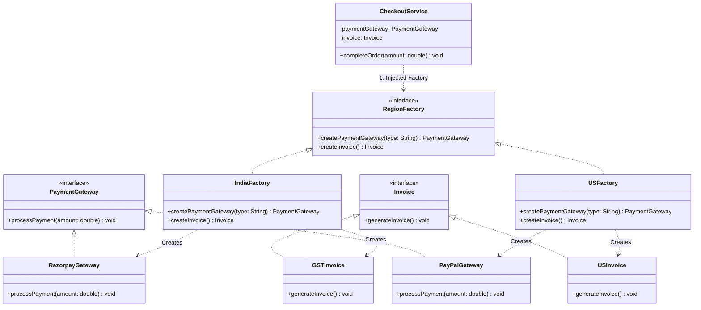

# 05 - Abstract Factory Design Pattern

> **Definition:** The Abstract Factory Pattern is a creational design pattern that provides an interface for creating **families of related or dependent objects** without specifying their concrete classes.

---

## 💡 Factory Method vs. Abstract Factory

| Feature | Factory Method | Abstract Factory |
|---|---|---|
| **Scope** | Creates **one product** type (e.g. `Logistics`). | Creates a **family of related products** (e.g. `PaymentGateway` + `Invoice`). |
| **Mechanism** | Uses inheritance or a single factory method. | Uses object composition with factory interfaces. |
| **Consistency** | Ensures decoupled creation of one entity. | Ensures **cross-product compatibility and consistency** within a cohesive family. |

---

## 🌍 Real-World Example: Multi-Region E-Commerce Checkout

In a global checkout system (e.g., TUF Plus Checkout), each geographical region requires a cohesive set of related services:
- 🇮🇳 **India Family:** `Razorpay` / `PayU` + `GSTInvoice`
- 🇺🇸 **US Family:** `PayPal` / `Stripe` + `USInvoice`

A US customer should never receive an Indian GST invoice, and vice-versa. The Abstract Factory enforces this family consistency at compile-time.

---

## 🏗️ Structure & UML Class Diagram



---

## ❌ Bad Design (Violating Abstract Factory & OCP)

```java
class BadCheckoutService {
    public void checkout(String region, String gatewayType, double amount) {
        PaymentGateway gateway;
        Invoice invoice;

        // ❌ Hardcoded conditional coupling for every product family member
        if ("India".equalsIgnoreCase(region)) {
            gateway = "razorpay".equalsIgnoreCase(gatewayType) ? new RazorpayGateway() : new PayUGateway();
            invoice = new GSTInvoice();
        } else if ("US".equalsIgnoreCase(region)) {
            gateway = "paypal".equalsIgnoreCase(gatewayType) ? new PayPalGateway() : new StripeGateway();
            invoice = new USInvoice();
        } else {
            throw new IllegalArgumentException("Unknown region: " + region);
        }

        gateway.processPayment(amount);
        invoice.generateInvoice();
    }
}
```

### Why this is bad:
- ⚠️ **Mismatched Families Risk:** Easy to accidentally pair a US Stripe gateway with an Indian GST invoice.
- ⚠️ **Violates OCP & SRP:** Adding Germany (`SEPA` + `VATInvoice`) requires modifying the core `checkout` method.

---

## ✅ Good Design (Adhering to Abstract Factory Pattern)

### 1. Abstract Products
```java
interface PaymentGateway {
    void processPayment(double amount);
}

interface Invoice {
    void generateInvoice();
}
```

### 2. Abstract Factory Interface
```java
interface RegionFactory {
    PaymentGateway createPaymentGateway(String gatewayType);
    Invoice createInvoice();
}
```

### 3. Concrete Region Families
```java
class IndiaFactory implements RegionFactory {
    public PaymentGateway createPaymentGateway(String type) {
        if ("razorpay".equalsIgnoreCase(type)) return new RazorpayGateway();
        return new PayUGateway();
    }

    public Invoice createInvoice() {
        return new GSTInvoice();
    }
}

class USFactory implements RegionFactory {
    public PaymentGateway createPaymentGateway(String type) {
        if ("paypal".equalsIgnoreCase(type)) return new PayPalGateway();
        return new StripeGateway();
    }

    public Invoice createInvoice() {
        return new USInvoice();
    }
}
```

### 4. Decoupled Client Service
```java
class CheckoutService {
    private final PaymentGateway paymentGateway;
    private final Invoice invoice;

    public CheckoutService(RegionFactory factory, String gatewayType) {
        this.paymentGateway = factory.createPaymentGateway(gatewayType);
        this.invoice = factory.createInvoice();
    }

    public void completeOrder(double amount) {
        paymentGateway.processPayment(amount);
        invoice.generateInvoice();
    }
}
```

---

## ⚖️ Pros & Cons of Abstract Factory Pattern

| Pros | Cons |
|---|---|
| **Guarantees Compatibility:** Related products from the same family are guaranteed to work together. | **High Initial Boilerplate:** Requires multiple interfaces and factory classes upfront. |
| **Strict Single Responsibility & OCP:** Encapsulates creation of multiple objects in dedicated factories. | **Difficult to Add New Product Types:** Adding a 3rd product (e.g. `TaxCalculator`) forces changes across all existing factories. |
| **Effortless Region/Theme Swapping:** Switching regions is as simple as injecting a different factory. | |

---

### 🎯 Quick Summary

* **Core Idea:** Provide an interface for creating complete families of related or dependent objects without coupling client code to concrete classes.
* **Code Demonstrates:** Creating region-specific payment gateways and invoices for India (`IndiaFactory`) and the US (`USFactory`) through a unified `RegionFactory` abstraction.
* **LLD Takeaway:** Use Abstract Factory when a system must configure multiple collaborating products that belong together (e.g. cross-platform UI suites or regional compliance toolkits).
* **Memorable Rule:** *"Factory Method creates a single object; Abstract Factory creates an entire family of matching objects."*
