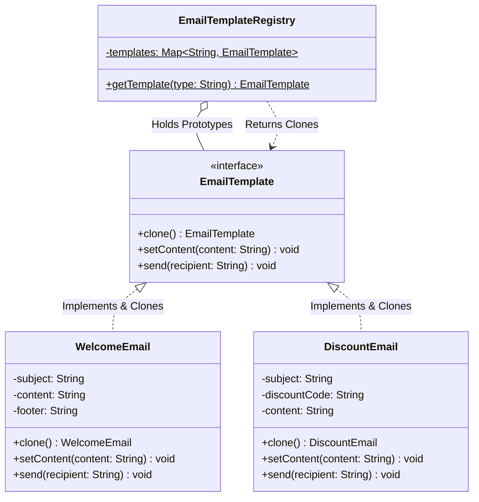

# 06 - Prototype Design Pattern

> **Definition:** The Prototype Pattern is a creational design pattern that creates new objects by **cloning an existing prototype instance** rather than constructing new ones from scratch.

---

## 💡 Real-Life Analogy

### 🖨️ The Photocopy Machine
Imagine preparing 50 personalized job offer letters:
- Instead of retyping the 5-page standard legal terms, company policies, and layout 50 separate times from scratch.
- You write the master template once, **photocopy (clone)** it, and simply fill in the candidate's name and compensation on each copy.

In software, when creating an object requires expensive database queries, external configuration loading, or deep data structures, we start with a pre-configured **Prototype** and clone it.

---

## 🏗️ Structure & UML Class Diagram



---

## ❌ Bad Design (Violating Prototype & DRY)

```java
class Client {
    public static void main(String[] args) {
        // ❌ Expensive repeated constructor calls and duplicate setup logic
        WelcomeEmail email1 = new WelcomeEmail();
        email1.setContent("Hi Alice!");
        email1.send("alice@example.com");

        WelcomeEmail email2 = new WelcomeEmail();
        email2.setContent("Hi Bob!");
        email2.send("bob@example.com");
    }
}
```

### Why this is bad:
- ⚠️ **Performance Waste:** Re-executes expensive constructor logic (e.g., loading HTML templates, logo assets, CSS styles from disk/DB) on every message.
- ⚠️ **Tight Coupling:** Client code is tightly coupled to concrete constructors (`new WelcomeEmail()`).

---

## ✅ Good Design (Adhering to Prototype Pattern)

### 1. Prototype Interface
```java
interface EmailTemplate extends Cloneable {
    EmailTemplate clone(); // Deep copy contract
    void setContent(String content);
    void send(String recipient);
}
```

### 2. Concrete Prototype Implementation
```java
class WelcomeEmail implements EmailTemplate {
    private String subject;
    private String content;
    private String footer;

    public WelcomeEmail() {
        // Simulating heavy initialization (parsing HTML templates, loading brand headers)
        this.subject = "Welcome to TUF Plus!";
        this.footer = "© 2026 TakeUForward Inc. All rights reserved.";
        this.content = "Default Welcome Message.";
    }

    @Override
    public WelcomeEmail clone() {
        try {
            return (WelcomeEmail) super.clone();
        } catch (CloneNotSupportedException e) {
            throw new RuntimeException("Cloning failed", e);
        }
    }

    @Override
    public void setContent(String content) { this.content = content; }

    @Override
    public void send(String to) {
        System.out.println("📧 [Sent to " + to + "] " + subject + " -> " + content + " | " + footer);
    }
}
```

### 3. Prototype Registry (Cache)
```java
class EmailTemplateRegistry {
    private static final Map<String, EmailTemplate> prototypes = new HashMap<>();

    static {
        // Pre-configure expensive master prototypes once during startup
        prototypes.put("welcome", new WelcomeEmail());
    }

    public static EmailTemplate getTemplate(String type) {
        EmailTemplate prototype = prototypes.get(type);
        if (prototype == null) {
            throw new IllegalArgumentException("Unknown template type: " + type);
        }
        return prototype.clone(); // Return an isolated clone
    }
}
```

---

## 🧬 Shallow Cloning vs. Deep Cloning

| Feature | Shallow Copy (`super.clone()`) | Deep Copy (Custom implementation) |
|---|---|---|
| **Primitive Fields** | Copied by value (independent). | Copied by value (independent). |
| **Object References** | Shares the **same memory reference** as original. | Creates **brand-new copies** of all referenced objects. |
| **Safety** | ⚠️ Mutating nested lists/maps in a clone corrupts the original! | ✅ Clone is 100% isolated and safe. |

> [!TIP]
> In production LLD systems, always implement **Deep Cloning** for prototype objects containing mutable collections or nested domain objects.

---

## ⚖️ Pros & Cons of Prototype Pattern

| Pros | Cons |
|---|---|
| **High Performance:** Cloning in-memory bypasses expensive disk I/O, DB queries, and heavy constructors. | **Deep Cloning Complexity:** Writing deep clone logic for circular references or complex object graphs can be difficult. |
| **Reduces Subclassing:** Create variations dynamically at runtime without defining new subclasses. | **Cloneable in Java:** Java's built-in `Cloneable` interface is historically flawed (often replaced by copy constructors or serialization). |
| **Decouples Client from Creation:** Clients request clones from a registry without knowing concrete classes. | |

---

### 🎯 Quick Summary

* **Core Idea:** Instantiate new objects by cloning pre-configured prototype instances rather than constructing them from scratch.
* **Code Demonstrates:** Caching expensive `WelcomeEmail` and `DiscountEmail` prototypes in an `EmailTemplateRegistry` and returning lightweight clones for client customization.
* **LLD Takeaway:** Use the Prototype Pattern when object creation is computationally or resource intensive, or when duplicating complex state trees (e.g. game entity spawning, UI layouts).
* **Memorable Rule:** *"Don't rebuild from scratch when you can photocopy and tweak."*
