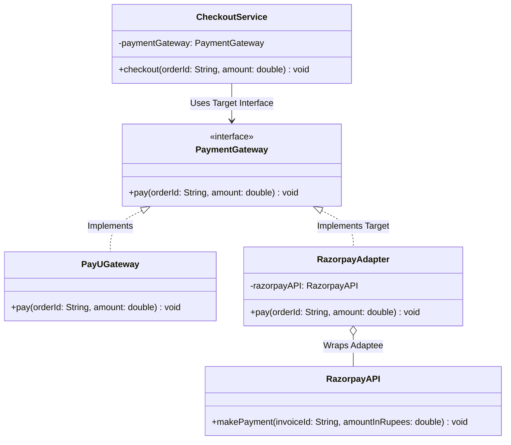

# 01 - Adapter Design Pattern

## Core Idea

The **Adapter Pattern** is a structural design pattern that allows incompatible interfaces to collaborate by acting as a translator or wrapper. It converts the interface of an existing class (**Adaptee**) into an interface that the client expects (**Target**), enabling systems with differing method signatures to work together seamlessly without modifying legacy or third-party source code.

---

## 💡 Real-Life Analogy

Imagine traveling from India to Europe:
- Your laptop charger uses an **Indian 3-pin plug**, but European hotel rooms only have **2-pin European round sockets**.
- Instead of re-wiring the hotel or buying a completely new charger, you use a **travel plug adapter**.
- The adapter bridges the physical interface mismatch without altering the internal electronics of either device.

---

## 🏗️ Structure & UML Class Diagram



---

## ❌ Bad Design (Direct Incompatible Invocations)

```java
// Client service forced to manually branch across incompatible vendor methods
class BadCheckoutService {
    public void checkout(String provider, String orderId, double amount) {
        if ("PayU".equalsIgnoreCase(provider)) {
            PayUGateway payU = new PayUGateway();
            payU.pay(orderId, amount);
        } else if ("Razorpay".equalsIgnoreCase(provider)) {
            RazorpayAPI razorpay = new RazorpayAPI();
            // ❌ Incompatible method name and parameter semantics directly in business logic!
            razorpay.makePayment(orderId, amount);
        }
    }
}
```

### What is wrong?
- ⚠️ **Interface Incompatibility:** `RazorpayAPI` does not implement `PaymentGateway` and uses a different method signature (`makePayment`).
- ⚠️ **Violates Open/Closed Principle (OCP):** Adding PayPal, Stripe, or Cashfree forces direct edits to `BadCheckoutService`.
- ⚠️ **Tight Coupling:** The checkout business logic is polluted with vendor-specific SDK details.

---

## ✅ Good Design (Adhering to Adapter Pattern)

Wrap `RazorpayAPI` inside a `RazorpayAdapter` that implements `PaymentGateway`:

```java
// Adapter translates Target pay() calls into Adaptee makePayment() calls
class RazorpayAdapter implements PaymentGateway {
    private final RazorpayAPI razorpayAPI;

    public RazorpayAdapter(RazorpayAPI razorpayAPI) {
        this.razorpayAPI = razorpayAPI;
    }

    @Override
    public void pay(String orderId, double amount) {
        // Translates target signature to vendor-specific method
        razorpayAPI.makePayment(orderId, amount);
    }
}
```

### Why this is better:
- ✅ **Seamless Polymorphism:** `CheckoutService` treats all payment providers uniformly via the `PaymentGateway` contract.
- ✅ **Zero Source Code Changes:** `RazorpayAPI` SDK code remains completely untouched.
- ✅ **Plug-and-Play Integration:** New payment gateways only require a dedicated adapter class.

---

## Java Classes

- **`PaymentGateway` (Target Interface):** Standard interface expected by the client checkout service.
- **`PayUGateway` (Concrete Target):** Native implementation directly conforming to `PaymentGateway`.
- **`RazorpayAPI` (Adaptee):** Third-party/legacy SDK with an incompatible method signature (`makePayment`).
- **`RazorpayAdapter` (Adapter):** Implements `PaymentGateway` and delegates/translates calls to `RazorpayAPI`.
- **`CheckoutService` (Client):** Executes checkout workflows using the `PaymentGateway` abstraction.

---

## How It Works

1. The client `CheckoutService` receives a `PaymentGateway` instance (e.g. `new RazorpayAdapter(new RazorpayAPI())`).
2. When `checkoutService.checkout("ORD-101", 1750.0)` is called, it invokes `paymentGateway.pay("ORD-101", 1750.0)`.
3. The `RazorpayAdapter` intercepts this call and translates it into `razorpayAPI.makePayment("ORD-101", 1750.0)`.

---

## When to Use

- **Integrating Third-Party SDKs / APIs:** When external vendor libraries provide different method signatures for the same core capability (e.g. payment gateways, SMS providers).
- **Reusing Legacy Code:** When integrating stable legacy modules into a modern codebase without refactoring their internal implementation.
- **Unifying Framework Interfaces:** Creating unified facades over different logging libraries (SLF4J $\rightarrow$ Log4j) or cloud storage SDKs (AWS S3 vs Google Cloud Storage).

---

## When NOT to Use

- **When You Own Both Classes:** If you have full control over the source code, directly refactoring the class to match the interface is cleaner than introducing an adapter.
- **Over-Engineering Trivial Differences:** Adding adapters for minor, isolated internal utilities can create unnecessary abstraction layers.

---

## LLD Takeaway

In Low-Level Design interviews and enterprise architectures, the Adapter Pattern is the standard technique for **Third-Party API Integration & Dependency Inversion**. It isolates vendor-specific volatility from core domain logic.

---

## 🎯 Quick Summary

- **Core Idea:** Converts an incompatible class interface into the target interface expected by the client.
- **Code Demonstrates:** Wrapping `RazorpayAPI` inside `RazorpayAdapter` so `CheckoutService` can treat it identically to `PayUGateway`.
- **LLD Takeaway:** Use adapters to bridge third-party vendor SDKs and legacy classes to standard domain interfaces without modifying existing code.
- **Memorable Rule:** *"An adapter translates what the client expects into what the adaptee provides."*
