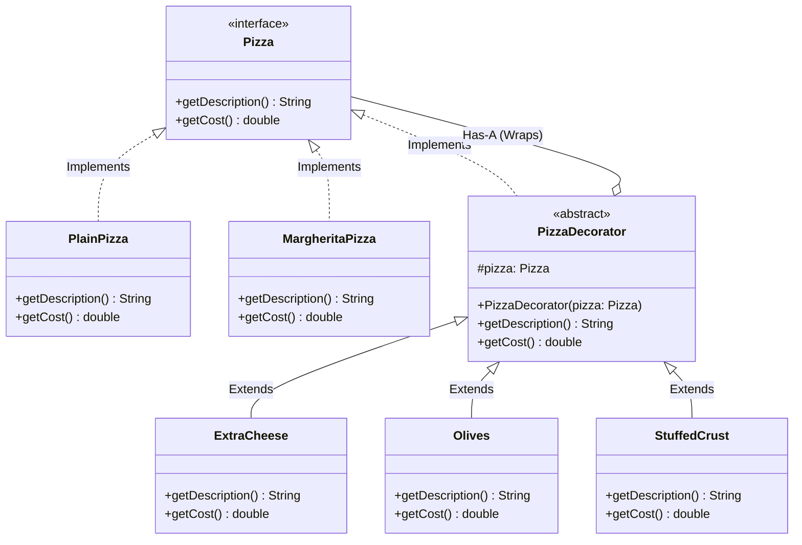

# 02 - Decorator Design Pattern

## Core Idea

The **Decorator Pattern** is a structural design pattern that allows behaviors and responsibilities to be added to individual objects dynamically at runtime without affecting other objects of the same class. It wraps the original object inside decorator classes that implement the same interface, stacking additional functionality layer-by-layer while keeping the base classes untouched and closed for modification.

---

## 💡 Real-Life Analogy

### ☕ Coffee Shop Add-Ons & Pizza Toppings
Imagine ordering a beverage or customized pizza:
- You start with a base **Coffee** or **Margherita Pizza**.
- You can dynamically add **Milk (+₹20)**, **Vanilla Syrup (+₹30)**, or **Extra Cheese (+₹40)**.
- The coffee shop doesn't need to invent a brand new drink category for every possible permutation of ingredients; each addition simply wraps the existing drink and accumulates cost and flavor.

---

## 🏗️ Structure & UML Class Diagram



---

## ❌ Bad Design (Inheritance Class Explosion Anti-Pattern)

Attempting to model every possible combination of toppings using class inheritance:

```java
class PlainPizza {}
class CheesePizza extends PlainPizza {}
class OlivePizza extends PlainPizza {}
class StuffedPizza extends PlainPizza {}
class CheeseOlivePizza extends CheesePizza {}
class CheeseStuffedPizza extends CheesePizza {}
class CheeseOliveStuffedPizza extends CheeseOlivePizza {}
// Adding N toppings requires up to 2^N subclasses!
```

### What is wrong?
- ⚠️ **Exponential Subclass Explosion ($2^N$):** Adding 5 toppings requires dozens of rigid subclasses.
- ⚠️ **Static & Inflexible:** You cannot add, remove, or change toppings at runtime once an object is instantiated.
- ⚠️ **Severe Code Duplication:** Price calculation and description logic is duplicated across multiple permutation classes.

---

## ✅ Good Design (Adhering to Decorator Pattern)

Wrap components recursively using a shared `Pizza` interface and `PizzaDecorator`:

```java
// 1. Component Interface
interface Pizza {
    String getDescription();
    double getCost();
}

// 2. Concrete Base Component
class MargheritaPizza implements Pizza {
    @Override
    public String getDescription() { return "Margherita Pizza"; }

    @Override
    public double getCost() { return 200.00; }
}

// 3. Abstract Decorator holding a component reference
abstract class PizzaDecorator implements Pizza {
    protected final Pizza pizza;

    public PizzaDecorator(Pizza pizza) {
        this.pizza = pizza;
    }
}

// 4. Concrete Decorators adding behavior layer-by-layer
class ExtraCheese extends PizzaDecorator {
    public ExtraCheese(Pizza pizza) { super(pizza); }

    @Override
    public String getDescription() { return pizza.getDescription() + ", Extra Cheese"; }

    @Override
    public double getCost() { return pizza.getCost() + 40.00; }
}

class Olives extends PizzaDecorator {
    public Olives(Pizza pizza) { super(pizza); }

    @Override
    public String getDescription() { return pizza.getDescription() + ", Olives"; }

    @Override
    public double getCost() { return pizza.getCost() + 30.00; }
}
```

### Why it better demonstrates the concept:
- ✅ **Eliminates Class Explosion:** Toppings are independent decorator classes that can be combined in infinite ways.
- ✅ **Runtime Customization:** Toppings can be stacked dynamically (`new Olives(new ExtraCheese(new MargheritaPizza()))`).
- ✅ **Adheres to OCP & SRP:** New toppings can be introduced without touching existing pizza or decorator code.

---

## Java Classes

- **`Pizza` (Component Interface):** Declares common methods (`getDescription()`, `getCost()`) for both base pizzas and toppings.
- **`PlainPizza` & `MargheritaPizza` (Concrete Components):** Base pizza items without extra toppings.
- **`PizzaDecorator` (Abstract Decorator):** Implements `Pizza` and maintains a reference to a wrapped `Pizza` instance.
- **`ExtraCheese`, `Olives`, `StuffedCrust` (Concrete Decorators):** Add specific toppings, modifying description and pricing dynamically.

---

## How It Works

1. A client instantiates a base component: `Pizza myPizza = new MargheritaPizza();`
2. Decorators wrap the object layer-by-layer: `myPizza = new ExtraCheese(myPizza);` followed by `myPizza = new Olives(myPizza);`
3. When `myPizza.getCost()` is called, it executes like a **call stack**:
   - `Olives.getCost()` calls `ExtraCheese.getCost() + 30`
   - `ExtraCheese.getCost()` calls `MargheritaPizza.getCost() + 40`
   - Returns $200 + 40 + 30 = 270.00$.

---

## When to Use

- **Dynamic Add-Ons & Pricing Systems:** E-commerce carts, food delivery apps (Swiggy/Zomato add-ons, extra warranty, gift wraps).
- **Text & UI Formatting:** Rich text editor styles (e.g. `Bold(Italic(Underline(Text)))`).
- **I/O Streams & Middleware Pipelines:** Standard Java I/O (`new BufferedReader(new InputStreamReader(System.in))`) and HTTP request/response filter chains.

---

## When NOT to Use

- **Fixed Component Configurations:** If object combinations never change at runtime, simple composition or constructors are cleaner.
- **When Deep Stack Inspection is Critical:** Debugging heavily nested decorator chains can produce long, complex stack traces.

---

## LLD Takeaway

The Decorator Pattern exemplifies the fundamental LLD principle: **"Favor Composition over Inheritance"**. It replaces rigid compile-time inheritance trees with dynamic runtime wrappers that accumulate state and behavior cleanly.

---

## 🎯 Quick Summary

- **Core Idea:** Dynamically attach additional responsibilities and behavior to an object by wrapping it inside decorator classes.
- **Code Demonstrates:** Dynamically stacking `ExtraCheese`, `Olives`, and `StuffedCrust` decorators onto a `MargheritaPizza` without subclass explosion.
- **LLD Takeaway:** Use the Decorator Pattern to compose additive features and pricing at runtime through wrapper layers sharing the same interface.
- **Memorable Rule:** *"Wrap the object to add new behavior without altering its original interface."*
