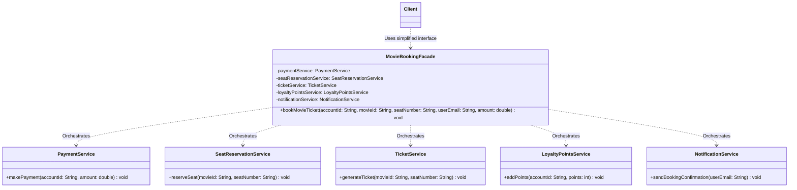

# 03 - Facade Design Pattern

## Core Idea

The **Facade Pattern** is a structural design pattern that provides a simplified, unified high-level interface to a complex subsystem or group of classes. It acts as a single entry point for clients, encapsulating intricate multi-step orchestration workflows and decoupling client code from the internal complexities of subsystem components.

---

## 💡 Real-Life Analogy

### 🚗 Automatic vs. Manual Transmission
- **Manual Car (Complex Subsystem):** The driver must coordinate the clutch pedal, gear shift lever, and accelerator in precise sequence while watching RPM levels.
- **Automatic Car (Facade):** The car provides a clean facade with simple modes: **Drive (D)**, **Reverse (R)**, and **Park (P)**. The driver simply selects "Drive", and the internal transmission facade coordinates gear shifts automatically behind the scenes.

---

## 🏗️ Structure & UML Class Diagram



---

## ❌ Bad Design (Client Directly Orchestrating Subsystems)

```java
// Client manually orchestrating 5 individual services in strict order
class BadClient {
    public static void main(String[] args) {
        PaymentService paymentService = new PaymentService();
        paymentService.makePayment("user123", 500.0);

        SeatReservationService seatService = new SeatReservationService();
        seatService.reserveSeat("movie456", "A10");

        TicketService ticketService = new TicketService();
        ticketService.generateTicket("movie456", "A10");

        LoyaltyPointsService loyaltyService = new LoyaltyPointsService();
        loyaltyService.addPoints("user123", 50);

        NotificationService notificationService = new NotificationService();
        notificationService.sendBookingConfirmation("user@example.com");
    }
}
```

### What is wrong?
- ⚠️ **High Client Complexity:** The client must know the exact order of execution, method signatures, and dependencies of 5 distinct services.
- ⚠️ **Tight Coupling:** Any change to internal subsystem methods breaks all client callers.
- ⚠️ **Code Duplication:** Every controller, CLI, or API endpoint that books a ticket duplicates this entire 5-step orchestration block.

---

## ✅ Good Design (Adhering to Facade Pattern)

Encapsulate the multi-service workflow behind `MovieBookingFacade`:

```java
class MovieBookingFacade {
    private final PaymentService paymentService;
    private final SeatReservationService seatReservationService;
    private final TicketService ticketService;
    private final LoyaltyPointsService loyaltyPointsService;
    private final NotificationService notificationService;

    public MovieBookingFacade() {
        this.paymentService = new PaymentService();
        this.seatReservationService = new SeatReservationService();
        this.ticketService = new TicketService();
        this.loyaltyPointsService = new LoyaltyPointsService();
        this.notificationService = new NotificationService();
    }

    public void bookMovieTicket(String accountId, String movieId, String seatNumber, String userEmail, double amount) {
        paymentService.makePayment(accountId, amount);
        seatReservationService.reserveSeat(movieId, seatNumber);
        ticketService.generateTicket(movieId, seatNumber);
        loyaltyPointsService.addPoints(accountId, (int) (amount * 0.10));
        notificationService.sendBookingConfirmation(userEmail);
        System.out.println("🎬 [MovieBookingFacade] Booking completed successfully!");
    }
}
```

### Why it better demonstrates the concept:
- ✅ **One-Line Client Interaction:** The client calls `facade.bookMovieTicket(...)` without caring about internal service choreography.
- ✅ **Loose Coupling & Clean Layering:** Internal services can be refactored or swapped without affecting the client.
- ✅ **Centralized Business Pipeline:** Workflow ordering and error handling are consolidated in a single place.

---

## Java Classes

- **`PaymentService`:** Subsystem handling monetary transactions.
- **`SeatReservationService`:** Subsystem managing cinema theater seat allocations.
- **`TicketService`:** Subsystem generating digital movie tickets and QR codes.
- **`LoyaltyPointsService`:** Subsystem crediting reward points to customer accounts.
- **`NotificationService`:** Subsystem sending email/SMS booking receipts.
- **`MovieBookingFacade`:** Facade unifying all 5 subsystem operations into a simple `bookMovieTicket()` API.

---

## How It Works

1. The client instantiates `MovieBookingFacade`.
2. The client invokes `movieBookingFacade.bookMovieTicket("user123", "M-101", "F12", "user@example.com", 450.0)`.
3. The facade coordinates the subsystem sequentially:
   - Charges the user $\rightarrow$ Reserves the seat $\rightarrow$ Generates ticket $\rightarrow$ Awards loyalty points $\rightarrow$ Dispatches confirmation email.

---

## When to Use

- **Complex Subsystem Simplification:** When an application requires coordinating multiple services (e.g. e-commerce checkout, flight booking, order dispatch).
- **Layered Architecture Boundaries:** To define clear entry points between layers (e.g. Presentation layer calling a Service Facade).
- **Wrapping Legacy or Third-Party Libraries:** Presenting a simple API over convoluted legacy frameworks.

---

## When NOT to Use

- **Trivial Subsystems:** If a system has only 1 or 2 straightforward method calls, a facade adds unnecessary indirection.
- **When Granular Client Control is Needed:** If power users need to customize every micro-step of the execution pipeline, a rigid facade may be too restrictive (or should expose optional subsystem access).

---

## LLD Takeaway

In Low-Level Design, the Facade Pattern is the standard pattern for **Service Orchestration**. It simplifies API gateways, controller layers, and business workflows by wrapping fine-grained subsystem classes into coarse-grained, client-friendly interfaces.

---

## 🎯 Quick Summary

- **Core Idea:** Provide a simplified, unified interface to a complex subsystem of classes.
- **Code Demonstrates:** Wrapping payment, seat reservation, ticket generation, loyalty points, and notification services inside a single `MovieBookingFacade`.
- **LLD Takeaway:** Use Facades to decouple client callers from internal multi-service choreography and provide clean architectural boundaries.
- **Memorable Rule:** *"A facade provides a simple front door to a complex building of services."*
