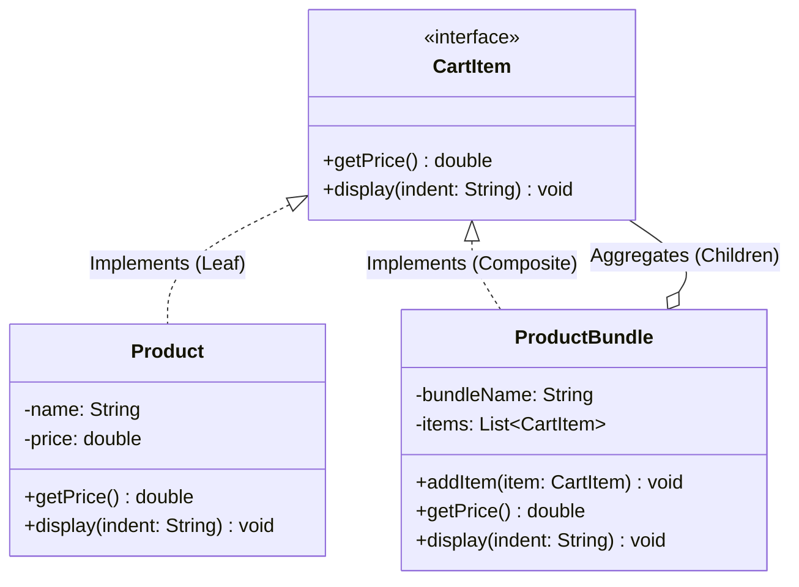

# 04 - Composite Design Pattern

## Core Idea

The **Composite Pattern** is a structural design pattern that allows you to compose objects into tree structures to represent part-whole hierarchies. It enables clients to treat individual objects (**Leaf**) and groups of objects (**Composite**) uniformly through a shared component interface, simplifying recursive operations across complex hierarchies.

---

## 💡 Real-Life Analogy

### 📦 E-Commerce Cart Bundles & File Systems
- **File System:** A **File** is an individual atomic item. A **Folder (Directory)** is a container that holds files and nested sub-folders. Calling `getSize()` on a folder recursively computes the size of everything inside it without the user needing to treat files and folders differently.
- **E-Commerce Cart:** An individual product (e.g. *iPhone 15*) and a combo bundle (e.g. *iPhone Essentials Pack* containing phone + charger + case) can both be added to the cart, priced, and displayed using the exact same methods.

---

## 🏗️ Structure & UML Class Diagram



---

## ❌ Bad Design (Non-Uniform Separate Types)

```java
// Product and ProductBundle are completely separate classes without a shared interface
class BadClient {
    public static void main(String[] args) {
        List<Object> cart = new ArrayList<>();
        cart.add(new Product("Book", 500));
        cart.add(new ProductBundle("iPhone Combo"));

        double total = 0;
        // ❌ Ugly instanceof branching and manual casting for every item type
        for (Object item : cart) {
            if (item instanceof Product) {
                total += ((Product) item).getPrice();
            } else if (item instanceof ProductBundle) {
                total += ((ProductBundle) item).getPrice();
            }
        }
    }
}
```

### What is wrong?
- ⚠️ **Breaks Polymorphism:** Forces client code to use unsafe `List<Object>` and repetitive `instanceof` checks.
- ⚠️ **No Recursive Nesting:** A `ProductBundle` cannot contain another nested `ProductBundle`.
- ⚠️ **Violates Open/Closed Principle (OCP):** Adding a new bundle or discount tier forces edits across all client loops.

---

## ✅ Good Design (Adhering to Composite Pattern)

Both individual products and bundles implement the common `CartItem` interface:

```java
// 1. Component Interface
interface CartItem {
    double getPrice();
    void display(String indent);
}

// 2. Leaf (Atomic Element)
class Product implements CartItem {
    private final String name;
    private final double price;

    public Product(String name, double price) {
        this.name = name;
        this.price = price;
    }

    @Override
    public double getPrice() { return price; }

    @Override
    public void display(String indent) {
        System.out.println(indent + "📦 Product: " + name + " - ₹" + price);
    }
}

// 3. Composite (Container of CartItems)
class ProductBundle implements CartItem {
    private final String bundleName;
    private final List<CartItem> items = new ArrayList<>();

    public ProductBundle(String bundleName) {
        this.bundleName = bundleName;
    }

    public void addItem(CartItem item) {
        items.add(item);
    }

    @Override
    public double getPrice() {
        double total = 0;
        for (CartItem item : items) {
            total += item.getPrice(); // Recursive delegation
        }
        return total;
    }

    @Override
    public void display(String indent) {
        System.out.println(indent + "📁 Bundle: " + bundleName);
        for (CartItem item : items) {
            item.display(indent + "   ");
        }
    }
}
```

### Why it better demonstrates the concept:
- ✅ **Uniform Polymorphic Treatment:** The cart is simply `List<CartItem>`, and total cost is computed with a clean one-liner `item.getPrice()`.
- ✅ **Arbitrary Recursive Nesting:** A `ProductBundle` can contain individual `Product` leaves as well as other nested `ProductBundle` composites.
- ✅ **Clean Client Logic:** Zero `instanceof` checks or typecasts required.

---

## Java Classes

- **`CartItem` (Component Interface):** Common contract defining `getPrice()` and `display()` operations.
- **`Product` (Leaf):** Individual purchasable item with its own direct price calculation.
- **`ProductBundle` (Composite):** Group of `CartItem` elements that recursively delegates pricing and rendering to its children.

---

## How It Works

1. Individual `Product` leaves and `ProductBundle` composites are created and assembled into a tree structure.
2. A client adds any `CartItem` to `List<CartItem> cart`.
3. When `item.getPrice()` is called on a composite bundle, it iterates through its children and invokes their `getPrice()` methods recursively, summing up all subtree totals automatically.

---

## When to Use

- **Hierarchical Tree Structures:** File system directories/files, UI component trees (Panels containing Buttons and other Panels).
- **Part-Whole Aggregations:** E-commerce product bundles/kits, organizational employee-manager hierarchies.
- **Uniform Processing:** When callers must perform operations (render, calculate totals, validate) uniformly across leaves and groups.

---

## When NOT to Use

- **Flat Collections:** If the domain model has no nested hierarchies, a simple `List<Product>` is much simpler.
- **When Leaves and Composites Have Vastly Incompatible Behaviors:** Forcing a shared interface onto fundamentally different classes violates interface segregation.

---

## LLD Takeaway

The Composite Pattern is the industry standard for modeling **Tree Hierarchies** in Low-Level Design. It allows algorithms to operate recursively over object graphs without coupling client code to concrete node types.

---

## 🎯 Quick Summary

- **Core Idea:** Compose objects into tree structures so that individual items (leaves) and collections (composites) are treated uniformly.
- **Code Demonstrates:** Treating standalone `Product` objects and nested `ProductBundle` combos identically through the `CartItem` interface.
- **LLD Takeaway:** Use the Composite Pattern to eliminate `instanceof` type-checking in tree/nested hierarchy domain models.
- **Memorable Rule:** *"Leaf and Composite share the same interface so the client never needs to know the difference."*
