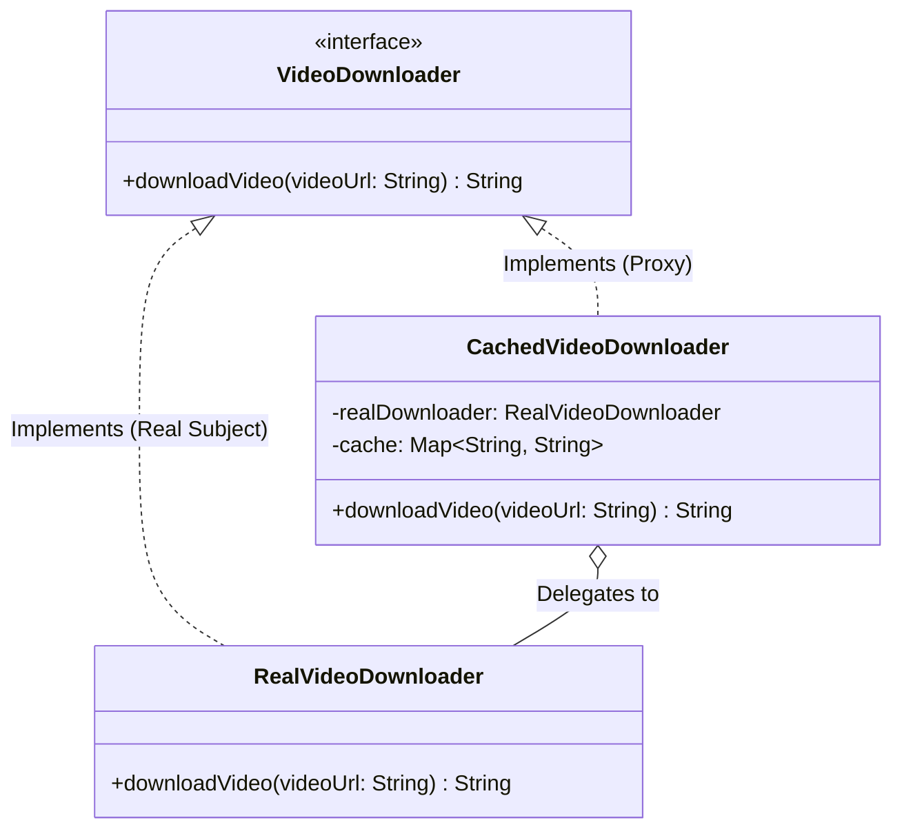

# 05 - Proxy Design Pattern

## Core Idea

The **Proxy Pattern** is a structural design pattern that provides a surrogate or placeholder object to control, optimize, or restrict access to another target object. The proxy implements the identical interface as the real subject, acting as an intermediary to handle concerns such as **lazy initialization**, **access control**, **caching**, **logging**, or **network communication** without altering the underlying object's core logic.

---

## 💡 Real-Life Analogy

### 🧑‍💼 The Executive Assistant
Imagine a CEO of a large enterprise:
- The CEO does not personally answer every incoming telephone call, filter cold emails, or schedule calendar slots.
- Instead, the **Executive Assistant (Proxy)** acts as a gatekeeper:
  - Answers common questions directly from stored notes (**Caching**).
  - Verifies visitor credentials and clearance (**Protection / Security**).
  - Only involves the actual CEO (**Real Subject**) when a legitimate, unhandled request requires attention.

---

## 🏗️ Structure & UML Class Diagram



---

## ❌ Bad Design (Direct Expensive Invocation)

```java
// Client connects directly to the heavy resource without caching or protection
class BadVideoDownloader {
    public String downloadVideo(String videoUrl) {
        // ❌ Re-downloads over the network every single time, wasting bandwidth and time
        System.out.println("Downloading video payload from remote CDN: " + videoUrl);
        return "Video Stream Data for " + videoUrl;
    }
}
```

### What is wrong?
- ⚠️ **Zero Caching:** Identical requests download the same heavy video payload repeatedly, causing redundant network bandwidth and latency.
- ⚠️ **No Access Control / Lazy Loading:** The expensive resource cannot be deferred or permission-checked without modifying its internal code.
- ⚠️ **Violates Single Responsibility Principle (SRP):** If caching logic is mixed inside `RealVideoDownloader`, the class handles both network I/O and caching mechanics.

---

## ✅ Good Design (Adhering to Proxy Pattern)

Wrap `RealVideoDownloader` with `CachedVideoDownloader` implementing `VideoDownloader`:

```java
// 1. Common Interface
interface VideoDownloader {
    String downloadVideo(String videoUrl);
}

// 2. Real Subject (Pure network logic)
class RealVideoDownloader implements VideoDownloader {
    @Override
    public String downloadVideo(String videoUrl) {
        System.out.println("🌐 [Network I/O] Downloading full HD stream from " + videoUrl);
        return "StreamData[" + videoUrl + "]";
    }
}

// 3. Proxy Class (Intercepts, caches, and delegates)
class CachedVideoDownloader implements VideoDownloader {
    private final RealVideoDownloader realDownloader;
    private final Map<String, String> cache;

    public CachedVideoDownloader() {
        this.realDownloader = new RealVideoDownloader();
        this.cache = new HashMap<>();
    }

    @Override
    public String downloadVideo(String videoUrl) {
        if (cache.containsKey(videoUrl)) {
            System.out.println("⚡ [Cache HIT] Serving cached video instantly: " + videoUrl);
            return cache.get(videoUrl);
        }

        System.out.println("⏳ [Cache MISS] Fetching from origin server...");
        String videoData = realDownloader.downloadVideo(videoUrl);
        cache.put(videoUrl, videoData);
        return videoData;
    }
}
```

### Why it better demonstrates the concept:
- ✅ **Transparent Interception:** The client interacts only with `VideoDownloader`, completely unaware that caching is happening.
- ✅ **Optimized Performance:** Avoids duplicate network calls for repeated requests.
- ✅ **Separation of Concerns:** `RealVideoDownloader` handles network fetching; `CachedVideoDownloader` handles caching and delegation.

---

## 🔍 The 4 Major Types of Proxies

| Proxy Type | Primary Responsibility | Practical Software Example |
|---|---|---|
| **1. Virtual Proxy** | **Lazy Initialization** (defers creating heavy objects until first method call). | High-res image loading in UI galleries, heavy DB connections. |
| **2. Protection Proxy** | **Access Control & Security** (checks auth token / user role before delegating). | Restricting `deleteUser()` or file modifications to `ADMIN` roles. |
| **3. Remote Proxy** | **Network Encapsulation** (represents an object residing on a remote server). | Java RMI, gRPC client stubs, Spring `@FeignClient`. |
| **4. Smart / Cache Proxy** | **Additional Interceptions** (in-memory caching, audit logging, reference counting). | Video stream caching (Netflix/YouTube CDN), Redis query cache proxy. |

---

## Java Classes

- **`VideoDownloader` (Subject Interface):** Common contract declaring `downloadVideo(videoUrl)`.
- **`RealVideoDownloader` (Real Subject):** Executes the actual heavy network download operation.
- **`CachedVideoDownloader` (Proxy):** Implements `VideoDownloader`, manages an in-memory cache, and delegates to `RealVideoDownloader` on cache misses.

---

## How It Works

1. Client initializes the proxy: `VideoDownloader downloader = new CachedVideoDownloader();`
2. First call for a URL (`User 1`):
   - Cache misses $\rightarrow$ Proxy delegates to `RealVideoDownloader` $\rightarrow$ Result cached $\rightarrow$ Data returned.
3. Second call for the same URL (`User 2`):
   - Cache hits $\rightarrow$ Proxy returns cached data immediately with **zero network latency**.

---

## When to Use

- **Caching & Rate Limiting:** Storing query/API results in memory to avoid repeated expensive operations.
- **Lazy Loading (Virtual Proxy):** Deferring instantiation of resource-heavy objects (e.g. database connection pools or heavy media renderers).
- **Security & Authorization (Protection Proxy):** Intercepting method calls to verify user roles or JWT tokens.
- **Remote RPC Calls (Remote Proxy):** Abstracting network serialization/deserialization for remote microservice calls.

---

## When NOT to Use

- **Trivial In-Memory Operations:** Adding proxy layers around lightweight POJOs adds unnecessary indirection and complexity.
- **When Client Code Requires Direct Low-Level Access:** Over-intercepting can sometimes hide necessary internal errors or connection states.

---

## LLD Takeaway

In Low-Level Design, the Proxy Pattern is foundational to **AOP (Aspect-Oriented Programming)**, **Spring Security/Transactions**, **Hibernate Lazy Loading**, and **API Gateway Caching**. It allows you to inject non-functional cross-cutting concerns without modifying core domain classes.

---

## 🎯 Quick Summary

- **Core Idea:** Provide a surrogate or placeholder object to control, optimize, or restrict access to a target object.
- **Code Demonstrates:** Using `CachedVideoDownloader` to intercept video download requests and serve repeated queries from an in-memory cache.
- **LLD Takeaway:** Use Proxies to implement cross-cutting concerns (lazy loading, caching, authorization, logging) without mutating target business logic.
- **Memorable Rule:** *"The proxy looks like the real object, talks like the real object, but controls when and how the real object is used."*
