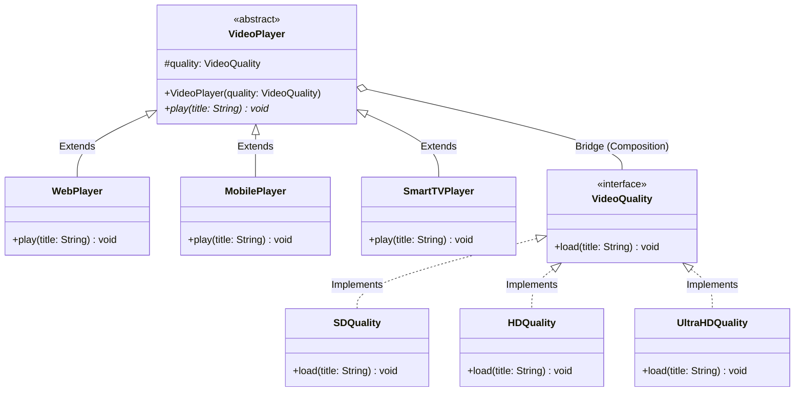

# 06 - Bridge Design Pattern

## Core Idea

The **Bridge Pattern** is a structural design pattern that decouples an **abstraction** (high-level control logic or platform) from its **implementation** (low-level execution or format) so that both can vary independently. It replaces rigid multi-dimensional inheritance with object composition, preventing a combinatorial class explosion ($M \times N \rightarrow M + N$) when systems evolve across orthogonal axes.

---

## 💡 Real-Life Analogy

### 📺 Universal TV Remote & TV Hardware
- **Abstraction Layer (Remote Controls):** A user can interact with a **Basic Remote** (power, volume) or an **Advanced Voice Remote** (voice search, streaming shortcuts).
- **Implementation Layer (TV Brands):** The actual hardware executing the commands could be a **Sony TV**, **Samsung TV**, or **LG TV**.
- Instead of building custom classes for every permutation (`BasicSonyRemote`, `VoiceSamsungRemote`, etc.), the remote holds a reference (**Bridge**) to any TV implementation.

---

## 🏗️ Structure & UML Class Diagram



---

## ❌ Bad Design (Combinatorial Subclass Explosion: $M \times N$)

```java
// Tightly coupling Platform (Web/Mobile/TV) with Quality (SD/HD/4K) using inheritance:
class WebHDPlayer implements PlayQuality { ... }
class MobileHDPlayer implements PlayQuality { ... }
class SmartTVUltraHDPlayer implements PlayQuality { ... }
class Web4KPlayer implements PlayQuality { ... }
class Mobile4KPlayer implements PlayQuality { ... }
class SmartTV4KPlayer implements PlayQuality { ... }
// 5 Platforms x 4 Resolutions = 20 bloated classes!
```

### What is wrong?
- ⚠️ **Combinatorial Class Explosion ($M \times N$):** Adding a new platform requires creating a class for every supported resolution.
- ⚠️ **Code Duplication:** Resolution decoding and streaming logic are duplicated across multiple platform classes.
- ⚠️ **Rigid Coupling:** Cannot change streaming quality dynamically at runtime without instantiating a completely new platform class.

---

## ✅ Good Design (Adhering to Bridge Pattern)

Separate the **Platform Abstraction** from the **Quality Implementor** via composition:

```java
// 1. Implementor Interface
interface VideoQuality {
    void load(String title);
}

// 2. Concrete Implementors
class HDQuality implements VideoQuality {
    @Override
    public void load(String title) {
        System.out.println("Streaming '" + title + "' in 1080p Full HD.");
    }
}

class UltraHDQuality implements VideoQuality {
    @Override
    public void load(String title) {
        System.out.println("Streaming '" + title + "' in 4K Ultra HD (HDR).");
    }
}

// 3. Abstraction with Bridge Reference
abstract class VideoPlayer {
    protected VideoQuality quality; // The Bridge

    public VideoPlayer(VideoQuality quality) {
        this.quality = quality;
    }

    public void setQuality(VideoQuality quality) {
        this.quality = quality; // Runtime dynamic switching!
    }

    public abstract void play(String title);
}

// 4. Refined Abstractions
class WebPlayer extends VideoPlayer {
    public WebPlayer(VideoQuality quality) { super(quality); }

    @Override
    public void play(String title) {
        System.out.print("🌐 [Web Player] ");
        quality.load(title);
    }
}

class MobilePlayer extends VideoPlayer {
    public MobilePlayer(VideoQuality quality) { super(quality); }

    @Override
    public void play(String title) {
        System.out.print("📱 [Mobile App] ");
        quality.load(title);
    }
}
```

### Why it better demonstrates the concept:
- ✅ **Linear Class Growth ($M + N$):** 5 platforms and 4 resolutions require only $5 + 4 = 9$ classes instead of $20$.
- ✅ **Runtime Flexibility:** A video player can switch resolution on the fly (`player.setQuality(new UltraHDQuality())`) without reconstructing the player.
- ✅ **Independent Evolution:** New platforms or new codec resolutions can be developed without touching existing code (OCP compliant).

---

## Java Classes

- **`VideoQuality` (Implementor Interface):** Defines low-level stream rendering behavior (`load(title)`).
- **`SDQuality`, `HDQuality`, `UltraHDQuality` (Concrete Implementors):** Specific video resolution processors.
- **`VideoPlayer` (Abstraction):** High-level client-facing interface holding a reference to `VideoQuality`.
- **`WebPlayer`, `MobilePlayer`, `SmartTVPlayer` (Refined Abstractions):** Platform-specific player wrappers.

---

## How It Works

1. A client chooses a platform and an initial quality: `VideoPlayer player = new WebPlayer(new HDQuality());`
2. Calling `player.play("Interstellar")` delegates the video payload to the bridged `VideoQuality.load(...)` implementation.
3. If network bandwidth improves, the client switches resolution dynamically via `player.setQuality(new UltraHDQuality())`.

---

## When to Use

- **Two Independent Dimensions of Variation:** When classes vary across two orthogonal axes (e.g. GUI Framework vs OS Window Manager; Message Notification Type vs Transport Channel; Video Player vs Video Quality).
- **Avoiding Subclass Explosion:** When inheritance creates an unmanageable matrix of classes.
- **Runtime Implementation Switching:** When an abstraction must switch its underlying execution engine dynamically at runtime.

---

## When NOT to Use

- **Single Dimension of Variation:** If a system only varies by one concept (e.g. only different payment gateways without multiple checkout types), the Strategy or Factory pattern is simpler.
- **Trivial Systems:** Adding abstractions and implementors to a small codebase with fixed requirements introduces unnecessary indirection.

---

## LLD Takeaway

The Bridge Pattern is the definitive solution for **Orthogonal Multidimensional Variation** in Low-Level Design. It decouples high-level business abstractions from low-level infrastructure drivers using composition over inheritance.

---

## 🎯 Quick Summary

- **Core Idea:** Decouple an abstraction from its implementation so both can vary independently without subclass explosion.
- **Code Demonstrates:** Bridging platform player abstractions (`WebPlayer`, `MobilePlayer`) with resolution implementors (`HDQuality`, `UltraHDQuality`).
- **LLD Takeaway:** Replace $M \times N$ inheritance matrix hierarchies with an $M + N$ composition bridge whenever a system varies in multiple dimensions.
- **Memorable Rule:** *"Bridge connects an abstraction to its implementation through composition, not inheritance."*
