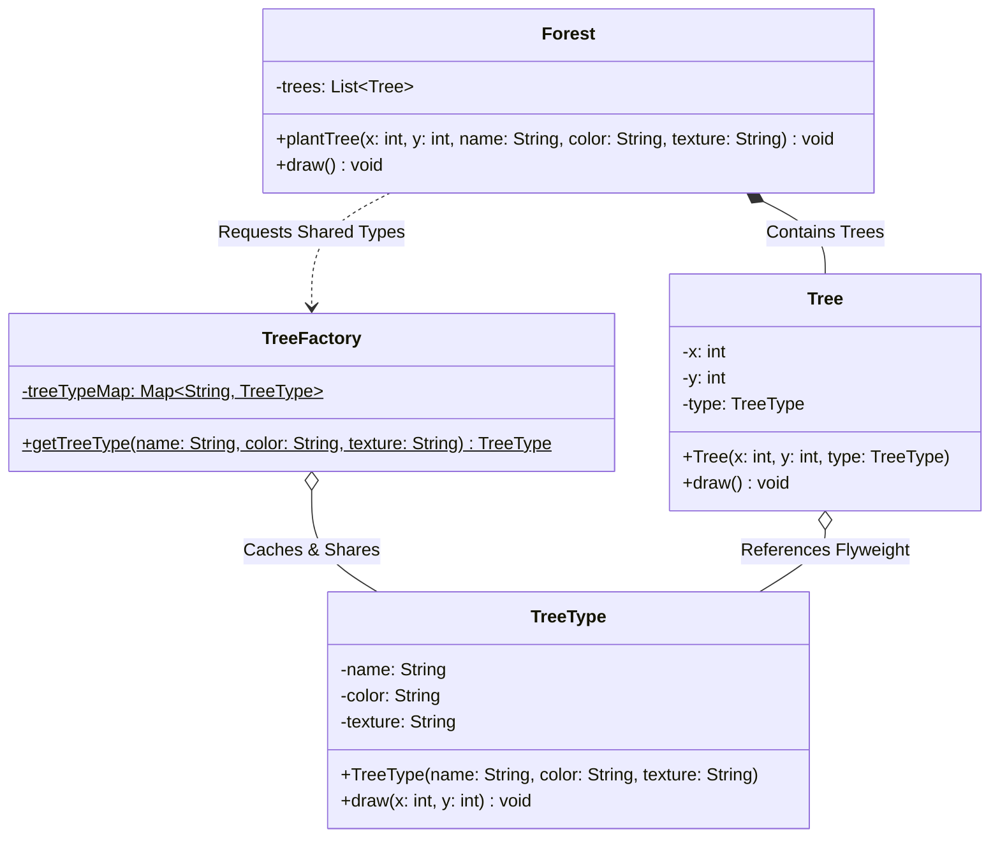

# 07 - Flyweight Design Pattern

## Core Idea

The **Flyweight Pattern** is a structural design pattern designed to drastically minimize memory consumption by sharing common, immutable data (**Intrinsic State**) across large numbers of fine-grained objects. Context-dependent, unique data (**Extrinsic State**) is decoupled from the shared objects and passed in dynamically during method execution, preventing redundant RAM allocation.

---

## 💡 Real-Life Analogy

### 🌲 Video Game Forests & Google Maps
Imagine an open-world video game (or Google Maps) rendering a forest with **1,000,000 oak trees**:
- Storing duplicate 3D meshes, leaf textures, and color strings for every single tree would require gigabytes of RAM and trigger severe Garbage Collection pauses.
- Instead, the engine creates **one shared Oak Model (Intrinsic State)** and renders it 1,000,000 times by passing different coordinates $(x, y)$ (**Extrinsic State**).

---

## 🔑 Core Concepts: Intrinsic vs. Extrinsic State

| Property | Intrinsic State (Shared) | Extrinsic State (Unique) |
|---|---|---|
| **Location** | Stored inside the Flyweight object. | Stored in the context object or passed by caller. |
| **Mutability** | **Immutable** (never changes across contexts). | **Mutable / Context-specific** (differs per instance). |
| **Sharing** | Shared across thousands/millions of instances. | Unique to a single instance/location. |
| **Example** | Tree `name`, `color`, `texture` (e.g. "Oak", "Green", "Rough"). | Tree coordinates $(x, y)$, heading, scale factor. |

---

## 🏗️ Structure & UML Class Diagram



---

## ❌ Bad Design (Duplicate Heavy Objects Without Sharing)

```java
// Each tree holds full duplicate copies of text, colors, and textures:
class HeavyTree {
    private int x, y;
    private String name;     // ❌ Duplicated 1,000,000 times
    private String color;    // ❌ Duplicated 1,000,000 times
    private String texture;  // ❌ Duplicated 1,000,000 times

    public HeavyTree(int x, int y, String name, String color, String texture) {
        this.x = x;
        this.y = y;
        this.name = name;
        this.color = color;
        this.texture = texture;
    }
}
```

### What is wrong?
- ⚠️ **Massive Memory Overhead:** 1 million trees create 3 million redundant String objects, consuming hundreds of megabytes of RAM.
- ⚠️ **High Garbage Collection Pressure:** Allocating and deallocating millions of identical objects triggers severe GC pauses.

---

## ✅ Good Design (Adhering to Flyweight Pattern)

Extract shared state into `TreeType` and pool instances in `TreeFactory`:

```java
// 1. Flyweight Class (Immutable Intrinsic State)
class TreeType {
    private final String name;
    private final String color;
    private final String texture;

    public TreeType(String name, String color, String texture) {
        this.name = name;
        this.color = color;
        this.texture = texture;
    }

    public void draw(int x, int y) {
        // Renders shared type using extrinsic coordinates passed as parameters
        System.out.println("🌲 Drawing " + name + " (" + color + ", " + texture + ") at (" + x + ", " + y + ")");
    }
}

// 2. Flyweight Factory (Object Cache)
class TreeFactory {
    private static final Map<String, TreeType> treeTypes = new HashMap<>();

    public static TreeType getTreeType(String name, String color, String texture) {
        String key = name + "_" + color + "_" + texture;
        return treeTypes.computeIfAbsent(key, k -> new TreeType(name, color, texture));
    }
}

// 3. Context Object (Lightweight Extrinsic State)
class Tree {
    private final int x;
    private final int y;
    private final TreeType type; // Shared reference

    public Tree(int x, int y, TreeType type) {
        this.x = x;
        this.y = y;
        this.type = type;
    }

    public void draw() {
        type.draw(x, y);
    }
}
```

### Why it better demonstrates the concept:
- ✅ **99% Memory Reduction:** 1 million trees share only 3–4 unique `TreeType` flyweight instances in memory.
- ✅ **Blazing Fast Instantiation:** Allocating a simple `Tree(x, y, ref)` requires negligible RAM.
- ✅ **Cleaner Architecture:** Shared visual properties and unique coordinate states are strictly decoupled.

---

## Java Classes

- **`TreeType` (Flyweight):** Stores immutable intrinsic properties (`name`, `color`, `texture`) and defines `draw(x, y)`.
- **`TreeFactory` (Flyweight Factory):** Manages the in-memory pool/cache of unique `TreeType` instances.
- **`Tree` (Context Object):** Holds extrinsic properties (`x`, `y`) and references a shared `TreeType`.
- **`Forest` (Client Manager):** Holds a collection of `Tree` objects and coordinates batch rendering.

---

## How It Works

1. The client invokes `forest.plantTree(10, 20, "Oak", "Green", "Rough")`.
2. `Forest` asks `TreeFactory.getTreeType("Oak", "Green", "Rough")`.
3. `TreeFactory` checks its cache:
   - Returns the existing cached `TreeType` instance if present.
   - Instantiates a new one once if absent.
4. A lightweight `Tree(10, 20, treeType)` is created and added to the forest.

---

## When to Use

- **Massive Number of Similar Objects:** Rendering large particle systems, document word processors (each character glyph), or map landmarks (Google Maps trees/pins).
- **RAM / Memory Optimization:** When an application is facing `OutOfMemoryError` or high GC latency due to millions of small objects.
- **Shared Immutable States:** When object state can be cleanly segregated into invariant shared attributes and dynamic context attributes.

---

## When NOT to Use

- **Small Number of Objects:** If your application only creates dozens or hundreds of objects, the factory and cache overhead is not justified.
- **When Object States are Highly Unique:** If every object has completely different attributes, sharing is impossible.

---

## LLD Takeaway

The Flyweight Pattern is the core architectural solution for **Memory Footprint Optimization** in systems handling massive datasets, game development, rendering engines, and UI text layout trees.

---

## 🎯 Quick Summary

- **Core Idea:** Minimize memory usage by sharing immutable intrinsic state across a massive number of similar objects.
- **Code Demonstrates:** Rendering 1,000,000 trees sharing only a handful of pooled `TreeType` instances cached in `TreeFactory`.
- **LLD Takeaway:** Separate immutable shared state from dynamic context state whenever object quantities threaten system memory limits.
- **Memorable Rule:** *"Store the shared state once in the Flyweight; pass the unique state into the method call."*
