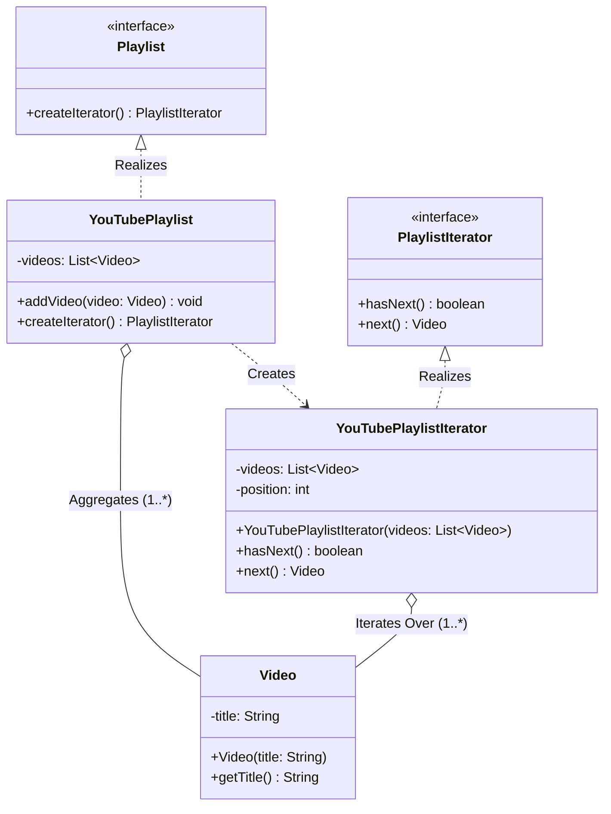

# 01 - Iterator Design Pattern

## Core Idea

The **Iterator Pattern** is a behavioral design pattern that provides a standard mechanism to sequentially traverse elements of an aggregate collection without exposing its internal representation (e.g. array, linked list, tree, or hash table). It delegates traversal responsibility and cursor state management to a dedicated iterator object, preserving strict data encapsulation.

---

## 💡 Real-Life Analogy

### 🥤 The Vending Machine "Next" Button
Imagine buying a drink from a vending machine:
- You don't need to know whether drinks are arranged in spiral coils, conveyor trays, or a robotic matrix internally.
- You simply press the **"Next"** button to cycle through options one-by-one.
- The vending machine controls the pace, order, and boundaries of traversal while keeping its internal mechanics hidden.

---

## 🏗️ Structure & UML Class Diagram



---

## ❌ Bad Design (Exposing Internal Collection Data Structure)

```java
class YouTubePlaylist {
    private List<Video> videos = new ArrayList<>();

    public void addVideo(Video video) { videos.add(video); }

    // ❌ Leaking internal collection directly to external clients!
    public List<Video> getVideos() {
        return videos;
    }
}

// Client Code
class BadClient {
    public static void main(String[] args) {
        YouTubePlaylist playlist = new YouTubePlaylist();
        playlist.addVideo(new Video("LLD Tutorial"));

        // ⚠️ Client directly coupled to List and can mutate internal state
        for (Video v : playlist.getVideos()) {
            System.out.println(v.getTitle());
        }
    }
}
```

### What is wrong?
- ⚠️ **Breaks Encapsulation:** Returning the internal `List<Video>` allows clients to directly modify, clear, or corrupt the playlist.
- ⚠️ **Tight Coupling:** If the internal structure is switched to a `Set`, `Tree`, or circular buffer, all client traversal loops break.
- ⚠️ **No Traversal Variations:** Custom traversal logic (e.g. shuffle, reverse, filtering by duration) is scattered across client code.

---

## ✅ Good Design (Adhering to Iterator Pattern)

Encapsulate traversal state inside `PlaylistIterator` created by `Playlist`:

```java
// 1. Domain Entity
class Video {
    private final String title;
    public Video(String title) { this.title = title; }
    public String getTitle() { return title; }
}

// 2. Iterator Interface
interface PlaylistIterator {
    boolean hasNext();
    Video next();
}

// 3. Aggregate Interface
interface Playlist {
    PlaylistIterator createIterator();
}

// 4. Concrete Iterator
class YouTubePlaylistIterator implements PlaylistIterator {
    private final List<Video> videos;
    private int position = 0;

    public YouTubePlaylistIterator(List<Video> videos) {
        this.videos = videos;
    }

    @Override
    public boolean hasNext() {
        return position < videos.size();
    }

    @Override
    public Video next() {
        return hasNext() ? videos.get(position++) : null;
    }
}

// 5. Concrete Aggregate
class YouTubePlaylist implements Playlist {
    private final List<Video> videos = new ArrayList<>();

    public void addVideo(Video video) {
        videos.add(video);
    }

    @Override
    public PlaylistIterator createIterator() {
        return new YouTubePlaylistIterator(videos);
    }
}
```

### Why it better demonstrates the concept:
- ✅ **Encapsulation Preserved:** The client has zero access to the underlying `List<Video>`.
- ✅ **Decoupled Client Code:** The client interacts exclusively with `Playlist` and `PlaylistIterator`.
- ✅ **Multiple Independent Traversals:** Multiple clients can iterate over the same playlist concurrently with independent cursor positions.

---

## Java Classes

- **`Video` (Domain Entity):** Represents a single video with a title.
- **`PlaylistIterator` (Iterator Interface):** Declares traversal methods (`hasNext()`, `next()`).
- **`YouTubePlaylistIterator` (Concrete Iterator):** Tracks iteration cursor position and fetches items sequentially.
- **`Playlist` (Aggregate Interface):** Factory contract for collections providing iterators.
- **`YouTubePlaylist` (Concrete Aggregate):** Stores videos and instantiates the iterator without exposing its internal list.

---

## How It Works

1. Client populates a `YouTubePlaylist`: `playlist.addVideo(new Video("LLD Primer"));`
2. Client requests an iterator: `PlaylistIterator it = playlist.createIterator();`
3. Traversal loop:
   - `it.hasNext()` checks if cursor position is within collection bounds.
   - `it.next()` returns the current video and advances the cursor index.

---

## When to Use

- **Hiding Complex Internal Data Structures:** When traversing custom complex data structures (Binary Trees, Graphs, Skip Lists, Circular Queues) without exposing their pointers/nodes.
- **Supporting Multiple Traversal Algorithms:** When the same collection needs forward, reverse, filtered, or random-shuffled iteration strategies.
- **Unified Traversal Interface:** When clients need to iterate over heterogeneous collections using identical loop semantics.

---

## When NOT to Use

- **Simple Trivial Collections:** For basic in-memory lists where standard Java enhanced for-loops (`for (Item x : list)`) or Streams are already standard.
- **Random Access Intensive Algorithms:** If an algorithm requires direct indexed lookup (e.g. binary search `get(mid)`), an iterator's sequential access is inefficient.

---

## LLD Takeaway

The Iterator Pattern enforces **Data Hiding & the Single Responsibility Principle**. It extracts traversal logic out of aggregate data containers and isolates cursor state into dedicated, stateless-to-the-collection iterator objects.

---

## 🎯 Quick Summary

- **Core Idea:** Sequentially access elements of a collection without exposing its underlying internal data structure.
- **Code Demonstrates:** Traversing a `YouTubePlaylist` via `PlaylistIterator` (`hasNext()`, `next()`) without exposing the private `List<Video>`.
- **LLD Takeaway:** Separate data storage from traversal logic to protect encapsulation and enable flexible iteration strategies.
- **Memorable Rule:** *"The aggregate holds the data; the iterator manages the traversal cursor."*
