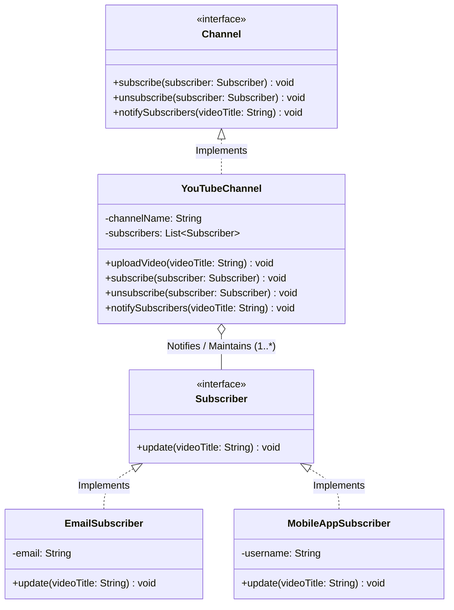

# 02 - Observer Design Pattern

## Core Idea

The **Observer Pattern** is a behavioral design pattern that defines a one-to-many dependency between objects. When the core object (**Subject / Publisher**) undergoes a state change, all its registered dependents (**Observers / Subscribers**) are automatically notified and updated, eliminating the need for subscribers to repeatedly poll the subject for updates.

---

## 💡 Real-Life Analogy

### 🔔 YouTube Channel Subscriptions
- **The Channel (Subject):** Uploads new video content.
- **The Viewers (Observers):** Click the "Subscribe" and "Bell" icon to register their interest.
- Viewers do not spend all day refreshing the creator's page (**No Polling**); instead, YouTube automatically dispatches alerts to all subscribed viewers as soon as a new video goes live.

---

## 🏗️ Structure & UML Class Diagram



---

## ❌ Bad Design (Hardcoded Polling / Hardcoded Notification Logic)

```java
// Subject directly coupled to specific users and communication channels
class BadYouTubeChannel {
    public void uploadNewVideo(String videoTitle) {
        System.out.println("Uploading: " + videoTitle);

        // ❌ Hardcoded notification channels and user recipients in business logic!
        System.out.println("Sending email to user1@example.com");
        System.out.println("Pushing in-app notification to user3@example.com");
    }
}
```

### What is wrong?
- ⚠️ **Violates Single Responsibility Principle (SRP):** The channel handles both video management and notification formatting/delivery.
- ⚠️ **Violates Open/Closed Principle (OCP):** Adding SMS, Webhooks, or Slack alerts requires editing the `BadYouTubeChannel` class.
- ⚠️ **Zero Dynamic Subscriptions:** Users cannot subscribe or unsubscribe at runtime.

---

## ✅ Good Design (Adhering to Observer Pattern)

Decouple publishers from subscribers via `Channel` and `Subscriber` interfaces:

```java
// 1. Observer Interface
interface Subscriber {
    void update(String videoTitle);
}

// 2. Concrete Observers
class EmailSubscriber implements Subscriber {
    private final String email;
    public EmailSubscriber(String email) { this.email = email; }

    @Override
    public void update(String videoTitle) {
        System.out.println("📧 [Email -> " + email + "] New video uploaded: " + videoTitle);
    }
}

class MobileAppSubscriber implements Subscriber {
    private final String username;
    public MobileAppSubscriber(String username) { this.username = username; }

    @Override
    public void update(String videoTitle) {
        System.out.println("🔔 [In-App -> " + username + "] New video uploaded: " + videoTitle);
    }
}

// 3. Subject Interface
interface Channel {
    void subscribe(Subscriber subscriber);
    void unsubscribe(Subscriber subscriber);
    void notifySubscribers(String videoTitle);
}

// 4. Concrete Subject
class YouTubeChannel implements Channel {
    private final String channelName;
    private final List<Subscriber> subscribers = new ArrayList<>();

    public YouTubeChannel(String channelName) {
        this.channelName = channelName;
    }

    @Override
    public void subscribe(Subscriber subscriber) {
        subscribers.add(subscriber);
    }

    @Override
    public void unsubscribe(Subscriber subscriber) {
        subscribers.remove(subscriber);
    }

    @Override
    public void notifySubscribers(String videoTitle) {
        for (Subscriber subscriber : subscribers) {
            subscriber.update(videoTitle);
        }
    }

    public void uploadVideo(String videoTitle) {
        System.out.println("🎬 [" + channelName + "] Uploaded: " + videoTitle);
        notifySubscribers(videoTitle);
    }
}
```

### Why it better demonstrates the concept:
- ✅ **Decoupled Architecture:** `YouTubeChannel` does not know whether a subscriber is receiving emails, SMS, or app notifications.
- ✅ **Dynamic Runtime Subscriptions:** Observers can attach (`subscribe`) and detach (`unsubscribe`) dynamically.
- ✅ **Adheres to OCP & SRP:** New notification channels can be added without modifying the channel class.

---

## Java Classes

- **`Subscriber` (Observer Interface):** Declares `update(videoTitle)` callback invoked upon state changes.
- **`EmailSubscriber`, `MobileAppSubscriber` (Concrete Observers):** Implement custom notification reception logic.
- **`Channel` (Subject Interface):** Contract for registering, unregistering, and notifying observers.
- **`YouTubeChannel` (Concrete Subject):** Stores subscriber list and broadcasts events upon video upload.

---

## How It Works

1. Subscribers register with the channel: `channel.subscribe(new EmailSubscriber("raj@tuf.com"));`
2. Creator uploads a video: `channel.uploadVideo("Observer Pattern Explained");`
3. The channel loops through its subscriber list and triggers `subscriber.update(...)` for each observer.

---

## When to Use

- **Event-Driven Notifications:** Real-time push alerts, social media follower feeds, email/SMS broadcasts.
- **UI Event Listeners:** Button clicks, form inputs, and window resize listeners in GUI frameworks.
- **Stock Market & Crypto Tickers:** Broadcasting real-time price updates to charts, watchlists, and trading bots.
- **File System Watchers:** Triggering automated builds or linters whenever source files change on disk.

---

## When NOT to Use

- **High-Volume Asynchronous Broadcasts (Millions of Subscribers):** Synchronous observer loops block the publisher thread. Use distributed message queues (Kafka, RabbitMQ, Redis Pub/Sub) instead.
- **Strict Execution Order Dependencies:** When observer execution order must follow a strict deterministic pipeline (use Chain of Responsibility or Workflow engines).

---

## LLD Takeaway

The Observer Pattern is the bedrock of **Reactive Programming**, **Event-Driven Architecture**, and **Model-View-Controller (MVC)**. It replaces inefficient polling with push-based reactive notification loops.

---

## 🎯 Quick Summary

- **Core Idea:** Define a one-to-many relationship where state changes in a Subject automatically notify all registered Observers.
- **Code Demonstrates:** `YouTubeChannel` broadcasting new video upload events to `EmailSubscriber` and `MobileAppSubscriber` without tight coupling.
- **LLD Takeaway:** Use Observer to build reactive, push-based communication systems where publishers remain decoupled from subscribers.
- **Memorable Rule:** *"Don't call us; we'll call you when something changes."*
