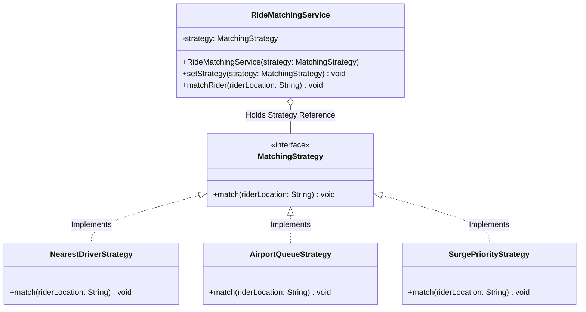

# 03 - Strategy Design Pattern

## Core Idea

The **Strategy Pattern** is a behavioral design pattern that defines a family of interchangeable algorithms, encapsulates each one inside a separate class, and makes them swappable at runtime. It allows the execution algorithm of a context object to vary independently based on user input, environmental conditions, or runtime configuration without modifying the context class.

---

## 💡 Real-Life Analogy

### 🚗 Uber Driver-Rider Matching & Navigation Modes
- **Navigation Apps (Google Maps):** When calculating a route from Point A to Point B, you can select **Driving Strategy**, **Walking Strategy**, or **Public Transit Strategy**. The route destination stays the same, but the underlying calculation algorithm changes dynamically.
- **Ride-Hailing (Uber):** Matching a rider to a vehicle depends on context:
  - In a standard suburb $\rightarrow$ **Nearest Driver Strategy** (Proximity-based).
  - In downtown during heavy rain $\rightarrow$ **Surge Pricing Priority Strategy**.
  - At the airport terminal $\rightarrow$ **FIFO Airport Queue Strategy**.

---

## 🏗️ Structure & UML Class Diagram



---

## ❌ Bad Design (Monolithic Conditional Branching)

```java
class BadRideMatchingService {
    public void matchRider(String riderLocation, String matchingType) {
        // ❌ Hardcoded if-else branching polluting the core service
        if ("NEAREST".equalsIgnoreCase(matchingType)) {
            System.out.println("Finding nearest driver to " + riderLocation);
        } else if ("SURGE_PRIORITY".equalsIgnoreCase(matchingType)) {
            System.out.println("Applying surge pricing matching for " + riderLocation);
        } else if ("AIRPORT_QUEUE".equalsIgnoreCase(matchingType)) {
            System.out.println("Matching driver from FIFO queue for " + riderLocation);
        } else {
            throw new IllegalArgumentException("Unknown strategy: " + matchingType);
        }
    }
}
```

### What is wrong?
- ⚠️ **Violates Open/Closed Principle (OCP):** Adding a new strategy (e.g., `VIPMatchingStrategy`) requires directly modifying `BadRideMatchingService`.
- ⚠️ **Poor Testability:** Algorithms cannot be unit-tested in isolation without instantiating the entire service.
- ⚠️ **Rigid & Inflexible:** Hard to swap algorithms dynamically mid-execution based on live traffic or price spikes.

---

## ✅ Good Design (Adhering to Strategy Pattern)

Encapsulate each algorithm inside its own class implementing `MatchingStrategy`:

```java
// 1. Strategy Interface
interface MatchingStrategy {
    void match(String riderLocation);
}

// 2. Concrete Strategy: Nearest Driver
class NearestDriverStrategy implements MatchingStrategy {
    @Override
    public void match(String riderLocation) {
        System.out.println("📍 [Nearest Driver] Matching rider at " + riderLocation + " with closest GPS coordinate.");
    }
}

// 3. Concrete Strategy: Surge Priority
class SurgePriorityStrategy implements MatchingStrategy {
    @Override
    public void match(String riderLocation) {
        System.out.println("⚡ [Surge Priority] Matching rider at " + riderLocation + " prioritizing surge zone drivers.");
    }
}

// 4. Concrete Strategy: Airport Queue
class AirportQueueStrategy implements MatchingStrategy {
    @Override
    public void match(String riderLocation) {
        System.out.println("🛫 [Airport Queue] Matching rider at " + riderLocation + " using strict FIFO terminal queue.");
    }
}

// 5. Context Class
class RideMatchingService {
    private MatchingStrategy strategy;

    public RideMatchingService(MatchingStrategy strategy) {
        this.strategy = strategy;
    }

    public void setStrategy(MatchingStrategy strategy) {
        this.strategy = strategy; // Dynamic runtime switching!
    }

    public void matchRider(String riderLocation) {
        strategy.match(riderLocation); // Delegation
    }
}
```

### Why it better demonstrates the concept:
- ✅ **Clean Elimination of Conditionals:** Eliminates brittle `if-else` cascades.
- ✅ **Adheres to OCP & SRP:** New strategies can be introduced as standalone classes without touching `RideMatchingService`.
- ✅ **Runtime Algorithm Hot-Swapping:** Context can change its active strategy dynamically via `setStrategy()`.

---

## Java Classes

- **`MatchingStrategy` (Strategy Interface):** Contract defining the `match(riderLocation)` operation.
- **`NearestDriverStrategy`, `SurgePriorityStrategy`, `AirportQueueStrategy` (Concrete Strategies):** Independent algorithmic implementations.
- **`RideMatchingService` (Context Class):** Maintains a reference to a `MatchingStrategy` and delegates execution to it.

---

## How It Works

1. Client initializes the context with an initial strategy: `RideMatchingService service = new RideMatchingService(new NearestDriverStrategy());`
2. Invoking `service.matchRider("Downtown")` delegates to `NearestDriverStrategy.match(...)`.
3. If conditions change (e.g. heavy rain/demand surge), client updates the strategy on the fly: `service.setStrategy(new SurgePriorityStrategy());`
4. The subsequent call immediately uses the new surge algorithm without rebuilding the context.

---

## When to Use

- **Multiple Interchangeable Algorithms:** Sorting algorithms (QuickSort vs MergeSort), payment gateways (UPI vs Card vs NetBanking), compression formats (ZIP vs GZIP).
- **Eliminating Complex Conditional Blocks:** When code contains large `switch` or `if-else` ladders choosing between business calculations.
- **Dynamic Runtime Strategy Switching:** When algorithms must adapt based on battery level, bandwidth, user subscription tier, or location.

---

## When NOT to Use

- **Static, Invariable Logic:** If an operation only has one implementation that never changes, introducing Strategy is over-engineering.
- **Trivial Algorithms (1-line functions):** A simple lambda or method reference (`Comparator.comparing(...)`) is cleaner than defining full-blown classes.

---

## LLD Takeaway

The Strategy Pattern is the most frequently tested behavioral pattern in Low-Level Design interviews (Payment systems, Pricing engines, Recommendation strategies, Routing services). It enforces **"Favor Composition over Inheritance"** and **Open/Closed Principle**.

---

## 🎯 Quick Summary

- **Core Idea:** Encapsulate a family of algorithms into interchangeable classes that can be swapped dynamically at runtime.
- **Code Demonstrates:** Switching `RideMatchingService` between `NearestDriverStrategy`, `SurgePriorityStrategy`, and `AirportQueueStrategy` at runtime.
- **LLD Takeaway:** Use the Strategy Pattern to eliminate conditional branching and decouple business workflows from algorithmic execution.
- **Memorable Rule:** *"Encapsulate what varies into strategies, and delegate execution to the interface."*
