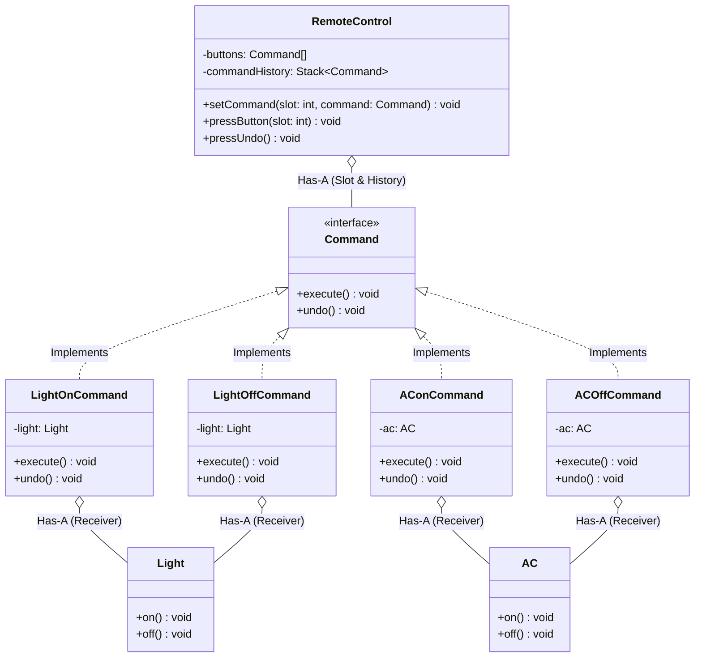

# 04 - Command Design Pattern

## Core Idea

The **Command Pattern** is a behavioral design pattern that turns a request into a standalone object containing all the details of the action to be performed. It completely decouples the object that issues the request (**Invoker**) from the object that performs the actual business logic (**Receiver**), enabling built-in support for **Undo / Redo operations**, **command history stacks**, **queuing / scheduling**, and **macro batch commands**.

---

## 💡 Real-Life Analogy

### 🎛️ Universal Smart Home Remote Control
- **The Remote (Invoker):** Has general buttons (Slot 1, Slot 2, Undo). It doesn't know about electrical wiring, refrigerant compressors, or lumens.
- **The Devices (Receivers):** A **Living Room Light** or a **Daikin Air Conditioner** knows how to physically turn on, off, or change temperature.
- **The Commands:** A button press executes a command object (`LightOnCommand`, `ACOffCommand`) that bridges the remote button to the specific device method. Pressing "Undo" simply pops the previous command and reverses it.

---

## 🔑 The 4 Key Components

```
[Client] ---> Creates ---> [Concrete Command] ---> Wraps ---> [Receiver]
    |                               ^
    | Registers into                |
    v                               |
[Invoker] -------- Triggers --------+ (execute() / undo())
```

1. **Client:** Creates concrete command objects and configures the invoker.
2. **Invoker:** Asks the command to carry out the request (`remoteControl.pressButton(0)`).
3. **Command:** Interface declaring `execute()` and `undo()` contracts.
4. **Receiver:** Knows how to perform the actual domain operations (`light.on()`, `ac.off()`).

---

## 🏗️ Structure & UML Class Diagram



---

## ❌ Bad Design (Invoker Directly Coupled to Receivers)

```java
// Remote control directly hardcoded with device instances and methods
class NaiveRemoteControl {
    private Light light;
    private AC ac;
    private String lastAction = "";

    public void pressLightOn() {
        light.on();
        lastAction = "LIGHT_ON";
    }

    // ❌ Rigid if/switch cascade for undo that cannot scale
    public void pressUndo() {
        switch (lastAction) {
            case "LIGHT_ON": light.off(); break;
            case "AC_ON": ac.off(); break;
            // Bloated conditional ladder for every single device and action!
        }
    }
}
```

### What is wrong?
- ⚠️ **Tight Coupling:** The remote must know every device class and its specific method signatures.
- ⚠️ **Violates Open/Closed Principle (OCP):** Adding a Smart TV or Fan requires editing `NaiveRemoteControl`.
- ⚠️ **Brittle Undo Logic:** Maintaining undo states using string flags and switch cases fails with multi-level undo histories.

---

## ✅ Good Design (Adhering to Command Pattern)

Encapsulate actions into objects implementing `Command`:

```java
// 1. Command Interface
interface Command {
    void execute();
    void undo();
}

// 2. Receivers
class Light {
    public void on() { System.out.println("💡 Light is ON"); }
    public void off() { System.out.println("💡 Light is OFF"); }
}

class AC {
    public void on() { System.out.println("❄️ AC is ON"); }
    public void off() { System.out.println("❄️ AC is OFF"); }
}

// 3. Concrete Commands
class LightOnCommand implements Command {
    private final Light light;
    public LightOnCommand(Light light) { this.light = light; }
    @Override public void execute() { light.on(); }
    @Override public void undo() { light.off(); }
}

class ACOnCommand implements Command {
    private final AC ac;
    public ACOnCommand(AC ac) { this.ac = ac; }
    @Override public void execute() { ac.on(); }
    @Override public void undo() { ac.off(); }
}

// 4. Invoker with Stack-based Multi-Level Undo
class RemoteControl {
    private final Command[] slots = new Command[4];
    private final Stack<Command> history = new Stack<>();

    public void setCommand(int slot, Command command) {
        slots[slot] = command;
    }

    public void pressButton(int slot) {
        if (slots[slot] != null) {
            slots[slot].execute();
            history.push(slots[slot]);
        }
    }

    public void pressUndo() {
        if (!history.isEmpty()) {
            Command lastCommand = history.pop();
            lastCommand.undo();
        } else {
            System.out.println("No commands to undo.");
        }
    }
}
```

### Why it better demonstrates the concept:
- ✅ **Complete Decoupling:** `RemoteControl` knows only the `Command` interface, making it 100% device-agnostic.
- ✅ **Robust Multi-Level Undo / Redo:** Reversing arbitrary sequences of actions is handled cleanly via a command history stack.
- ✅ **Extensible & Macro-Friendly:** New devices and compound multi-step commands (e.g. `GoodNightMacroCommand`) can be created without changing existing invokers.

---

## Java Classes

- **`Command` (Command Interface):** Declares `execute()` and `undo()` contracts.
- **`Light`, `AC` (Receivers):** Hardware devices performing concrete actions.
- **`LightOnCommand`, `LightOffCommand`, `ACOnCommand`, `ACOffCommand` (Concrete Commands):** Bind receivers to specific actions and reversals.
- **`RemoteControl` (Invoker):** Stores button slot mappings and manages the execution/undo history stack.

---

## How It Works

1. Client creates receivers (`Light`, `AC`) and binds them into commands (`LightOnCommand`, `ACOnCommand`).
2. Client maps commands into remote slots: `remote.setCommand(0, lightOn);`
3. Invoker triggers `remote.pressButton(0)`, which executes `lightOn.execute()` and pushes the command onto the history stack.
4. Calling `remote.pressUndo()` pops the latest command and executes `command.undo()`.

---

## When to Use

- **Undo / Redo Functionality:** Text editors, graphics tools (Photoshop/Figma canvas), transactional wizards.
- **Queueing & Scheduling Requests:** Task queues, job schedulers, thread pool workers executing `Runnable` / `Callable` commands.
- **Transactional Rollbacks & Sagas:** Distributed microservices executing compensating transactions upon failure.
- **Macro Commands:** Grouping multiple commands into a composite sequence (e.g. "Movie Mode": Dim lights + Turn on projector + Set volume to 50%).

---

## When NOT to Use

- **Simple Synchronous Invocations:** If an action is a direct one-line method call that never requires undo, history, or scheduling, creating full command classes adds unnecessary boilerplate.

---

## LLD Takeaway

The Command Pattern is the standard foundation for **Undo/Redo History Stacks**, **Job Schedulers**, **CQRS (Command Query Responsibility Segregation)**, and **Transactional Sagas** in Low-Level Design.

---

## 🎯 Quick Summary

- **Core Idea:** Encapsulate a request as a standalone object to decouple sender from receiver and support undo/redo/queueing.
- **Code Demonstrates:** A `RemoteControl` invoker executing and undoing `Light` and `AC` commands via a unified `Command` interface and history stack.
- **LLD Takeaway:** Turn actions into first-class objects whenever you need parameterization, queuing, logging, or reversible operations.
- **Memorable Rule:** *"Encapsulate an action into an object with execute() and undo()."*
