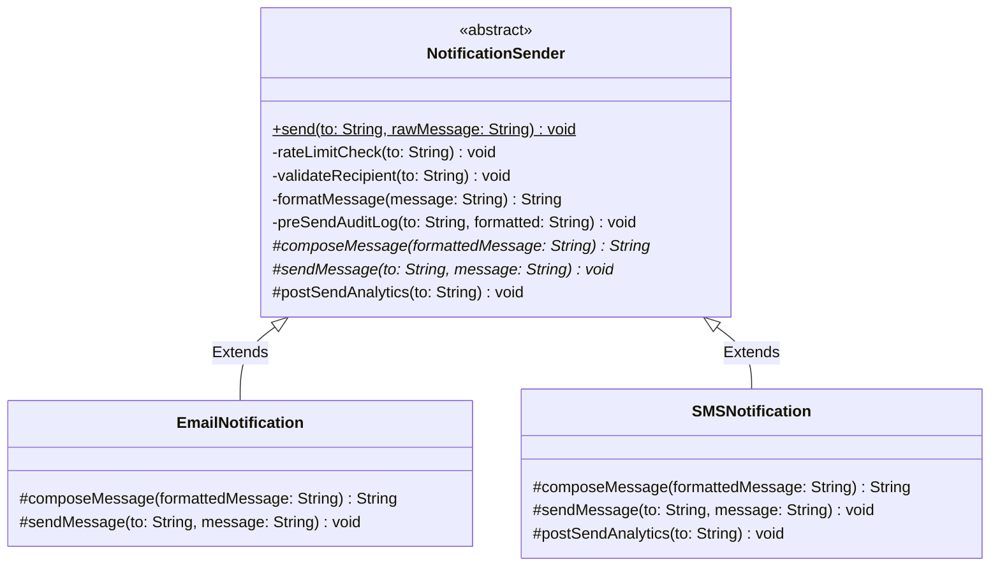

# 05 - Template Method Design Pattern

## Core Idea

The **Template Method Pattern** is a behavioral design pattern that defines the invariant skeleton of an algorithm in a base class method while deferring specific customizable steps to subclasses. By marking the template method `final`, the base class enforces a strict execution sequence, allowing subclasses to override specific algorithmic steps without altering the overarching workflow structure.

---

## 💡 Real-Life Analogy

### 🎂 Master Baking Recipe
- **Fixed Workflow Skeleton (Template):**
  1. Preheat Oven to 180°C $\rightarrow$ 2. Mix Base Batter $\rightarrow$ 3. **Add Custom Flavors/Toppings** $\rightarrow$ 4. Bake for 30 mins $\rightarrow$ 5. **Apply Custom Icing (Hook)**.
- **Customizable Variations (Subclasses):**
  - **Chocolate Cake:** Adds cocoa powder and dark ganache icing.
  - **Fruit Cake:** Adds dried berries and vanilla glaze.
- The master baking sequence never changes, but the specific ingredients and toppings are customized.

---

## 🔑 The 4 Key Method Types in Template Pattern

| Component | Visibility & Modifier | Purpose | Example |
|---|---|---|---|
| **1. Template Method** | `public final` | Defines the invariant sequence of the algorithm; cannot be overridden. | `send(to, message)` |
| **2. Concrete Operations** | `private` or `final` | Invariant shared logic executed identically for all subclasses. | `rateLimitCheck()`, `validateRecipient()` |
| **3. Primitive Operations** | `protected abstract` | Variable steps that each subclass **must** implement. | `composeMessage()`, `sendMessage()` |
| **4. Hooks** | `protected` (concrete default) | Optional extension points that subclasses **can choose** to override. | `postSendAnalytics()` |

---

## 🏗️ Structure & UML Class Diagram



---

## ❌ Bad Design (Duplicating the Invariant Workflow Skeleton)

```java
class EmailNotification {
    public void send(String to, String message) {
        // ❌ Duplicated boilerplate checks
        System.out.println("Checking rate limits for: " + to);
        System.out.println("Validating email: " + to);
        System.out.println("Audit logging...");

        // Email-specific logic
        String html = "<html>" + message + "</html>";
        System.out.println("Sending EMAIL to " + to + ": " + html);

        // Duplicated analytics
        System.out.println("Analytics recorded.");
    }
}

class SMSNotification {
    public void send(String to, String message) {
        // ❌ Identical boilerplate checks copied again!
        System.out.println("Checking rate limits for: " + to);
        System.out.println("Validating phone: " + to);
        System.out.println("Audit logging...");

        // SMS-specific logic
        String sms = "[SMS] " + message;
        System.out.println("Sending SMS to " + to + ": " + sms);

        // Duplicated analytics
        System.out.println("Analytics recorded.");
    }
}
```

### What is wrong?
- ⚠️ **Massive Code Duplication (Violates DRY):** Rate limiting, logging, validation, and analytics are copy-pasted across every notification class.
- ⚠️ **Brittle Maintenance:** Changing the rate limiter or audit logging logic requires editing every single notification class.
- ⚠️ **No Enforced Pipeline:** A rogue subclass might forget to perform rate-limiting or audit logging before dispatching.

---

## ✅ Good Design (Adhering to Template Method Pattern)

Define the execution sequence in `NotificationSender.send()`:

```java
// 1. Abstract Template Class
abstract class NotificationSender {
    // Invariant Template Method enforcing exact pipeline sequence
    public final void send(String to, String rawMessage) {
        rateLimitCheck(to);
        validateRecipient(to);
        String formatted = formatMessage(rawMessage);
        preSendAuditLog(to, formatted);

        // Primitive operations delegated to subclasses
        String composedMessage = composeMessage(formatted);
        sendMessage(to, composedMessage);

        // Optional hook
        postSendAnalytics(to);
    }

    // Invariant steps
    private void rateLimitCheck(String to) { System.out.println("⏳ Rate limit checked for " + to); }
    private void validateRecipient(String to) { System.out.println("🔍 Validating recipient " + to); }
    private String formatMessage(String message) { return message.trim(); }
    private void preSendAuditLog(String to, String msg) { System.out.println("📝 Audit log recorded for " + to); }

    // Abstract steps for subclasses
    protected abstract String composeMessage(String formattedMessage);
    protected abstract void sendMessage(String to, String message);

    // Optional hook with default implementation
    protected void postSendAnalytics(String to) {
        System.out.println("📊 Standard analytics updated for " + to);
    }
}

// 2. Concrete Subclass: Email
class EmailNotification extends NotificationSender {
    @Override
    protected String composeMessage(String formatted) {
        return "<html><body><p>" + formatted + "</p></body></html>";
    }

    @Override
    protected void sendMessage(String to, String message) {
        System.out.println("📧 [Email Gateway] Sent to " + to + " -> " + message);
    }
}

// 3. Concrete Subclass: SMS (Overrides Hook)
class SMSNotification extends NotificationSender {
    @Override
    protected String composeMessage(String formatted) {
        return "[SMS-OTP] " + formatted;
    }

    @Override
    protected void sendMessage(String to, String message) {
        System.out.println("📱 [SMS Gateway] Sent to " + to + " -> " + message);
    }

    @Override
    protected void postSendAnalytics(String to) {
        System.out.println("📈 [Custom SMS Analytics] Carrier delivery stats synced for " + to);
    }
}
```

### Why it better demonstrates the concept:
- ✅ **Guaranteed Execution Order:** The `final` template method guarantees rate-limiting, logging, and validation happen before any message is sent.
- ✅ **Zero Code Duplication:** Invariant operations are written once in the base class.
- ✅ **Open for Extension (OCP):** Adding `WhatsAppNotification` or `PushNotification` requires only implementing 2 abstract methods.

---

## Java Classes

- **`NotificationSender` (Abstract Base Template):** Enforces the algorithm sequence via `final send()` and houses common validation/logging logic.
- **`EmailNotification` (Concrete Subclass):** Implements HTML email payload composition and SMTP dispatch.
- **`SMSNotification` (Concrete Subclass):** Implements text formatting, SMS gateway dispatch, and custom analytics hook.

---

## How It Works

1. Client creates a sender: `NotificationSender sender = new EmailNotification();`
2. Client calls `sender.send("john@example.com", "Welcome to TUF+!");`
3. The base class `send()` method executes in strict sequence:
   - Rate limit check $\rightarrow$ Validate recipient $\rightarrow$ Format text $\rightarrow$ Audit log $\rightarrow$ Subclass `composeMessage()` $\rightarrow$ Subclass `sendMessage()` $\rightarrow$ Hook `postSendAnalytics()`.

---

## When to Use

- **Fixed Algorithmic Pipelines with Variable Steps:** E-commerce checkout workflows, data ingestion/ETL pipelines (Extract $\rightarrow$ Transform $\rightarrow$ Load), report generators (PDF vs CSV vs HTML).
- **Framework Lifecycles:** Web framework request lifecycles (Spring HTTP request handlers, JUnit test runner `@BeforeEach` $\rightarrow$ `@Test` $\rightarrow$ `@AfterEach`).
- **Standardized Enterprise Policies:** Enforcing mandatory security, audit logging, or compliance checks before and after business transactions.

---

## When NOT to Use

- **Radically Divergent Algorithms:** If two workflows share almost no common steps, forcing them into a shared template hierarchy creates confusing, empty methods. Use **Strategy Pattern** instead.
- **When Deep Subclassing Creates Hierarchy Bloat:** Heavy inheritance trees can become brittle; favor composition if step variations are independent.

---

## LLD Takeaway

The Template Method Pattern is the foundation of **Framework Design & The Hollywood Principle** (*"Don't call us, we'll call you"*). The parent framework controls the high-level lifecycle and calls down into developer-supplied subclass hooks.

---

## 🎯 Quick Summary

- **Core Idea:** Define the invariant skeleton of an algorithm in a base class `final` method, letting subclasses implement specific variable steps.
- **Code Demonstrates:** `NotificationSender` standardizing rate-limiting, validation, and logging while `EmailNotification` and `SMSNotification` customize message formatting.
- **LLD Takeaway:** Use Template Method to guarantee mandatory execution sequences (validation/security/logging) while preserving extensibility.
- **Memorable Rule:** *"The base class owns the workflow sequence; subclasses fill in the blanks."*
