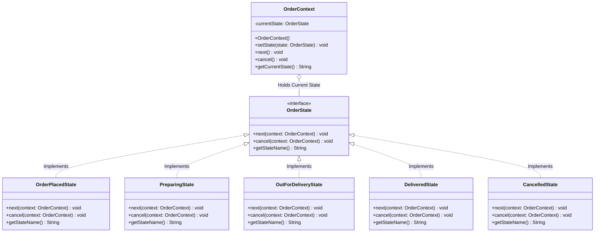

# 06 - State Design Pattern

## Core Idea

The **State Pattern** is a behavioral design pattern that allows an object to dynamically alter its behavior when its internal state changes, making it appear as if the object changed its class. It encapsulates state-specific behaviors and transition rules into distinct state classes and delegates execution to the current active state object within the context.

---

## 💡 Real-Life Analogy

### 🛵 Swiggy / Zomato Food Delivery Lifecycle
As a food order progresses, the application's available actions change based on its state:
- **Order Placed:** Customer can freely cancel or edit items $\rightarrow$ Transitions to *Preparing*.
- **Preparing:** Restaurant cooking in progress; cancellation incurs penalty $\rightarrow$ Transitions to *Out for Delivery*.
- **Out for Delivery:** Live GPS tracking enabled; cancellation is **strictly forbidden**.
- **Delivered:** Order completed; only ratings/tips available.

---

## ⚖️ State Pattern vs. Strategy Pattern

| Aspect | State Pattern | Strategy Pattern |
|---|---|---|
| **Primary Intent** | Alter behavior dynamically based on **internal lifecycle state changes**. | Swap interchangeable **algorithms** configured by the client. |
| **State Awareness** | Concrete states are **aware of each other** and drive transitions on the context. | Strategies are **completely independent** and unaware of other strategies. |
| **Transition Control** | Context or state classes trigger transitions automatically. | Client or configuration explicitly selects and injects the strategy. |
| **Common Use Cases** | Order lifecycles, ATM workflows, TCP connection states, game character states. | Sorting algorithms, payment gateways, tax calculation engines. |

---

## 🏗️ Structure & UML Class Diagram



---

## ❌ Bad Design (Monolithic Conditional State Tracking)

```java
class BadOrder {
    private String state = "ORDER_PLACED";

    public void cancelOrder() {
        // ❌ Brittle string comparisons and fragile conditional checks
        if ("ORDER_PLACED".equals(state) || "PREPARING".equals(state)) {
            state = "CANCELLED";
            System.out.println("Order cancelled.");
        } else {
            System.out.println("Cannot cancel order in state: " + state);
        }
    }

    public void nextState() {
        // ❌ Massive switch-case ladder that violates Open/Closed Principle
        switch (state) {
            case "ORDER_PLACED": state = "PREPARING"; break;
            case "PREPARING": state = "OUT_FOR_DELIVERY"; break;
            case "OUT_FOR_DELIVERY": state = "DELIVERED"; break;
            default: System.out.println("No next state for: " + state); break;
        }
    }
}
```

### What is wrong?
- ⚠️ **Violates Open/Closed Principle (OCP):** Adding a new state (e.g. `REFUNDED` or `OUT_FOR_PICKUP`) requires modifying every method and switch statement in `BadOrder`.
- ⚠️ **Violates Single Responsibility Principle (SRP):** The order class handles lifecycle rules for all possible states simultaneously.
- ⚠️ **Error-Prone State Management:** String-based state flags lead to invalid state jumps and typo bugs.

---

## ✅ Good Design (Adhering to State Pattern)

Encapsulate state behaviors and transitions inside dedicated `OrderState` implementations:

```java
// 1. Context Class
class OrderContext {
    private OrderState currentState;

    public OrderContext() {
        this.currentState = new OrderPlacedState(); // Default initial state
    }

    public void setState(OrderState state) { this.currentState = state; }
    public void next() { currentState.next(this); }
    public void cancel() { currentState.cancel(this); }
    public String getCurrentState() { return currentState.getStateName(); }
}

// 2. State Interface
interface OrderState {
    void next(OrderContext context);
    void cancel(OrderContext context);
    String getStateName();
}

// 3. Concrete State: Order Placed
class OrderPlacedState implements OrderState {
    @Override
    public void next(OrderContext context) {
        context.setState(new PreparingState());
        System.out.println("👨‍🍳 [State -> PREPARING] Restaurant accepted order and started cooking.");
    }

    @Override
    public void cancel(OrderContext context) {
        context.setState(new CancelledState());
        System.out.println("❌ [State -> CANCELLED] Order cancelled before food preparation.");
    }

    @Override public String getStateName() { return "ORDER_PLACED"; }
}

// 4. Concrete State: Out for Delivery (Blocks Cancellation)
class OutForDeliveryState implements OrderState {
    @Override
    public void next(OrderContext context) {
        context.setState(new DeliveredState());
        System.out.println("🎉 [State -> DELIVERED] Order handed over to customer.");
    }

    @Override
    public void cancel(OrderContext context) {
        System.out.println("⛔ Cannot cancel order! Delivery partner is already on the way.");
    }

    @Override public String getStateName() { return "OUT_FOR_DELIVERY"; }
}
```

### Why it better demonstrates the concept:
- ✅ **Decentralized State Transitions:** Each state explicitly governs which states it can legally transition into.
- ✅ **Adheres to OCP & SRP:** New states can be added without modifying the `OrderContext` class or existing state classes.
- ✅ **Eliminates `switch-case` Hell:** State-specific validation logic is isolated to clean, single-purpose classes.

---

## Java Classes

- **`OrderContext` (Context Class):** Maintains a reference to the active `OrderState` and exposes `next()` / `cancel()` triggers.
- **`OrderState` (State Interface):** Defines state lifecycle transition methods.
- **`OrderPlacedState`, `PreparingState`, `OutForDeliveryState`, `DeliveredState`, `CancelledState` (Concrete States):** Implement specific business rules and transition constraints.

---

## How It Works

1. `OrderContext` begins in `OrderPlacedState`.
2. Invoking `order.next()` triggers `OrderPlacedState.next(context)`, which transitions the context to `PreparingState`.
3. Calling `order.next()` again moves it to `OutForDeliveryState`.
4. If a user calls `order.cancel()` while in `OutForDeliveryState`, the state's `cancel()` method blocks the action with a friendly error message, preserving system integrity.

---

## When to Use

- **Finite State Machines (FSM):** Order processing pipelines (E-commerce / Food delivery), document publishing lifecycles (Draft $\rightarrow$ Review $\rightarrow$ Published $\rightarrow$ Archived).
- **Hardware & Machine State Workflows:** Vending machines, ATMs (Card inserted $\rightarrow$ Authenticated $\rightarrow$ Dispensing), traffic signal controllers.
- **Connection Handshakes:** Network socket connections (Listening $\rightarrow$ Syn-Received $\rightarrow$ Established $\rightarrow$ Closed).

---

## When NOT to Use

- **Few States with Rare Transitions:** If an object only has 1 or 2 static boolean flags (e.g. `isActive`), creating multiple state classes is overkill.
- **Independent Algorithm Swapping:** If operations don't follow a lifecycle progression, use **Strategy Pattern**.

---

## LLD Takeaway

The State Pattern is the gold standard for modeling **Finite State Machines (FSM) & Lifecycle Workflows** in Low-Level Design interviews (Vending Machine, ATM Machine, Swiggy Order Lifecycle, Elevator Control System).

---

## 🎯 Quick Summary

- **Core Idea:** Encapsulate state-specific behavior and transitions into separate classes, allowing an object to alter its behavior as its state changes.
- **Code Demonstrates:** Managing an `OrderContext` transitioning across `OrderPlaced`, `Preparing`, `OutForDelivery`, and `Delivered` states while strictly validating cancellations.
- **LLD Takeaway:** Replace sprawling `switch-case` statements with State classes whenever object behavior changes according to a defined lifecycle.
- **Memorable Rule:** *"Encapsulate each state into a class; let states drive transitions on the context."*
