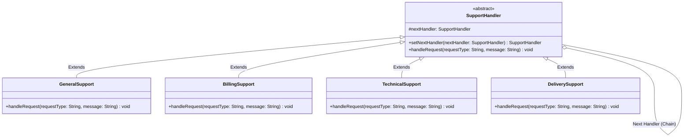

# 07 - Chain of Responsibility Design Pattern

## Core Idea

The **Chain of Responsibility** is a behavioral design pattern that allows a request to be passed along a sequential chain of potential handlers. Upon receiving a request, each handler decides whether to process it or pass it forward to the next handler in the pipeline, completely decoupling the sender from the specific receiver that ultimately handles the request.

---

## 💡 Real-Life Analogy

### 🎧 Multi-Tier Customer Support Routing
Imagine raising a support ticket on an e-commerce platform:
1. **L1 General Bot:** Tries to answer basic FAQs (store hours, return policy).
2. If it is a refund issue $\rightarrow$ Forwards to **L2 Billing Department**.
3. If it is an app crash or glitch $\rightarrow$ Forwards to **L3 Technical Engineering**.
4. If it is a missing parcel $\rightarrow$ Forwards to **L4 Logistics & Delivery Team**.
- The customer simply submits a ticket to the front desk without needing to know which specific department will resolve it.

---

## 🏗️ Structure & UML Class Diagram



---

## ❌ Bad Design (Monolithic If-Else Routing Anti-Pattern)

```java
class BadSupportService {
    public void handleRequest(String type) {
        // ❌ Monolithic conditional routing tightly coupling all departments
        if (type.equals("general")) {
            System.out.println("Handled by General Support");
        } else if (type.equals("refund")) {
            System.out.println("Handled by Billing Team");
        } else if (type.equals("technical")) {
            System.out.println("Handled by Technical Support");
        } else if (type.equals("delivery")) {
            System.out.println("Handled by Delivery Team");
        } else {
            System.out.println("No handler available");
        }
    }
}
```

### What is wrong?
- ⚠️ **Violates Open/Closed Principle (OCP):** Adding a new department (e.g. `FraudDepartment`) requires modifying the monolithic `handleRequest` method.
- ⚠️ **Tightly Coupled Logic:** All department validation, handling, and priority logic are entangled in a single class.
- ⚠️ **Inflexible Routing:** Handler sequence cannot be dynamically rearranged or configured at runtime.

---

## ✅ Good Design (Adhering to Chain of Responsibility)

Encapsulate each support department into independent handlers linked in a chain:

```java
// 1. Abstract Handler
abstract class SupportHandler {
    protected SupportHandler nextHandler;

    public SupportHandler setNextHandler(SupportHandler nextHandler) {
        this.nextHandler = nextHandler;
        return nextHandler; // Enables fluent chain assembly
    }

    public abstract void handleRequest(String requestType, String message);
}

// 2. Concrete Handler: General Support
class GeneralSupport extends SupportHandler {
    @Override
    public void handleRequest(String type, String message) {
        if ("GENERAL".equalsIgnoreCase(type)) {
            System.out.println("🙋 [General Support] Solved FAQ query: " + message);
        } else if (nextHandler != null) {
            nextHandler.handleRequest(type, message); // Forward to next
        }
    }
}

// 3. Concrete Handler: Billing Support
class BillingSupport extends SupportHandler {
    @Override
    public void handleRequest(String type, String message) {
        if ("REFUND".equalsIgnoreCase(type) || "BILLING".equalsIgnoreCase(type)) {
            System.out.println("💳 [Billing Team] Processed refund request: " + message);
        } else if (nextHandler != null) {
            nextHandler.handleRequest(type, message);
        }
    }
}

// 4. Concrete Handler: Technical Support
class TechnicalSupport extends SupportHandler {
    @Override
    public void handleRequest(String type, String message) {
        if ("TECHNICAL".equalsIgnoreCase(type)) {
            System.out.println("💻 [Tech Support] Investigating bug ticket: " + message);
        } else if (nextHandler != null) {
            nextHandler.handleRequest(type, message);
        }
    }
}

// 5. Concrete Handler: Delivery Support (Tail of Chain)
class DeliverySupport extends SupportHandler {
    @Override
    public void handleRequest(String type, String message) {
        if ("DELIVERY".equalsIgnoreCase(type)) {
            System.out.println("🚚 [Logistics Team] Tracking delayed parcel: " + message);
        } else if (nextHandler != null) {
            nextHandler.handleRequest(type, message);
        } else {
            System.out.println("⚠️ [Unresolved] No department available to handle: " + type);
        }
    }
}
```

### Why it better demonstrates the concept:
- ✅ **Decoupled Sender & Receivers:** The client sends tickets only to the first handler in the chain.
- ✅ **Adheres to OCP & SRP:** Each support team handles only its domain. Adding a `FraudSupport` class requires zero edits to existing handlers.
- ✅ **Dynamic Pipeline Reconfiguration:** Handlers can be assembled, reordered, or removed at runtime.

---

## Java Classes

- **`SupportHandler` (Abstract Handler):** Defines `handleRequest()` contract and maintains the `nextHandler` link.
- **`GeneralSupport`, `BillingSupport`, `TechnicalSupport`, `DeliverySupport` (Concrete Handlers):** Inspect request types, process matching tickets, or pass requests down the chain.

---

## How It Works

1. Client links handlers together:
   `general.setNextHandler(billing).setNextHandler(technical).setNextHandler(delivery);`
2. Client submits a `"REFUND"` ticket to `general.handleRequest("REFUND", "Duplicate charge")`.
3. `GeneralSupport` rejects it and forwards to `BillingSupport`.
4. `BillingSupport` detects a match, processes the refund, and terminates the chain traversal.

---

## When to Use

- **HTTP Middleware & Servlet Filters:** Spring Security filter chains, authentication $\rightarrow$ rate-limiting $\rightarrow$ CORS $\rightarrow$ audit logging $\rightarrow$ request controller.
- **Multi-Level Approval Workflows:** Corporate expense approval (Manager $< \$1000 \rightarrow$ Director $< \$5000 \rightarrow$ VP).
- **Event Dispatchers & UI Bubbling:** DOM event propagation (target element $\rightarrow$ parent container $\rightarrow$ window).

---

## When NOT to Use

- **Fixed Single Handler:** If every request has exactly one known destination that never changes, direct method calls or Strategy are simpler.
- **Critical Performance Paths with Long Chains:** Traversing dozens of unoptimized handlers can add unnecessary latency.

---

## LLD Takeaway

The Chain of Responsibility Pattern is the industry standard for **Middleware Pipelines**, **Event Bubbling**, **Request Validation Chains**, and **Tiered Escalation Workflows** in Low-Level Design.

---

## 🎯 Quick Summary

- **Core Idea:** Pass a request along a chain of handlers where each handler decides to process it or pass it to the next.
- **Code Demonstrates:** Routing support requests through a `GeneralSupport -> BillingSupport -> TechnicalSupport -> DeliverySupport` pipeline.
- **LLD Takeaway:** Use Chain of Responsibility to eliminate monolithic `if-else` routing and decouple request senders from processing receivers.
- **Memorable Rule:** *"Handle the request if you can; otherwise pass it down the chain."*
