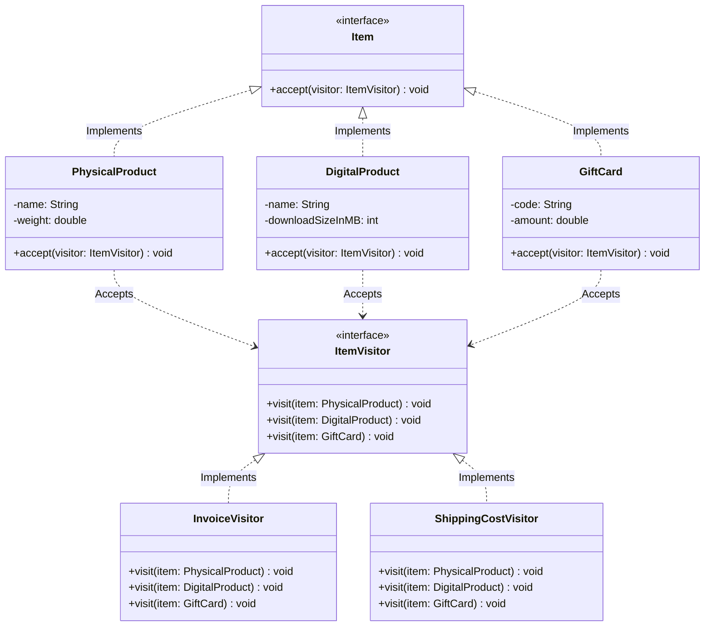

# 08 - Visitor Design Pattern

## Core Idea

The **Visitor Pattern** is a behavioral design pattern that allows you to add new operations and algorithms to an existing object hierarchy without modifying the classes themselves. It accomplishes this by extracting operations into standalone **Visitor** classes and leveraging **Double Dispatch** (`element.accept(visitor)` $\rightarrow$ `visitor.visit(this)`), ensuring complete separation between data structures and algorithmic logic.

---

## 💡 Real-Life Analogy

### 🏢 Tax Auditor Visiting Diverse Businesses
Imagine a government tax auditor visiting a commercial complex:
- The complex contains different entities: a **Bookstore**, an **Electronics Outlet**, and an **Online SaaS Office**.
- The business buildings do not rewrite their corporate structures or inventory systems for tax season.
- Instead, they simply allow the **Tax Auditor (Visitor)** in through their doors (`accept()`). The auditor inspects the entity (`visit()`) and applies the legal tax calculation rules specific to that industry.

---

## 🔁 Understanding Double Dispatch

Java natively supports **Single Dispatch** (methods are resolved dynamically based only on the runtime type of the calling object). The Visitor Pattern simulates **Double Dispatch** so execution depends on the runtime types of **both** the receiver and the parameter:

```
Step 1 (First Dispatch):   item.accept(visitor)      --> Polymorphic lookup finds concrete Item type.
Step 2 (Second Dispatch):  visitor.visit(this)       --> Polymorphic & overloaded lookup executes exact visit() logic.
```

---

## 🏗️ Structure & UML Class Diagram



---

## ❌ Bad Design (Bloating Entities & Client `instanceof` Checks)

```java
// Client forced to perform type checking to execute separate operations
class BadClient {
    public static void main(String[] args) {
        List<Object> cart = Arrays.asList(new PhysicalProduct("Shoes", 1.5), new DigitalProduct("E-book", 50));

        for (Object item : cart) {
            // ❌ Brittle instanceof ladders violating Open/Closed Principle
            if (item instanceof PhysicalProduct) {
                PhysicalProduct p = (PhysicalProduct) item;
                p.printInvoice();
                p.calculateShippingCost();
            } else if (item instanceof DigitalProduct) {
                DigitalProduct d = (DigitalProduct) item;
                d.printInvoice();
            }
        }
    }
}
```

### What is wrong?
- ⚠️ **Violates Single Responsibility Principle (SRP):** Product entities are polluted with unrelated concerns (invoice rendering, shipping freight calculations, tax audits).
- ⚠️ **Brittle `instanceof` Cascades:** Adding a new product type requires modifying every client loop across the codebase.
- ⚠️ **Violates Open/Closed Principle (OCP):** Adding a new operation (e.g., `ExportToJSON`) forces edits across every single entity class.

---

## ✅ Good Design (Adhering to Visitor Pattern)

Separate operations into `ItemVisitor` implementations and accept them dynamically:

```java
// 1. Element Interface
interface Item {
    void accept(ItemVisitor visitor);
}

// 2. Concrete Elements
class PhysicalProduct implements Item {
    String name;
    double weightInKg;

    public PhysicalProduct(String name, double weightInKg) {
        this.name = name;
        this.weightInKg = weightInKg;
    }

    @Override
    public void accept(ItemVisitor visitor) {
        visitor.visit(this); // First dispatch
    }
}

class DigitalProduct implements Item {
    String name;
    public DigitalProduct(String name) { this.name = name; }

    @Override
    public void accept(ItemVisitor visitor) {
        visitor.visit(this);
    }
}

// 3. Visitor Interface
interface ItemVisitor {
    void visit(PhysicalProduct item);
    void visit(DigitalProduct item);
}

// 4. Concrete Visitor: Shipping Cost
class ShippingCostVisitor implements ItemVisitor {
    @Override
    public void visit(PhysicalProduct item) {
        double cost = item.weightInKg * 40.0;
        System.out.println("🚚 Shipping for '" + item.name + "': ₹" + cost);
    }

    @Override
    public void visit(DigitalProduct item) {
        System.out.println("⚡ Instant Digital Delivery for '" + item.name + "': ₹0.00");
    }
}

// 5. Concrete Visitor: Invoice Generation
class InvoiceVisitor implements ItemVisitor {
    @Override
    public void visit(PhysicalProduct item) {
        System.out.println("📄 [Invoice] Physical Package: " + item.name + " (" + item.weightInKg + " kg)");
    }

    @Override
    public void visit(DigitalProduct item) {
        System.out.println("📄 [Invoice] Digital License Key: " + item.name);
    }
}
```

### Why it better demonstrates the concept:
- ✅ **Clean Separation of Concerns:** Product classes only represent state; operations live in dedicated visitor classes.
- ✅ **Zero `instanceof` Downcasting:** Double dispatch resolves types safely and polymorphically.
- ✅ **Effortless Extensibility for New Operations:** Adding `TaxAuditVisitor` or `ExportXMLVisitor` requires zero changes to product classes.

---

## Java Classes

- **`Item` (Element Interface):** Declares `accept(ItemVisitor visitor)` contract.
- **`PhysicalProduct`, `DigitalProduct`, `GiftCard` (Concrete Elements):** Domain entities holding state and dispatching to visitors.
- **`ItemVisitor` (Visitor Interface):** Overloaded contract declaring `visit()` for each concrete element type.
- **`InvoiceVisitor`, `ShippingCostVisitor` (Concrete Visitors):** Encapsulate operation algorithms across all element types.

---

## How It Works

1. Client initializes a heterogeneous collection: `List<Item> cart = List.of(new PhysicalProduct("Shoes", 1.2), new DigitalProduct("E-Book"));`
2. Client iterates over the list: `item.accept(new ShippingCostVisitor());`
3. `item.accept(...)` invokes `visitor.visit(this)`.
4. The exact overloaded `visit(PhysicalProduct)` or `visit(DigitalProduct)` method executes automatically.

---

## When to Use

- **Frequent New Operations on Stable Class Hierarchies:** When element types are fixed (e.g., AST syntax nodes, Document elements: Text/Image/Table), but new tools/operations (linting, code generation, PDF export) are frequently added.
- **Compiler Abstract Syntax Trees (AST):** Syntax tree traversals for type checking, optimization, and bytecode compilation.
- **Decoupling Analytics / Auditing / Serialization:** Moving reporting and export logic out of domain data structures.

---

## When NOT to Use

- **Frequently Changing Element Hierarchies:** Adding a new element class requires updating the `Visitor` interface and every existing concrete visitor class.
- **Simple, Flat Object Models:** If classes only have 1 or 2 static operations, Visitor adds unnecessary boilerplate.

---

## LLD Takeaway

The Visitor Pattern is the ultimate solution for **AST Traversals, Compiler Backends, and Reporting Engines** in Low-Level Design. It allows developers to add infinite distinct operations over an established object graph without touching a single domain entity class.

---

## 🎯 Quick Summary

- **Core Idea:** Separate algorithms from the object structures on which they operate using Double Dispatch.
- **Code Demonstrates:** Applying `InvoiceVisitor` and `ShippingCostVisitor` operations across `PhysicalProduct`, `DigitalProduct`, and `GiftCard` elements without `instanceof` checks.
- **LLD Takeaway:** Use the Visitor Pattern when you have a stable class hierarchy that requires frequent, extensible new operations.
- **Memorable Rule:** *"Elements accept visitors; visitors execute operations based on the concrete element type."*
