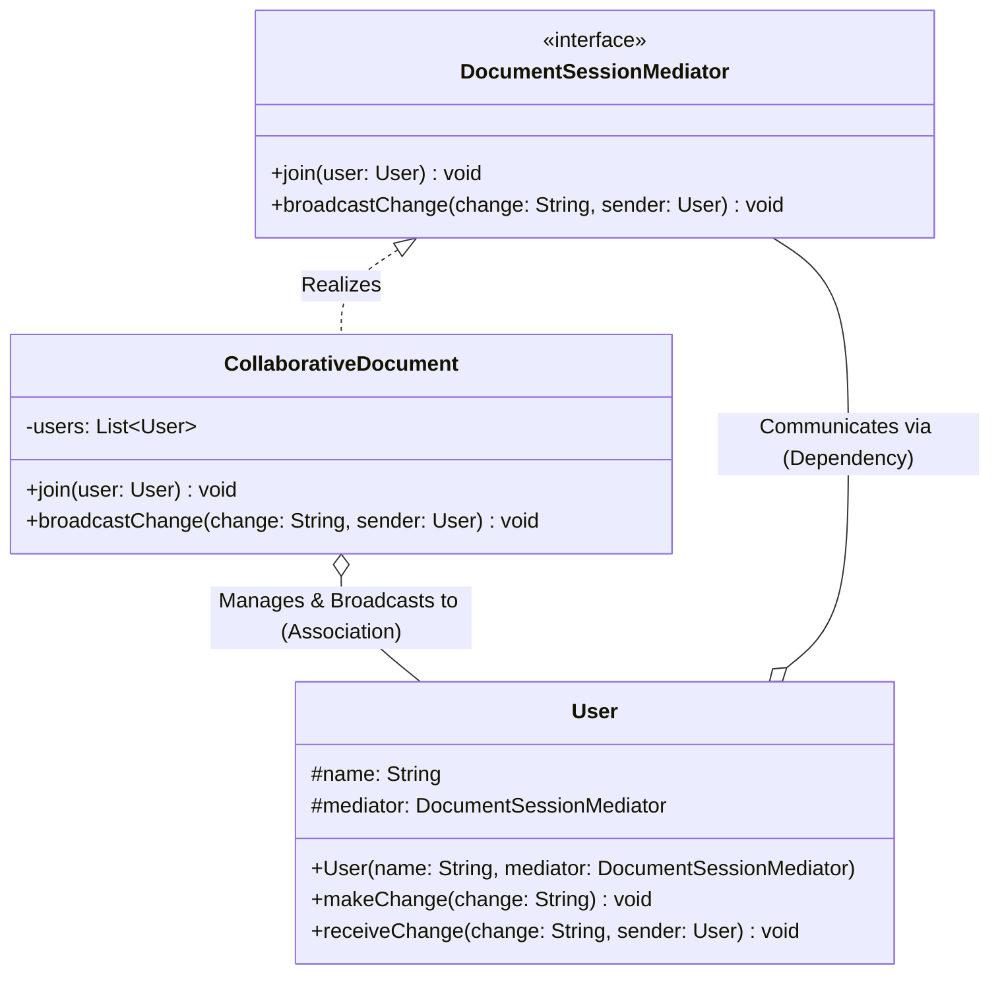

# 09 - Mediator Design Pattern

## Core Idea

The **Mediator Pattern** is a behavioral design pattern that centralizes complex communication and interactions between multiple objects into a single dedicated mediation object. By preventing components (**Colleagues**) from referencing each other directly, it transforms a tightly coupled many-to-many mesh network ($O(N^2)$ connections) into a clean, maintainable hub-and-spoke star topology ($O(N)$ connections).

---

## 💡 Real-Life Analogy

### ✈️ Air Traffic Control (ATC) Tower
Imagine an airport with 50 airplanes arriving and departing:
- Airplanes **never** radio each other directly in mid-air to negotiate runway access ($50 \times 49 = 2,450$ communication links).
- Instead, every pilot communicates exclusively with the **Air Traffic Control (ATC) Tower (Mediator)**.
- The ATC centralizes flight paths, landing sequences, and collision avoidance rules, making the airspace safe and manageable.

---

## 🌐 Topology Transformation

```
❌ Without Mediator (Mesh Network: O(N^2))       ✅ With Mediator (Star Topology: O(N))

       [User A] <------> [User B]                      [User A]       [User B]
          ^   \        /   ^                              \              /
          |    \      /    |                               v            v
          |     \    /     |                         +-----------------------+
          |      \  /      |                         |  CollaborativeDocument|
          |       \/       |                         |       (Mediator)      |
          v       /\       v                         +-----------------------+
       [User C] <------> [User D]                         ^            ^
                                                         /              \
                                                      [User C]       [User D]
```

---

## 🏗️ Structure & UML Class Diagram



---

## ❌ Bad Design (Direct Peer-to-Peer Mesh Coupling)

```java
// Each user maintains direct references to every other collaborator
class BadUser {
    private String name;
    private List<BadUser> others = new ArrayList<>();

    public void addCollaborator(BadUser user) { others.add(user); }

    public void makeChange(String change) {
        System.out.println(name + " edited: " + change);
        // ❌ Direct notification loop coupled to all peers
        for (BadUser u : others) {
            u.receiveChange(change, this);
        }
    }
}
```

### What is wrong?
- ⚠️ **Quadratic Dependency Explosion ($O(N^2)$):** Every user must hold hardcoded references to every other collaborator.
- ⚠️ **Fragile Lifecycle:** Adding or removing a user requires updating collaborator lists across all existing user objects.
- ⚠️ **Impossible Central Governance:** Role-based access control (Admin vs Editor vs Viewer) or audit logging cannot be applied globally.

---

## ✅ Good Design (Adhering to Mediator Pattern)

Decouple users by introducing `DocumentSessionMediator`:

```java
// 1. Mediator Interface
interface DocumentSessionMediator {
    void join(User user);
    void broadcastChange(String change, User sender);
}

// 2. Concrete Mediator (Hub)
class CollaborativeDocument implements DocumentSessionMediator {
    private final List<User> users = new ArrayList<>();

    @Override
    public void join(User user) {
        users.add(user);
        System.out.println("👋 " + user.getName() + " joined the document session.");
    }

    @Override
    public void broadcastChange(String change, User sender) {
        for (User user : users) {
            // Broadcast to all participants EXCEPT the sender
            if (user != sender) {
                user.receiveChange(change, sender);
            }
        }
    }
}

// 3. Colleague Class
class User {
    protected final String name;
    protected final DocumentSessionMediator mediator;

    public User(String name, DocumentSessionMediator mediator) {
        this.name = name;
        this.mediator = mediator;
    }

    public void makeChange(String change) {
        System.out.println("\n✏️ " + name + " modified: '" + change + "'");
        mediator.broadcastChange(change, this); // Delegates to mediator
    }

    public void receiveChange(String change, User sender) {
        System.out.println("👀 " + name + " received update from " + sender.getName() + ": \"" + change + "\"");
    }

    public String getName() { return name; }
}
```

### Why it better demonstrates the concept:
- ✅ **Zero Peer Dependencies:** Users know only about their `DocumentSessionMediator`, never about each other.
- ✅ **Centralized Communication Rules:** Filtering, role checks (e.g. Viewers cannot edit), and audit logging live in one place.
- ✅ **High Scalability:** Adding 100 new users requires zero changes to existing user instances.

---

## Java Classes

- **`DocumentSessionMediator` (Mediator Interface):** Declares registration (`join`) and message coordination (`broadcastChange`) contracts.
- **`CollaborativeDocument` (Concrete Mediator):** Stores participant registry and orchestrates real-time broadcast routing.
- **`User` (Colleague):** Interacts with the document by sending edits to and receiving updates from the mediator.

---

## How It Works

1. Client initializes the central mediator: `DocumentSessionMediator doc = new CollaborativeDocument();`
2. Users are created and join the session: `doc.join(alice); doc.join(bob); doc.join(charlie);`
3. When Alice edits a title: `alice.makeChange("New Chapter Added");`
4. The mediator intercepts the change and broadcasts it strictly to Bob and Charlie, suppressing echo to Alice.

---

## When to Use

- **Multi-User Collaboration Systems:** Chat rooms (Slack/Discord channels), collaborative document/canvas editors (Google Docs, Figma).
- **Complex UI Dialogs & Form Controllers:** When UI fields (dropdowns, checkboxes, submit buttons) have interdependencies (e.g. selecting "Country" resets "State" and enables "Zip Code").
- **Microservice Orchestration & Message Brokers:** When distributed services need a centralized event bus or API mediator.

---

## When NOT to Use

- **Few Components with Simple Direct Interactions:** If only 2 classes communicate, adding a mediator creates unnecessary boilerplate.
- **Risk of God Object:** If the mediator accumulates too much business logic, it can become bloated and difficult to maintain.

---

## LLD Takeaway

The Mediator Pattern is the industry standard for **Chat Rooms, UI Form Controllers, and Multi-Player Session Hubs** in Low-Level Design. It prevents spider-web dependency graphs by funneling communication through a single authoritative coordinator.

---

## 🎯 Quick Summary

- **Core Idea:** Centralize communication between multiple objects into a single mediator object to eliminate peer-to-peer coupling.
- **Code Demonstrates:** `CollaborativeDocument` mediating real-time edit broadcasts between `User` colleagues in a shared editing room.
- **LLD Takeaway:** Replace complex $O(N^2)$ mesh dependencies with an $O(N)$ star topology managed by a mediator.
- **Memorable Rule:** *"Colleagues never talk to colleagues; they only talk to the Mediator."*
