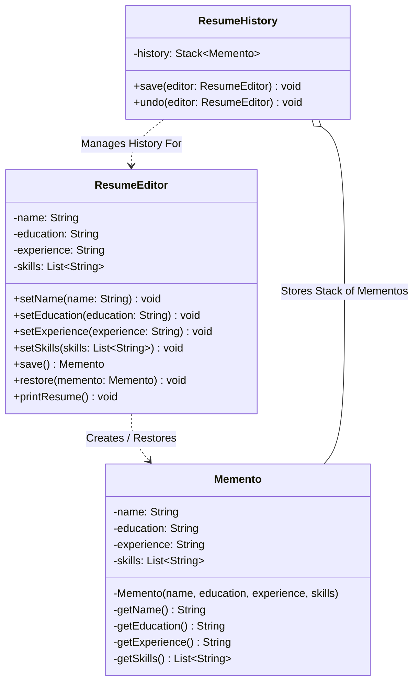

# 10 - Memento Design Pattern

## Core Idea

The **Memento Pattern** is a behavioral design pattern that allows capturing and externalizing an object's internal state into an immutable snapshot (**Memento**) so that the object can be restored to this exact state later without violating encapsulation. It assigns history management to a **Caretaker** while ensuring only the **Originator** has access to the internal state stored within the memento.

---

## 💡 Real-Life Analogy

### 💾 Video Game Save Points & Google Docs Version History
- **Video Game Checkpoint:** Before facing a boss, the game engine creates a save checkpoint (Memento). If your character dies, the engine reverts your inventory, health, and position back to that exact snapshot without exposing save file internals to other game systems.
- **Resume / Document Editor:** As you edit text, formatting, and skills, snapshots are pushed to an undo history stack. Clicking "Undo" pops the latest memento and restores the editor.

---

## 🔑 The 3 Key Components

```
+----------------+      creates / restores      +--------------------+
|   Originator   | ---------------------------> |      Memento       |
| (ResumeEditor) |                              | (Immutable State)  |
+----------------+                              +--------------------+
        ^                                                 ^
        | calls save() / undo()                           | stores in stack
+----------------+                                        |
|   Caretaker    | ---------------------------------------+
| (ResumeHistory)|
+----------------+
```

1. **Originator:** Owns the mutable state; creates new Mementos (`save()`) and restores its state from a Memento (`restore(memento)`).
2. **Memento:** Passive, immutable data capsule holding a snapshot of the Originator's internal fields.
3. **Caretaker:** Manages the history timeline (e.g. `Stack<Memento>`) and triggers save/undo without modifying or inspecting memento fields.

---

## 🏗️ Structure & UML Class Diagram



---

## ❌ Bad Design (Exposing Internal State and Breaking Encapsulation)

```java
// Snapshot object exposes public mutable fields, destroying encapsulation
class BadResumeSnapshot {
    public String name;
    public String education;
    public List<String> skills;

    public BadResumeSnapshot(BadResumeEditor editor) {
        // ❌ Leaking editor fields directly to the world
        this.name = editor.name;
        this.education = editor.education;
        this.skills = new ArrayList<>(editor.skills);
    }
}

// Client manually managing raw snapshots without a caretaker or multi-level history
class BadClient {
    public static void main(String[] args) {
        BadResumeEditor editor = new BadResumeEditor();
        BadResumeSnapshot snapshot = new BadResumeSnapshot(editor);

        // Any external code can tamper with the snapshot fields!
        snapshot.name = "Hacked Name";
    }
}
```

### What is wrong?
- ⚠️ **Breaks Encapsulation:** Making snapshot state fields `public` allows external classes to inspect or tamper with private originator data.
- ⚠️ **Tight Coupling:** Any field change in `ResumeEditor` requires rewriting external snapshot and client code.
- ⚠️ **No Caretaker / Single Undo Limit:** Only a single hardcoded snapshot is stored with no multi-level history stack.

---

## ✅ Good Design (Adhering to Memento Pattern)

Encapsulate state inside an immutable inner `Memento` managed by `ResumeHistory`:

```java
// 1. Originator Class
class ResumeEditor {
    private String name;
    private String education;
    private String experience;
    private List<String> skills = new ArrayList<>();

    public void setDetails(String name, String education, String experience, List<String> skills) {
        this.name = name;
        this.education = education;
        this.experience = experience;
        this.skills = new ArrayList<>(skills);
    }

    // Creates an immutable snapshot
    public Memento save() {
        return new Memento(name, education, experience, List.copyOf(skills));
    }

    // Restores internal state from snapshot
    public void restore(Memento memento) {
        this.name = memento.name;
        this.education = memento.education;
        this.experience = memento.experience;
        this.skills = new ArrayList<>(memento.skills);
    }

    // 2. Memento Class (Private constructor & immutable fields)
    public static class Memento {
        private final String name;
        private final String education;
        private final String experience;
        private final List<String> skills;

        private Memento(String name, String education, String experience, List<String> skills) {
            this.name = name;
            this.education = education;
            this.experience = experience;
            this.skills = skills;
        }
    }
}

// 3. Caretaker Class (Manages Undo Stack)
class ResumeHistory {
    private final Stack<ResumeEditor.Memento> history = new Stack<>();

    public void save(ResumeEditor editor) {
        history.push(editor.save());
    }

    public void undo(ResumeEditor editor) {
        if (!history.isEmpty()) {
            ResumeEditor.Memento previousState = history.pop();
            editor.restore(previousState);
        } else {
            System.out.println("⚠️ No previous states to undo.");
        }
    }
}
```

### Why it better demonstrates the concept:
- ✅ **Strict Encapsulation:** Memento fields and constructors are private to `ResumeEditor`. External classes cannot inspect or tamper with snapshot state.
- ✅ **Multi-Level Undo/Redo:** `ResumeHistory` manages an arbitrary depth history stack.
- ✅ **Separation of Concerns:** `ResumeEditor` focuses only on editing; `ResumeHistory` focuses purely on stack management.

---

## Java Classes

- **`ResumeEditor` (Originator):** Holds active resume data and produces/consumes `Memento` snapshots.
- **`ResumeEditor.Memento` (Memento):** Immutable inner class storing a point-in-time state of the resume.
- **`ResumeHistory` (Caretaker):** Stores the history stack of mementos and coordinates undo operations.

---

## How It Works

1. Client initializes `ResumeEditor` and fills in details.
2. Caretaker records a snapshot before major edits: `history.save(editor);`
3. User modifies the resume with new skills or experience.
4. Calling `history.undo(editor)` pops the most recent memento from the stack and invokes `editor.restore(memento)`.

---

## When to Use

- **Multi-Level Undo / Redo:** Text editors (Word/Docs), graphic software (Photoshop/Figma canvas), diagramming tools.
- **Database & Transactional Rollbacks:** Creating checkpoints/savepoints before batch operations and rolling back on failure.
- **Game State Checkpoints:** Saving progress at level boundaries or boss checkpoints.

---

## When NOT to Use

- **High-Frequency Snapshots on Massive Objects:** Storing hundreds of full-object deep copies in memory can trigger `OutOfMemoryError`. (Use incremental diffs instead).
- **Stateless Services:** Applications without mutable lifecycles do not need mementos.

---

## LLD Takeaway

The Memento Pattern is the standard architectural mechanism for **State Snapshots & Encapsulated Rollbacks** in Low-Level Design. It allows you to build multi-level undo/redo systems without leaking internal domain entity fields.

---

## 🎯 Quick Summary

- **Core Idea:** Capture and externalize an object's internal state into an immutable snapshot to restore it later without violating encapsulation.
- **Code Demonstrates:** `ResumeHistory` caretaker using a stack of `Memento` snapshots to restore `ResumeEditor` state step-by-step.
- **LLD Takeaway:** Keep snapshot creation internal to the Originator and history tracking delegated to a Caretaker.
- **Memorable Rule:** *"The Originator creates and restores the snapshot; the Caretaker only stores it."*
