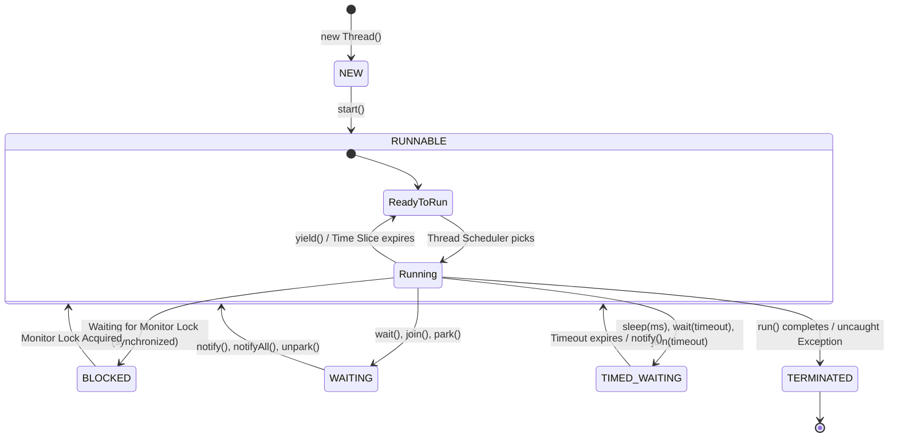

# 02 - Creating and Managing Threads in Java

## Core Idea

In Java, threads can be created and managed using four primary approaches: extending the **`Thread` class**, implementing the **`Runnable` interface** (fire-and-forget), using **lambdas**, or implementing **`Callable<V>` with `Future<V>` / `FutureTask<V>`** (when asynchronous results or checked exceptions are required). Managing threads involves orchestrating their lifecycle transitions across `NEW`, `RUNNABLE`, `BLOCKED`, `WAITING`, `TIMED_WAITING`, and `TERMINATED` states.

---

## 💡 Key Approaches to Create Threads

| Approach | Method Contract | Returns Value? | Throws Checked Exceptions? | Best Used For |
|---|---|---|---|---|
| **1. Extending `Thread`** | `void run()` | ❌ No (`void`) | ❌ No | Simple demo code; restricts inheritance. |
| **2. Implementing `Runnable`** | `void run()` | ❌ No (`void`) | ❌ No | Clean task separation; fire-and-forget background tasks. |
| **3. Lambda Expression** | `() -> { ... }` | ❌ No (`void`) | ❌ No | Concise inline tasks without boilerplate classes. |
| **4. Implementing `Callable<V>`** | `V call()` | ✅ Yes (`Future<V>`) | ✅ Yes (`throws Exception`) | Asynchronous computation returning results (e.g. ETA calculation). |

---

## 🔄 Java Thread Lifecycle State Machine



---

## ❌ Bad Design (Sequential Blocking & Extending Thread Anti-Pattern)

```java
// ❌ Sequential blocking: User waits 2s + 3s + 5s = 10 seconds total
class SequentialOrderService {
    public void processOrder() throws InterruptedException {
        sendSMS();       // Blocks 2s
        sendEmail();     // Blocks 3s
        String eta = calculateETA(); // Blocks 5s
        System.out.println("Total delay: 10 seconds");
    }
}

// ❌ Extending Thread wastes single inheritance and cannot return values
class BadETAThread extends Thread {
    public void run() {
        // Cannot return the computed ETA string because run() is void!
    }
}
```

### What is wrong?
- ⚠️ **Sequential Bottleneck:** Blocks the main thread for the sum of all task delays.
- ⚠️ **Inheritance Restriction:** Extending `Thread` prevents extending any other domain class (e.g. `extends BaseService`).
- ⚠️ **Cannot Return Results:** `Thread.run()` and `Runnable.run()` return `void`, preventing caller from capturing computed values.

---

## ✅ Good Design (Using `Runnable` for Side-Effects and `Callable` for Results)

```java
import java.util.concurrent.*;

public class GoodOrderService {
    public static void main(String[] args) throws Exception {
        ExecutorService executor = Executors.newFixedThreadPool(3);

        // 1. Fire-and-Forget tasks using Runnable
        Runnable smsTask = () -> {
            try { Thread.sleep(2000); } catch (InterruptedException e) {}
            System.out.println("📱 [SMS] Dispatched OTP (2s)");
        };

        Runnable emailTask = () -> {
            try { Thread.sleep(3000); } catch (InterruptedException e) {}
            System.out.println("📧 [Email] Dispatched Invoice (3s)");
        };

        // 2. Value-returning task using Callable<String>
        Callable<String> etaTask = () -> {
            Thread.sleep(5000);
            return "25 minutes (Driver: Rahul)";
        };

        // Submit tasks concurrently
        executor.submit(smsTask);
        executor.submit(emailTask);
        Future<String> etaFuture = executor.submit(etaTask);

        // Blocks only for the ETA calculation (~5s total instead of 10s)
        String etaResult = etaFuture.get();
        System.out.println("🛵 ETA Result Received: " + etaResult);

        executor.shutdown();
    }
}
```

### Why it better demonstrates the concept:
- ✅ **Decoupled Architecture:** Tasks implement `Runnable` / `Callable` instead of subclassing `Thread`.
- ✅ **Asynchronous Return Values:** `Future.get()` retrieves the computed ETA cleanly with checked exception handling.
- ✅ **Concurrency Overlap:** Total response time drops from 10s down to 5s.

---

## Java Classes

- **`SMSTask` (Implements `Runnable`):** Fire-and-forget SMS notification worker.
- **`EmailTask` (Implements `Runnable`):** Fire-and-forget Email receipt worker.
- **`ETACalculationTask` (Implements `Callable<String>`):** Value-returning background worker calculating delivery ETA.
- **`CreatingAndManagingThreadsExample` (Main Driver):** Demonstrates `Thread`, `Runnable`, `Callable` + `Future`, `FutureTask`, and Thread Lifecycle inspection.

---

## How It Works

1. **`Thread.start()` vs `Thread.run()`:** Calling `start()` creates a new OS thread and moves state to `RUNNABLE`. Calling `run()` directly executes synchronously on the calling thread.
2. **`Thread.join()`:** Causes the calling thread to enter `WAITING` until the target thread terminates.
3. **`Future.get()`:** Blocks the calling thread (`WAITING`) until the asynchronous `Callable.call()` finishes and returns the computed generic value.
4. **`FutureTask<V>`:** A bridge class implementing both `Runnable` and `Future`, allowing a `Callable` to be wrapped and passed to a raw `new Thread(futureTask).start()`.

---

## When to Use

- **`Runnable`:** Logging, analytics ingestion, sending push notifications/emails, metrics flushers where no return value is required (*Fire-and-Forget*).
- **`Callable<V>` & `Future<V>`:** Database queries, external API calls, parallel map-reduce aggregations, search queries where results are needed.
- **`FutureTask<V>`:** When you need a cancellable, value-returning asynchronous task that can be executed directly by a single `Thread` or customized runner.

---

## When NOT to Use Raw `Thread` Creation

- **High-Volume Web Requests:** Never create `new Thread()` per request in production backends. Unbounded thread creation exhausts OS memory and causes thread thrashing. (Use **`ThreadPoolExecutor`**).

---

## LLD Takeaway

Mastering `Runnable`, `Callable`, `Future`, and thread lifecycle management is required for building **Asynchronous Task Workers**, **Parallel Aggregators (Scatter-Gather)**, and **Multi-Service Microservice Gateways** in Low-Level Design.

---

## 🎯 Quick Summary

- **Core Idea:** Java provides `Runnable` for fire-and-forget tasks and `Callable<V>` + `Future<V>` for asynchronous value-returning computations.
- **Code Demonstrates:** Parallel execution of SMS (`Runnable`), Email (`Runnable`), and ETA Calculation (`Callable<String>`) using `ExecutorService` and `FutureTask`.
- **LLD Takeaway:** Favor `Runnable`/`Callable` interfaces over extending `Thread` to preserve composition, enable thread pooling, and retrieve asynchronous results.
- **Memorable Rule:** *"Use Runnable when you don't need a result; use Callable with Future when you do."*
