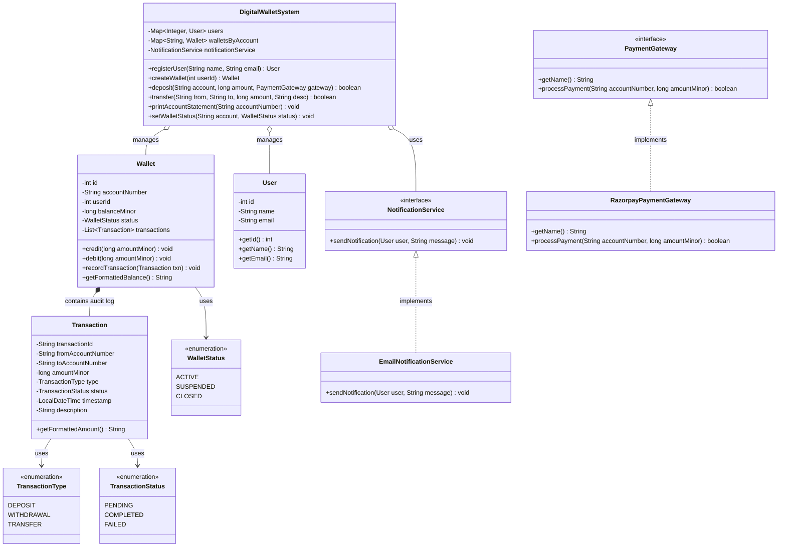

# Digital Wallet System - Low-Level Design

## 1. Problem Statement

Design a secure, concurrent **Digital Wallet System** supporting the native **TUF currency** that enables:
- User onboarding and wallet provisioning with unique account numbers (enforcing a 1:1 user-to-wallet constraint).
- Adding money via pluggable **Payment Gateways** (e.g. Razorpay, Stripe).
- Atomic **Peer-to-Peer (P2P) transfers** between wallets with strict concurrency control and deadlock prevention.
- Minimum balance constraints (balance $\ge$ 0.00 TUF; no overdrafts) and minimum transfer amounts.
- Complete audit trails, immutable transaction histories, and printable **Account Statements**.
- Real-time transactional notifications (Email/SMS).
- Administrative controls (suspend, reopen, close wallets).

---

## 2. Requirements

### Functional Requirements
- **User & Wallet Creation:** Register users and provision a single active wallet per user with unique account identifiers (`ACC-0001`).
- **Deposit Funds:** Add money to a wallet via external payment gateways (`PaymentGateway` strategy).
- **P2P Transfer:** Transfer funds atomically from a sender wallet to a receiver wallet.
- **Account Constraints:** Account balances cannot drop below 0.00 TUF. Minimum transferable amount is 0.01 TUF (1 minor unit).
- **Currency Precision:** All monetary amounts are stored and calculated in **minor units** (`long` integer representing cents/paisa, e.g., 100.50 TUF = `10050`) to eliminate floating-point rounding errors.
- **Account Statements & Audit Trail:** Maintain an immutable record of all transactions (`DEPOSIT`, `WITHDRAWAL`, `TRANSFER`) with statuses (`COMPLETED`, `FAILED`).
- **Notifications:** Dispatch notifications to users upon deposit or transfer completion.
- **Admin Management:** Enable administrators to `SUSPEND`, `REOPEN`, or `CLOSE` wallets, blocking transactions on inactive wallets.

### Important Non-Functional Requirements
- **Thread Safety & Data Consistency:** Prevent race conditions, double-spending, and deadlocks during concurrent bidirectional transfers using **deterministic ordered locking**.
- **Extensibility:** Pluggable payment gateways and notification channels (Open/Closed Principle via Strategy Pattern).
- **Interview Simplicity:** Lean, cohesive design (~10-12 classes) free from unnecessary enterprise frameworks or redundant DAO boilerplate.

---

## 3. Core Entities

1. **`User`**: Represents the wallet owner (`id`, `name`, `email`).
2. **`Wallet`**: Core entity encapsulating account number, user reference, balance in minor units (`long`), operating status, and transaction history.
3. **`Transaction`**: Immutable audit record capturing transaction ID, source/destination accounts, amount, type, status, timestamp, and description.
4. **`PaymentGateway`**: Strategy interface for external deposit processing.
5. **`RazorpayPaymentGateway`**: Concrete payment gateway implementation.
6. **`NotificationService`**: Strategy interface for transactional user alerts.
7. **`EmailNotificationService`**: Concrete email delivery channel.
8. **`DigitalWalletSystem`**: Central facade orchestrating users, wallets, atomic transfers, locking, and statements.
9. **`WalletStatus`** (`Enum`): `ACTIVE`, `SUSPENDED`, `CLOSED`.
10. **`TransactionType`** (`Enum`): `DEPOSIT`, `WITHDRAWAL`, `TRANSFER`.
11. **`TransactionStatus`** (`Enum`): `PENDING`, `COMPLETED`, `FAILED`.

---

## 4. Main Use Cases

1. **User Registration & Wallet Provisioning:** Onboard a user and create a dedicated wallet (`ACC-0001`).
2. **Deposit via Payment Gateway:** Charge external card/bank and credit wallet balance.
3. **Peer-to-Peer Transfer:** Debit sender and credit receiver atomically under synchronized ordered locks.
4. **Account Statement Generation:** Retrieve full historical statement with formatted currency and transaction statuses.
5. **Admin Status Management:** Suspend a compromised wallet and reject attempted debit/credit transactions until reopened.

---

## 5. Class Responsibilities

| Class / Interface / Enum | Responsibility (1 Line) |
|---|---|
| **`WalletStatus`** | Enum defining wallet states (`ACTIVE`, `SUSPENDED`, `CLOSED`). |
| **`TransactionType`** | Enum defining transaction categories (`DEPOSIT`, `WITHDRAWAL`, `TRANSFER`). |
| **`TransactionStatus`** | Enum defining transaction states (`PENDING`, `COMPLETED`, `FAILED`). |
| **`User`** | Domain entity holding user profile metadata. |
| **`Transaction`** | Immutable audit log record with timestamps and minor-unit currency formatting. |
| **`Wallet`** | Encapsulates minor-unit balance mutations, status transitions, and audit records. |
| **`PaymentGateway`** | Strategy interface for processing external payments. |
| **`RazorpayPaymentGateway`** | Concrete payment provider simulating gateway authorization and capture. |
| **`NotificationService`** | Strategy interface for sending transactional notifications. |
| **`EmailNotificationService`** | Concrete notification channel delivering email messages. |
| **`DigitalWalletSystem`** | Facade orchestrator managing atomic transfers with ordered locking and audit logs. |
| **`Main`** | Driver simulation demonstrating all operations, edge cases, and concurrency. |

---

## 6. Class Relationships



---

## 7. Design

### Important Design Decisions

1. **Minor Units for Monetary Precision (`long` instead of `double`):**
   - Financial applications must never use `double` or `float` due to binary floating-point representation errors (e.g. `0.1 + 0.2 = 0.30000000000000004`).
   - Storing balances in minor units (`100.50 TUF` = `10050` cents/paisa as `long`) ensures exact integer arithmetic and zero precision loss.
2. **Deadlock-Free Ordered Locking (Concurrency Control):**
   - When User A transfers to User B while User B transfers to User A simultaneously:
     - Thread 1 locks A and waits for B.
     - Thread 2 locks B and waits for A $\rightarrow$ **Deadlock!**
   - **Solution:** Always acquire locks in a globally deterministic order sorted by `Wallet.id` (`firstLock = min(idA, idB)`, `secondLock = max(idA, idB)`). This guarantees circular wait is mathematically impossible.
3. **Strategy Pattern for Payment Gateways & Notifications:**
   - Decouples external providers from core wallet logic, allowing runtime switching between providers (`Razorpay`, `Stripe`, `PayPal`).
4. **Immutable Audit Trail:**
   - `Transaction` records are created and appended to both sender and receiver histories upon completion or failure, providing complete financial traceability.

---

### Concurrency & Locking Comparison

| Approach | Description | Pros | Cons / When to Use |
|---|---|---|---|
| **Approach 1: DB Row-Level Locking (`SELECT FOR UPDATE`)** | Database transactions lock rows until commit. | Strong consistency guaranteed by SQL engine. | Locks held during entire DB transaction; database-specific. |
| **Approach 2: Optimistic Locking (`@Version` / Timestamp)** | Check version before update; fail/retry on mismatch. | Lock-free; high throughput for read-heavy workloads. | High retry rates under heavy concurrent writes to the same account. |
| **Approach 3: Deterministic Application Locking (Our Implementation)** | Synchronize on wallet objects ordered by `walletId`. | **Deadlock-free**, zero external dependencies, extremely fast in-memory execution. | Best for in-memory LLD interviews and distributed lock managers (e.g., Redlock on Redis). |

---

### SOLID Principles

- **Single Responsibility Principle (SRP):**
  - `Wallet` manages its own balance and transaction log.
  - `DigitalWalletSystem` coordinates inter-wallet transfers and account lifecycle.
  - `PaymentGateway` handles external payment processor integrations.
- **Open/Closed Principle (OCP):**
  - Add new payment gateways or notification channels by implementing interfaces without changing wallet transfer logic.
- **Liskov Substitution Principle (LSP):**
  - Any `PaymentGateway` or `NotificationService` implementation can be substituted seamlessly.
- **Interface Segregation Principle (ISP):**
  - Clean, minimal interfaces (`PaymentGateway`, `NotificationService`).
- **Dependency Inversion Principle (DIP):**
  - `DigitalWalletSystem` depends on abstractions (`PaymentGateway`, `NotificationService`), not concrete classes.

---

## 8. Main Flows

### Flow 1: External Deposit via Payment Gateway
```
Client initiates Deposit (100.00 TUF -> ACC-0001 via Razorpay)
  │
  ▼
DigitalWalletSystem.deposit("ACC-0001", 10000, razorpay)
  │
  ├── Validate: Wallet exists and is ACTIVE
  ├── RazorpayPaymentGateway.processPayment("ACC-0001", 10000) ──> Returns true
  │
  ▼
synchronized(wallet) {
  wallet.credit(10000)
  wallet.recordTransaction(DEPOSIT, COMPLETED, 100.00 TUF)
}
  │
  ▼
NotificationService.sendNotification(user, "Deposit successful")
```

### Flow 2: Deadlock-Free P2P Fund Transfer
```
Alice (ACC-0001, id=1) transfers 50.00 TUF to Bob (ACC-0002, id=2)
  │
  ▼
DigitalWalletSystem.transfer("ACC-0001", "ACC-0002", 5000, "Dinner")
  │
  ├── Validate: from != to, amount >= 1 minor unit, both accounts ACTIVE
  ├── Determine Lock Order:
  │     firstLock  = Wallet with id 1 (Alice)
  │     secondLock = Wallet with id 2 (Bob)
  │
  ▼
synchronized (firstLock) {
  synchronized (secondLock) {
    ├── Check: Alice.balance >= 5000
    ├── Alice.debit(5000)
    ├── Bob.credit(5000)
    │
    ├── Create Transaction(TXN-1234, TRANSFER, COMPLETED, 50.00 TUF)
    ├── Alice.recordTransaction(TXN-1234)
    └── Bob.recordTransaction(TXN-1234)
  }
}
  │
  ▼
Dispatch notifications to both Alice and Bob
```

---

## 9. Edge Cases

| Edge Case | Handling in Implementation |
|---|---|
| **Insufficient Balance / Overdraft** | Checked under synchronized lock; creates a `FAILED` transaction audit record and aborts transfer. |
| **Self-Transfer** | Rejected immediately if `fromAccount.equals(toAccount)`. |
| **Zero or Negative Amount** | Rejected if `amountMinor <= 0` (minimum transferable amount is 0.01 TUF). |
| **Suspended / Closed Wallet** | Validated before and inside lock; credit/debit operations throw `IllegalStateException`. |
| **Simultaneous Bidirectional Transfers** | **Deadlock-free** ordered locking by `Wallet.id` eliminates circular wait conditions. |
| **Floating-Point Rounding Error** | Eliminated by storing all balances and amounts as integer minor units (`long`). |
| **Duplicate User Wallets** | `createWallet` enforces the 1:1 user-to-wallet constraint via `walletsByUser` lookup. |

---

## 10. How the Code Works

1. **User Onboarding:** Users are registered in the `DigitalWalletSystem`, and a wallet is provisioned with unique account numbers (`ACC-0001`).
2. **Depositing Funds:** Money is added via `deposit()`, which calls the `PaymentGateway` strategy and credits minor units to the wallet balance.
3. **Atomic Transfers:**
   - Checks account validity and non-negative transfer amounts.
   - Computes `firstLock` and `secondLock` using `wallet.getId()`.
   - Acquires locks sequentially, validates sufficient balance, debits the sender, and credits the recipient.
   - Generates an immutable `Transaction` object and appends it to both wallets.
   - Notifies both parties via `NotificationService`.
4. **Statements:** `printAccountStatement()` displays current balances and an audit log of all completed and failed transactions.

---

## 11. How to Run

### Prerequisites
- Java JDK 11 or higher.

### Compilation & Execution
```bash
# Navigate to the project directory
cd 13-Interview-Problems-Part-3/03-Digital-Wallet-Design

# Compile Java files
mkdir -p bin
javac -d bin src/digitalwallet/*.java

# Run the simulation
java -cp bin digitalwallet.Main
```

---

## 12. Bad vs Good Design

### ❌ Bad Design (Float Balances & Unordered Locking)

```java
// ❌ Anti-pattern 1: Floating-point money arithmetic leads to rounding errors
class BadWallet {
    double balance = 100.50; // 0.1 + 0.2 != 0.3!
}

// ❌ Anti-pattern 2: Unordered locking causes DEADLOCK under concurrent transfers
class BadWalletService {
    public void transfer(Wallet from, Wallet to, double amount) {
        synchronized(from) {        // Thread 1 locks A, waits for B
            synchronized(to) {      // Thread 2 locks B, waits for A -> DEADLOCK!
                from.balance -= amount;
                to.balance += amount;
            }
        }
    }
}
```

### ✅ Good Design (Minor Units & Deterministic Ordered Locking)

```java
// ✅ Exact integer arithmetic in minor units (long)
public class Wallet {
    private long balanceMinor; // 100.50 TUF = 10050 minor units
}

// ✅ Deterministic lock acquisition order eliminates circular wait
public class DigitalWalletSystem {
    public boolean transfer(Wallet from, Wallet to, long amountMinor) {
        Wallet firstLock  = from.getId() < to.getId() ? from : to;
        Wallet secondLock = from.getId() < to.getId() ? to : from;

        synchronized (firstLock) {
            synchronized (secondLock) {
                from.debit(amountMinor);
                to.credit(amountMinor);
            }
        }
        return true;
    }
}
```

---

## 13. Interview Thinking

### How I Would Explain This in an Interview

1. **Clarify Requirements (2 mins):** Confirm currencies, minor-unit precision, P2P transfers, deposit methods, locking strategy, and account constraints.
2. **Define Core Entities (3 mins):** `User`, `Wallet`, `Transaction`, Enums (`WalletStatus`, `TransactionType`, `TransactionStatus`), and interfaces (`PaymentGateway`, `NotificationService`).
3. **Address Concurrency & Deadlocks (5 mins):** Explain the deadlock vulnerability in two-way transfers and demonstrate **deterministic ordered locking** by `walletId`.
4. **Detail Monetary Precision (2 mins):** Explain why `long` minor units are used instead of `double` to prevent financial rounding inaccuracies.
5. **Implement Core Classes (20 mins):** Code `Wallet`, `Transaction`, `DigitalWalletSystem`, and `PaymentGateway`.
6. **Walkthrough Edge Cases & Audit Logs (8 mins):** Demonstrate overdraft rejection, account suspension, immutable statements, and failure logging.

### Likely Follow-up Questions

1. **Q: How do you scale this across multiple microservice instances?**
   - *A:* Replace in-memory `synchronized` blocks with a distributed lock manager like Redis Redlock (locking `wallet_lock:{id}` in sorted key order) or use database row-level locking (`SELECT FOR UPDATE` sorted by primary key).
2. **Q: How would you handle idempotent payment callbacks from Razorpay/Stripe?**
   - *A:* Store a unique `idempotencyKey` / `providerReference` in the `Transaction` table. Check if the transaction was already processed before applying credits.
3. **Q: How would you support multi-currency wallets (e.g. USD, EUR, TUF)?**
   - *A:* Change `balance` in `Wallet` to a `Map<Currency, Long> balances` and introduce an `FXRateService` to handle currency conversion during cross-currency transfers.
4. **Q: What if a transfer debit succeeds but the credit fails due to a system crash?**
   - *A:* In a database environment, wrap both operations in an ACID transaction (`BEGIN TRANSACTION ... COMMIT`). In distributed architectures, use the **Saga Pattern** with compensating transactions.

---

## 14. Trade-offs

| Decision | Chosen Approach | Alternative Considered | Trade-off / Rationale |
|---|---|---|---|
| **Currency Representation** | `long` Minor Units | `BigDecimal` or `double` | `long` provides exact integer arithmetic with superior performance and zero memory overhead compared to `BigDecimal`. |
| **Concurrency Locking** | Ordered `synchronized` Locks | Optimistic Locking (`@Version`) | Ordered locking provides guaranteed deadlock-free execution without retry storms under high contention on the same wallet. |
| **Architecture Scope** | Facade + Domain Entities | Controller + Service + Repository + DTO | Kept to clean, cohesive domain models suitable for a 45-minute technical interview. |

---

## 🎯 Quick Summary

- **Problem:** Digital wallet system supporting deposits, P2P transfers, minor-unit currency precision, and audit trails.
- **Core Classes:** `Wallet`, `Transaction`, `User`, `DigitalWalletSystem`, `PaymentGateway`, `NotificationService`.
- **Main Flow:** Onboard user $\rightarrow$ Deposit via gateway $\rightarrow$ Acquire ordered locks $\rightarrow$ Atomically debit sender & credit receiver $\rightarrow$ Record immutable transaction $\rightarrow$ Notify users.
- **Important Design:** Strategy Pattern for gateways and notifications; deterministic sorted-ID locking for deadlock prevention.
- **Edge Cases:** Overdraft protection, self-transfer rejection, inactive wallet blocking, floating-point error elimination.
- **LLD Takeaway:** Always use minor units (`long`) for money and deterministic lock ordering to guarantee deadlock freedom.
- **Memorable Rule:** *Always lock the lower wallet ID first to make circular deadlocks mathematically impossible.*
