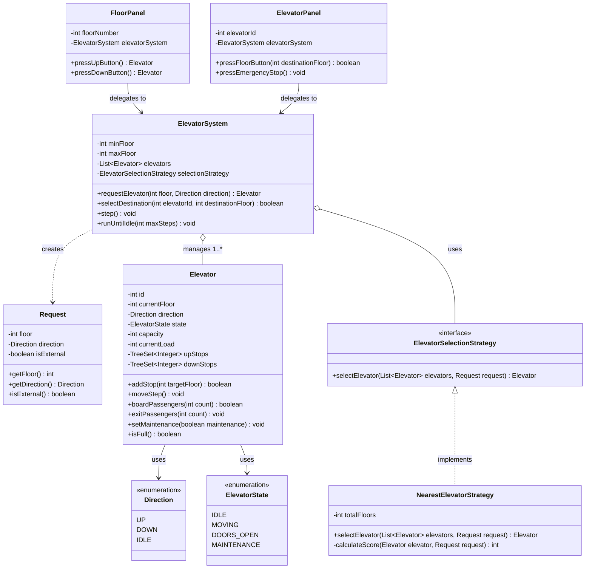

# Elevator System - Low-Level Design

## 1. Problem Statement

Design a multi-car **Elevator Control System** for a multi-floor building that handles:
- External hall calls (passengers requesting an elevator from a floor going `UP` or `DOWN`).
- Internal cabin calls (passengers inside an elevator selecting a destination floor).
- Optimal elevator dispatching to minimize passenger wait times.
- Safe elevator movement and stop scheduling using the **LOOK / SCAN** algorithm.
- Real-world constraints such as maximum cabin capacity, door safety, emergency stop, and maintenance mode.

---

## 2. Requirements

### Functional Requirements
- **Multi-Floor & Multi-Elevator:** Support $N$ floors (`minFloor` to `maxFloor`) and $M$ elevator cars.
- **External Hall Requests:** Passengers on any floor can press `UP` or `DOWN` on the floor panel.
- **Internal Cabin Requests:** Passengers inside an elevator can press destination floor buttons.
- **Pluggable Dispatching:** System selects the best elevator using a swappable strategy (e.g., `NearestElevatorStrategy`).
- **LOOK / SCAN Movement:** An elevator continues in its current direction servicing all pending stops in that direction before reversing.
- **Capacity Management:** Prevent passenger boarding when the elevator reaches maximum capacity.
- **Safety & Maintenance:** Doors cannot open while moving; elevators under maintenance or in emergency stop mode are excluded from new external dispatches.

### Important Non-Functional Requirements
- **Thread Safety & Concurrency:** Thread-safe state transitions and request scheduling to prevent race conditions.
- **Extensibility:** Open/Closed Principle applied to elevator selection strategies without modifying core elevator logic.
- **Simplicity & Explainability:** Lean, interview-sized object model (~10 classes) that can be coded and explained in a 45-minute technical interview without enterprise boilerplate.

---

## 3. Core Entities

1. **`Elevator`**: Represents a physical elevator car with position (`currentFloor`), `direction`, `state`, passenger load, and scheduled stops (`upStops`, `downStops`).
2. **`ElevatorSystem`**: Central orchestrator and facade managing the elevator fleet, dispatching requests, and running simulation steps.
3. **`Request`**: Encapsulates floor request data (source floor, destination floor, direction, and request type).
4. **`FloorPanel`**: External button panel located at each floor.
5. **`ElevatorPanel`**: Internal cabin panel located inside each elevator.
6. **`ElevatorSelectionStrategy`**: Strategy interface defining the contract for dispatching algorithms.
7. **`NearestElevatorStrategy`**: Concrete strategy scoring proximity, directional alignment, and passenger load.
8. **`Direction`** (`Enum`): `UP`, `DOWN`, `IDLE`.
9. **`ElevatorState`** (`Enum`): `IDLE`, `MOVING`, `DOORS_OPEN`, `MAINTENANCE`.

---

## 4. Main Use Cases

1. **Call Elevator from Floor (Hall Call):** Passenger at Floor 3 presses `UP` $\rightarrow$ System assigns the nearest suitable elevator $\rightarrow$ Elevator schedules stop at Floor 3.
2. **Select Destination (Car Call):** Passenger inside Elevator 1 presses Floor 8 $\rightarrow$ Elevator schedules destination stop at Floor 8.
3. **Elevator Step Movement (LOOK/SCAN):** Elevator advances floor-by-floor, stops at scheduled floors, opens doors, lets passengers board/alight, closes doors, and continues or reverses direction.
4. **Overload Prevention:** Passenger attempts to board an already full elevator $\rightarrow$ Boarding rejected.
5. **Emergency Stop / Maintenance:** Operator or passenger triggers emergency stop $\rightarrow$ Elevator clears stops, enters `MAINTENANCE` state, and is excluded from dispatching.

---

## 5. Class Responsibilities

| Class / Interface / Enum | Responsibility (1 Line) |
|---|---|
| **`Direction`** | Enum defining vertical movement directions (`UP`, `DOWN`, `IDLE`). |
| **`ElevatorState`** | Enum defining operating and safety states (`IDLE`, `MOVING`, `DOORS_OPEN`, `MAINTENANCE`). |
| **`Request`** | Encapsulates request parameters (floor, direction, external/internal flag). |
| **`Elevator`** | Encapsulates car state, load capacity, LOOK/SCAN stop sets (`TreeSet`), and door cycles. |
| **`ElevatorSelectionStrategy`** | Strategy interface for selecting the optimal elevator for a hall request. |
| **`NearestElevatorStrategy`** | Concrete strategy selecting car based on distance, direction match, and load. |
| **`ElevatorSystem`** | Facade orchestrating elevators, dispatching requests, and stepping simulation. |
| **`FloorPanel`** | Hardware abstraction for external floor up/down call buttons. |
| **`ElevatorPanel`** | Hardware abstraction for internal cabin floor buttons and emergency stop. |
| **`Main`** | Driver simulation demonstrating all core flows and edge cases. |

---

## 6. Class Relationships



---

## 7. Design

### Important Design Decisions

1. **LOOK / SCAN Algorithm with `TreeSet<Integer>`:**
   - Instead of a naive FIFO queue (which causes massive elevator thrashing back and forth), we maintain two sorted sets: `upStops` (ascending) and `downStops` (descending).
   - `TreeSet` provides $O(\log N)$ insertion, sorted traversal, and automatic duplicate suppression (multiple people requesting Floor 5 only creates one stop).
2. **Strategy Pattern for Dispatching:**
   - The dispatching logic is decoupled behind `ElevatorSelectionStrategy`. This allows seamless swapping between Nearest-Car, Zone-Based, or Energy-Saving dispatchers without modifying `ElevatorSystem` or `Elevator`.
3. **Facade Pattern in `ElevatorSystem`:**
   - Provides a clean, unified API for external floor panels and internal cabin panels to interact with the system without coupling them to fleet internals.
4. **State Machine in `Elevator`:**
   - Simplified to 4 clear states (`IDLE`, `MOVING`, `DOORS_OPEN`, `MAINTENANCE`) managed with explicit transition rules, avoiding the bloat of separate class-per-state objects while maintaining safety invariants.

### SOLID Principles

- **Single Responsibility Principle (SRP):**
  - `Elevator` handles its own movement, stops, and passenger load.
  - `ElevatorSelectionStrategy` handles car dispatching algorithms.
  - `ElevatorSystem` coordinates the fleet.
- **Open/Closed Principle (OCP):**
  - New dispatch algorithms can be added by implementing `ElevatorSelectionStrategy` without changing existing code.
- **Liskov Substitution Principle (LSP):**
  - Any `ElevatorSelectionStrategy` implementation can be substituted interchangeably.
- **Interface Segregation Principle (ISP):**
  - Lean, focused interfaces (`ElevatorSelectionStrategy`).
- **Dependency Inversion Principle (DIP):**
  - `ElevatorSystem` depends on the `ElevatorSelectionStrategy` abstraction, not concrete implementations.

### Design Patterns

- **Strategy Pattern:** Used for elevator selection (`ElevatorSelectionStrategy`, `NearestElevatorStrategy`).
  - *Why here?* Dispatch algorithms vary widely across building heights, traffic conditions, and energy modes.
- **Facade Pattern:** Used in `ElevatorSystem`.
  - *Why here?* Hides fleet coordination and scheduling complexity from floor panels and cabin panels.

---

## 8. Main Flows

### Flow 1: External Hall Request (Floor Call)
```
Passenger at Floor 3 presses UP
  │
  ▼
FloorPanel.pressUpButton()
  │
  ▼
ElevatorSystem.requestElevator(3, UP)
  │
  ▼
NearestElevatorStrategy.selectElevator(fleet, request)
  │  ├── Filters out cars in MAINTENANCE or FULL
  │  └── Calculates score: proximity + directional alignment
  ▼
Selected Elevator.addStop(3)
  │  └── Adds 3 to upStops, transitions state from IDLE -> MOVING
```

### Flow 2: Elevator Step & LOOK/SCAN Stop Servicing
```
ElevatorSystem.step()
  │
  ▼
Elevator.moveStep()
  │
  ├── If DOORS_OPEN: Cycles doors closed, transitions to MOVING or IDLE
  │
  ├── If Direction == UP:
  │     currentFloor++
  │     If upStops contains currentFloor:
  │        remove stop -> state = DOORS_OPEN -> chime arrival
  │     If upStops empty & downStops present:
  │        reverse direction to DOWN
  │
  └── If Direction == DOWN:
        currentFloor--
        If downStops contains currentFloor:
           remove stop -> state = DOORS_OPEN -> chime arrival
        If downStops empty & upStops present:
           reverse direction to UP
```

### Flow 3: Internal Cabin Request & Passenger Boarding
```
Elevator arrives at Floor 3 (Doors OPEN)
  │
  ▼
Elevator.boardPassengers(3) ──> checks (currentLoad + 3 <= capacity)
  │
  ▼
ElevatorPanel.pressFloorButton(8)
  │
  ▼
ElevatorSystem.selectDestination(elevatorId, 8)
  │
  ▼
Elevator.addStop(8) ──> Adds 8 to upStops
```

---

## 9. Edge Cases

| Edge Case | Solution in Code |
|---|---|
| **Cabin Capacity Overflow** | `boardPassengers(count)` returns `false` if `currentLoad + count > capacity`. Dispatcher ignores full cars (`isFull()`). |
| **Emergency Stop / Maintenance** | `setMaintenance(true)` clears all pending stops, sets state to `MAINTENANCE`. Dispatcher immediately bypasses this car. |
| **Duplicate Floor Calls** | `TreeSet<Integer>` automatically suppresses duplicate stop requests for the same floor. |
| **Out-of-Bounds Floor Request** | `ElevatorSystem.isValidFloor(floor)` validates against `[minFloor, maxFloor]`, rejecting invalid inputs. |
| **Equidistant Elevators** | `NearestElevatorStrategy` uses passenger load as a secondary tie-breaker (prefers emptier car). |
| **Doors Safety Invariant** | Elevator cannot move when doors are open; a full step is dedicated to closing doors before motion resumes. |

---

## 10. How the Code Works

1. **`ElevatorSystem`** is created with a floor range (`0` to `10`) and $N$ elevators (e.g. 3 cars).
2. External panels (`FloorPanel`) and internal cabin panels (`ElevatorPanel`) delegate user actions to the `ElevatorSystem`.
3. When a hall call arrives, `NearestElevatorStrategy` calculates a score for each elevator:
   - **Idle elevator:** Score = $| \text{currentFloor} - \text{targetFloor} |$
   - **Elevator moving towards target in same direction:** Score = distance on the path
   - **Elevator moving away or opposite direction:** Score = full round-trip penalty + distance
4. The winning elevator adds the floor to its sorted `upStops` or `downStops` set.
5. In each simulation tick (`step()`):
   - Cars with open doors close them and determine their next direction.
   - Moving cars advance one floor in their current direction.
   - If the new floor matches a stop in `upStops` or `downStops`, the car stops and opens doors.
   - When all stops in the current direction are satisfied, the car checks the opposite direction set and reverses, or returns to `IDLE`.

---

## 11. How to Run

### Prerequisites
- Java JDK 11 or higher installed.

### Compilation & Execution
```bash
# Navigate to the project directory
cd 13-Interview-Problems-Part-3/01-Elevator-System-Design

# Compile Java files into bin/
mkdir -p bin
javac -d bin src/elevator/*.java

# Run the simulation
java -cp bin elevator.Main
```

---

## 12. Bad vs Good Design

### ❌ Bad Design (Over-Engineered Monolith or Micro-Layering)

```java
// ❌ Anti-pattern 1: 40 enterprise files with empty controllers, DAOs, and service proxies
public class ElevatorController {
    private ElevatorService elevatorService;
    public void pressButton(int floor) { elevatorService.handle(floor); }
}
public class ElevatorService {
    private ElevatorRepository repo; // In-memory database abstraction for a single in-memory car!
}

// ❌ Anti-pattern 2: Naive FIFO queue causing terrible elevator thrashing
public class BadElevator {
    private Queue<Integer> stops = new LinkedList<>(); // Floor 1 -> Floor 10 -> Floor 2 -> Floor 9!
}
```

### ✅ Good Design (LOOK/SCAN with TreeSet & Clean Strategy)

```java
// ✅ Clean, efficient, and directly explainable in an interview
public class Elevator {
    private final TreeSet<Integer> upStops = new TreeSet<>();
    private final TreeSet<Integer> downStops = new TreeSet<>();

    public synchronized boolean addStop(int targetFloor) {
        if (targetFloor > currentFloor) upStops.add(targetFloor);
        else downStops.add(targetFloor);
        // Automatically sorted, O(log N), no duplicates!
    }
}
```

### Improvements
1. **No Enterprise Boilerplate:** Eliminates 30+ redundant files (Controllers, DTOs, Repositories) that add zero value in an LLD interview.
2. **Algorithmic Efficiency:** Replaced naive FIFO thrashing with disk-scheduling style **LOOK/SCAN** using `TreeSet`.
3. **Extensibility:** Clean `ElevatorSelectionStrategy` allows swapping dispatch algorithms on the fly.

---

## 13. Interview Thinking

### How I Would Explain This in an Interview

1. **Clarify Requirements (2 mins):** Confirm building bounds, number of elevators, external vs internal requests, capacity limits, and maintenance mode.
2. **Identify Core Entities (3 mins):** `Elevator`, `ElevatorSystem`, `Request`, `FloorPanel`, `ElevatorPanel`, and Enums (`Direction`, `ElevatorState`).
3. **Discuss Scheduling Algorithm (5 mins):** Explain why naive FIFO fails and propose the **LOOK/SCAN** algorithm using `TreeSet<Integer>` for `upStops` and `downStops`.
4. **Choose Design Patterns (3 mins):** Introduce `ElevatorSelectionStrategy` (Strategy Pattern) for pluggable dispatching and `ElevatorSystem` (Facade Pattern).
5. **Implement Core Classes (20 mins):** Code `Elevator`, `NearestElevatorStrategy`, `ElevatorSystem`, and panels.
6. **Address Edge Cases & Concurrency (7 mins):** Discuss synchronization (`synchronized` methods), capacity overflow, door safety invariants, and maintenance offline modes.

### Likely Follow-up Questions

1. **Q: How would you handle high concurrency with dozens of requests per second?**
   - *A:* Use `ConcurrentSkipListSet` for thread-safe concurrent stop sets or place external requests into a `BlockingQueue` consumed by a dedicated dispatcher thread.
2. **Q: How would you implement energy-saving mode during off-peak hours?**
   - *A:* Implement an `EnergySavingStrategy` that parks idle elevators at the ground floor and limits active cars to a subset of the fleet.
3. **Q: What if the building has express elevators (e.g., stopping only at floors 1, 10, 20)?**
   - *A:* Add a `Set<Integer> serviceableFloors` to `Elevator`. The selection strategy filters elevators by whether `serviceableFloors.contains(request.getFloor())`.
4. **Q: How do you prevent starvation for opposite-direction requests?**
   - *A:* The LOOK/SCAN algorithm naturally guarantees that once all stops in the current direction are cleared, the elevator immediately reverses and services the opposite set.

---

## 14. Trade-offs

| Decision | Chosen Approach | Alternative Considered | Trade-off / Rationale |
|---|---|---|---|
| **Stop Scheduling** | `TreeSet<Integer>` (LOOK/SCAN) | FIFO `Queue<Integer>` or FCFS | `TreeSet` prevents elevator thrashing and removes duplicate stops in $O(\log N)$ time. |
| **State Representation** | `ElevatorState` Enum + State Machine | State Pattern (7 separate classes) | Enum is concise, readable, and avoids 7 boilerplate classes while still enforcing door and motion safety. |
| **Car Dispatching** | `ElevatorSelectionStrategy` Interface | Hardcoded `if/else` inside `ElevatorSystem` | Interface enables swapping dispatch algorithms (Nearest, Load-Balancing, Zone-based) without modifying core system. |
| **Layering** | Direct Domain + Facade Model | Controller + Service + Repository + DTO | Kept to clean domain models; enterprise layers waste interview time without adding architectural value. |

---

## 🎯 Quick Summary

- **Problem:** Multi-elevator control system with external hall calls, internal cabin calls, and LOOK/SCAN scheduling.
- **Core Classes:** `Elevator`, `ElevatorSystem`, `Request`, `FloorPanel`, `ElevatorPanel`, `NearestElevatorStrategy`.
- **Main Flow:** Passenger calls floor $\rightarrow$ Strategy dispatches nearest car $\rightarrow$ Car schedules stop in `TreeSet` $\rightarrow$ Steps floor-by-floor using LOOK/SCAN $\rightarrow$ Doors cycle $\rightarrow$ Destination selected.
- **Important Design:** Strategy Pattern for dispatching; LOOK/SCAN algorithm with `TreeSet<Integer>` for directional stop ordering.
- **Edge Cases:** Capacity overflow rejection, emergency stop / maintenance mode, duplicate stop suppression, door motion locking.
- **LLD Takeaway:** Favor algorithmic clarity (LOOK/SCAN) and focused design patterns (Strategy) over enterprise layering boilerplate.
- **Memorable Rule:** *Store UP stops in an ascending set, DOWN stops in a descending set, and change direction only when the current path is clear.*
