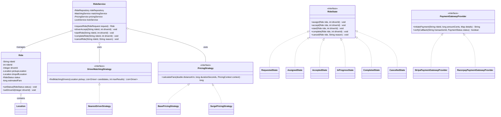

# Ride Booking App (Uber / Lyft) - Low-Level Design

## 1. Problem Statement

Design a robust, concurrent **Ride Booking System** (similar to Uber / Lyft) supporting:
- Rider and Driver onboarding, authentication, and driver availability status (`ONLINE` / `OFFLINE`).
- Real-time location telemetry with GPS coordinate tracking.
- Upfront fare estimates and surge pricing calculation.
- Asynchronous driver matching to the nearest available drivers using pluggable matching strategies.
- Driver double-assignment prevention under concurrent booking traffic via distributed locking.
- State-machine driven ride lifecycle (`REQUESTED` $\rightarrow$ `ASSIGNED` $\rightarrow$ `ACCEPTED` $\rightarrow$ `IN_PROGRESS` $\rightarrow$ `COMPLETED` / `CANCELLED`).
- Multi-channel transactional notifications (Email, SMS) and payment gateway routing (Stripe, Razorpay, PayPal).

---

## 2. Requirements

### Functional Requirements
- **Rider & Driver Accounts:** Register riders and onboard drivers with vehicle details; drivers toggle online/offline.
- **Location & ETA Telemetry:** Drivers periodically update current GPS coordinates; system computes Haversine distance and ETAs.
- **Upfront Fare Estimate:** Riders view guaranteed upfront fare estimate before booking based on distance and duration.
- **Driver Matching:** Asynchronously matches a ride request to the top-$N$ nearest online drivers.
- **Concurrency & Double-Assignment Protection:** Ensure a driver cannot be assigned to multiple active rides concurrently.
- **Driver Accept / Decline:** Driver can accept or decline ride assignment. Declining immediately cascades matching to the next candidate.
- **Trip Progression:** Driver marks pickup (`IN_PROGRESS`) and dropoff (`COMPLETED`), generating a final receipt.
- **Cancellations:** Riders or drivers can cancel rides with reason tracking subject to cancellation policies.
- **Payments & Notifications:** Pluggable payment gateways (`PRE_PAYMENT` and `POST_PAYMENT`) and notifications.

### Important Non-Functional Requirements
- **Concurrency Safety:** Non-blocking distributed lock acquisition preventing driver double-booking race conditions.
- **State Integrity:** Finite State Machine (State Pattern) enforcing valid lifecycle transitions.
- **Extensibility:** Open/Closed Principle for pricing strategies, matching algorithms, and payment gateways.

---

## 3. Package Structure

```
src/
├── controller/
│   ├── DriverController.java
│   ├── PaymentController.java
│   └── RideController.java
├── domain/
│   ├── Driver.java
│   ├── DriverStatus.java              (Enum: ONLINE, OFFLINE, ON_RIDE)
│   ├── FareEstimateResponse.java
│   ├── Location.java
│   ├── NotificationMessage.java
│   ├── PaymentStatus.java             (Enum: PENDING, COMPLETED, FAILED, REFUNDED)
│   ├── PaymentType.java               (Enum: PRE_PAYMENT, POST_PAYMENT)
│   ├── Ride.java                      (Core Entity)
│   ├── Rider.java
│   ├── RideRequest.java
│   ├── RideStatus.java                (Enum: REQUESTED, ASSIGNED, ACCEPTED, IN_PROGRESS, COMPLETED, CANCELLED)
│   ├── RideStatusResponse.java
│   ├── state/
│   │   ├── AcceptedState.java
│   │   ├── AssignedState.java
│   │   ├── CancelledState.java
│   │   ├── CompletedState.java
│   │   ├── InProgressState.java
│   │   ├── RequestedState.java
│   │   └── RideState.java             (State Interface)
│   └── strategy/
│       ├── BasePricingStrategy.java
│       ├── DriverMatchingStrategy.java (Strategy Interface)
│       ├── FastestEtaStrategy.java
│       ├── MockPaymentGatewayProvider.java
│       ├── NearestDriverStrategy.java
│       ├── PaymentGatewayProvider.java (Strategy Interface)
│       ├── PaymentGatewayRouter.java
│       ├── PayPalPaymentGatewayProvider.java
│       ├── PricingContext.java
│       ├── PricingStrategy.java       (Strategy Interface)
│       ├── RazorpayPaymentGatewayProvider.java
│       ├── StripePaymentGatewayProvider.java
│       └── SurgePricingStrategy.java
├── repository/
│   ├── DriverRepository.java
│   ├── LocationRepository.java
│   ├── RideRepository.java
│   ├── RiderRepository.java
│   └── impl/
│       ├── DriverRepositoryImpl.java
│       ├── LocationRepositoryImpl.java
│       ├── RideRepositoryImpl.java
│       └── RiderRepositoryImpl.java
├── service/
│   ├── DriverService.java
│   ├── LocationService.java
│   ├── LockService.java               (Distributed Lock Simulator)
│   ├── MatchingService.java           (Async Driver Matcher)
│   ├── PaymentService.java
│   ├── PricingService.java
│   ├── RideService.java               (Core Orchestrator)
│   └── notification/
│       ├── EmailNotificationChannel.java
│       ├── NotificationChannel.java   (Interface)
│       ├── NotificationRouter.java
│       └── SmsNotificationChannel.java
└── main/
    └── RideSharingSimulation.java     (Driver Simulation)
```

---

## 4. Core Entities

1. **`Ride`**: Represents a trip with pickup/dropoff locations, rider/driver references, fare, timeline timestamps, and state.
2. **`Rider`**: Represents a registered rider profile.
3. **`Driver`**: Represents an onboarded driver with vehicle details, availability status (`ONLINE`, `OFFLINE`), and current GPS location.
4. **`Location`**: Value object encapsulating latitude, longitude, address, and timestamp.
5. **`RideState`** (`Interface`): State pattern interface managing transitions across `Requested`, `Assigned`, `Accepted`, `InProgress`, `Completed`, and `Cancelled`.
6. **`DriverMatchingStrategy`** (`Interface`): Strategy pattern for finding candidate drivers (e.g. `NearestDriverStrategy`).
7. **`PricingStrategy`** (`Interface`): Strategy pattern for base and surge fare calculations.
8. **`PaymentGatewayProvider`** (`Interface`): Strategy pattern for swappable payment gateways.

---

## 5. Class Responsibilities

| Package | Class / Interface | Responsibility (1 Line) |
|---|---|---|
| `domain` | **`Ride`** | Domain entity holding trip metadata, locked upfront fare, and lifecycle timestamps. |
| `domain` | **`Driver`** | Domain entity tracking vehicle information, online status, and live GPS coordinates. |
| `domain` | **`Location`** | Immutable value object representing geographical coordinates. |
| `domain.state` | **`RideState`** | State interface defining legal lifecycle operations (`assign`, `accept`, `start`, `complete`, `cancel`). |
| `domain.strategy` | **`DriverMatchingStrategy`** | Strategy interface for matching drivers based on location. |
| `domain.strategy` | **`NearestDriverStrategy`** | Haversine-based proximity matching sorting online drivers by distance. |
| `domain.strategy` | **`PricingStrategy`** | Strategy interface computing fare from distance and duration. |
| `domain.strategy` | **`PaymentGatewayRouter`** | Dynamic registry resolving preferred payment gateways. |
| `service` | **`RideService`** | Core orchestrator coordinating booking, state transitions, locking, and receipts. |
| `service` | **`MatchingService`** | Async worker evaluating candidate drivers and dispatching offers under distributed lock. |
| `service` | **`LocationService`** | Computes Haversine distance, speed, and ETAs between coordinates. |
| `service` | **`LockService`** | Manages non-blocking distributed locks to prevent driver double-booking. |
| `controller` | **`RideController`**, **`DriverController`** | Boundary controllers exposing clean client APIs for riders and drivers. |

---

## 6. Class Relationships & Architecture



---

## 7. Design

### Important Design Decisions

1. **State Machine via State Pattern:**
   - Enforces strict safety rules across the ride lifecycle (`REQUESTED` $\rightarrow$ `ASSIGNED` $\rightarrow$ `ACCEPTED` $\rightarrow$ `IN_PROGRESS` $\rightarrow$ `COMPLETED`).
   - Prevents illegal operations (e.g., starting an unassigned ride, accepting an already cancelled ride).
2. **Upfront Fare Locking:**
   - Upfront fare estimate is computed and locked in the `Ride` entity upon creation, protecting riders from post-trip price shocks.
3. **Distributed Locking for Driver Matching:**
   - When candidate drivers are evaluated, `LockService.acquire("driver_lock_" + driverId, 200)` is used to guarantee no two concurrent ride requests offer the same driver simultaneously.

---

### Concurrency & Locking Comparison

| Approach | Description | Pros | Cons / When to Use |
|---|---|---|---|
| **Approach 1: DB Row-Level Locking (`SELECT FOR UPDATE`)** | Database transactions lock driver rows. | ACID guarantee. | Locks held during entire DB transaction; database bottleneck. |
| **Approach 2: Optimistic Locking (`@Version`)** | Check driver version before assignment. | High read throughput. | High retry rate under high ride request density. |
| **Approach 3: Distributed Non-Blocking Locking (Our Implementation)** | Redis/Application lock manager with timeout. | **High throughput**, non-blocking failover to next driver, deadlock-free. | Standard industry architecture for real-time ride matching. |

---

## 8. Main Flows

### Flow 1: Ride Request & Async Driver Assignment
```
Rider submits RideRequest (Pickup -> Dropoff)
  │
  ├── PricingService.calculateFare() ──> Locks upfront fare
  ├── Ride created (Status: REQUESTED)
  │
  ▼
MatchingService.matchDriver(ride)
  │
  ├── Fetches ONLINE drivers
  ├── NearestDriverStrategy sorts by Haversine distance
  │
  ▼
For each candidate:
  Acquire Lock("driver_lock_" + driver.id)
  ├── Send push notification offer to driver
  └── Assign ride (Status: ASSIGNED) -> Release lock
```

### Flow 2: Trip Progression & Live Tracking
```
Driver accepts offer ──> Ride Status = ACCEPTED (Notifies Rider)
  │
  ▼
Driver drives to pickup ──> GPS location updates stream via LocationService
  │
  ▼
Driver presses Start Trip ──> Ride Status = IN_PROGRESS
  │
  ▼
Driver navigates to dropoff ──> Driver presses Complete Trip
  │
  ▼
Ride Status = COMPLETED ──> Final payment captured ──> Receipt issued to Rider
```

---

## 9. Edge Cases

| Edge Case | Solution in Code |
|---|---|
| **No Drivers Available** | `MatchingService` returns empty `Optional`; ride remains `REQUESTED` with rider notification. |
| **Driver Double-Assignment** | `LockService` acquires exclusive lock per driver during candidate evaluation; busy drivers skipped. |
| **Driver Declines Offer** | `driverDecline()` clears assigned driver and immediately triggers `MatchingService` for next candidate. |
| **Rider Cancels After Assignment** | `cancelRide()` releases driver back to `ONLINE` and sets ride state to `CANCELLED`. |
| **GPS Coordinate Out-of-Bounds** | Validated via `LocationService` prior to fare estimation. |

---

## 10. How to Run

### Compilation & Execution
```bash
# Navigate to the project directory
cd 13-Interview-Problems-Part-3/06-Ride-Booking-App-Design

# Compile Java files
mkdir -p bin
javac -d bin $(find src -name "*.java")

# Run the simulation
java -cp bin main.RideSharingSimulation
```

---

## 11. Bad vs Good Design

### ❌ Bad Design (Monolithic & Race-Condition Prone)

```java
// ❌ Anti-pattern: Direct assignment without locking causes driver double-booking
public class BadRideService {
    public void assign(Ride ride, Driver driver) {
        // Two threads assign the same driver to two different riders simultaneously!
        driver.status = "BUSY";
        ride.driver = driver;
    }
}
```

### ✅ Good Design (State Machine + Distributed Locking)

```java
// ✅ Distributed lock prevents double-assignment; State pattern guarantees legal transitions
public class RideService {
    public void driverAccept(String rideId, int driverId) {
        String lockKey = "ride_lock_" + rideId;
        if (lockService.acquire(lockKey, 500)) {
            try {
                Ride ride = rideRepo.findByRideId(rideId).orElseThrow();
                new AssignedState().accept(ride, driverId); // Validated transition!
            } finally {
                lockService.release(lockKey);
            }
        }
    }
}
```

---

## 12. Interview Thinking

### How I Would Explain This in an Interview

1. **Clarify Requirements (2 mins):** Define rider/driver journeys, upfront fare estimates, async driver matching, and lifecycle states.
2. **Design Core Entities (3 mins):** `Ride`, `Rider`, `Driver`, `Location`, and Enums (`RideStatus`, `DriverStatus`, `PaymentType`).
3. **Address Concurrency & Double-Booking (5 mins):** Explain why concurrent matching requires **distributed locking** on driver IDs.
4. **State Machine Architecture (5 mins):** Present the **State Pattern** (`Requested`, `Assigned`, `Accepted`, `InProgress`, `Completed`, `Cancelled`).
5. **Implement Core Services (20 mins):** Code `RideService`, `MatchingService`, `PricingService`, and `NearestDriverStrategy`.
6. **Discuss Real-Time Tracking & Trade-offs (8 mins):** Explain GPS streaming, Polling vs WebSockets, and payment flows.

### Likely Follow-up Questions

1. **Q: How do you handle real-time driver tracking at scale (100k drivers updating GPS every 3s)?**
   - *A:* Use an in-memory geospatial store like Redis Geospatial (`GEOADD` / `GEORADIUS`) or Apache Kafka to ingest high-frequency location streams without hitting relational databases.
2. **Q: How would you implement surge pricing dynamically?**
   - *A:* Partition the city into H3 / S2 hexagonal spatial cells. Compute the ratio of active riders (demand) to available online drivers (supply) per hexagon; apply surge multiplier when ratio $> 1.5$.
3. **Q: How do you prevent riders from booking multiple simultaneous rides?**
   - *A:* Query `RideRepository.findByRiderId()` for any active status (`REQUESTED`, `ASSIGNED`, `ACCEPTED`, `IN_PROGRESS`) and reject new booking requests.
4. **Q: What if a driver loses internet connection mid-trip?**
   - *A:* Mobile app buffers GPS breadcrumbs locally. Upon reconnection, buffered coordinates are uploaded to calculate actual route and finalize the trip.

---

## 13. Trade-offs

| Decision | Chosen Approach | Alternative Considered | Trade-off / Rationale |
|---|---|---|---|
| **Fare Pricing** | Guaranteed Upfront Pricing | Metered Post-Trip Pricing | Upfront pricing gives riders price certainty and reduces payment disputes. |
| **Driver Matching** | Nearest Proximity (`NearestDriverStrategy`) | Global Optimal Hungarian Matching | Nearest proximity provides instant sub-second response times; global optimization is complex and introduces batching delays. |
| **Ride Lifecycle** | State Pattern | Monolithic `switch/case` | State pattern encapsulates transition invariants and prevents illegal multi-state jumps. |

---

## 🎯 Quick Summary

- **Problem:** Ride booking platform (Uber/Lyft) with real-time matching, upfront fare estimation, and GPS tracking.
- **Core Classes:** `Ride`, `Driver`, `Rider`, `Location`, `RideService`, `MatchingService`, `NearestDriverStrategy`, `PricingService`.
- **Main Flow:** Rider requests ride $\rightarrow$ Upfront fare locked $\rightarrow$ Nearest driver matched & assigned under lock $\rightarrow$ Driver accepts $\rightarrow$ Trip progresses with GPS updates $\rightarrow$ Trip completed & receipt issued.
- **Important Design:** State Pattern for ride lifecycle; Strategy Pattern for matching, pricing, and payments; Distributed locking for double-assignment prevention.
- **Edge Cases:** Driver decline re-matching, no drivers available, ride cancellation, GPS telemetry failure.
- **LLD Takeaway:** Enforce lifecycle integrity with the State Pattern and eliminate race conditions with non-blocking locks.
- **Memorable Rule:** *Lock the driver during offer dispatch to ensure one driver never receives two rides simultaneously.*
