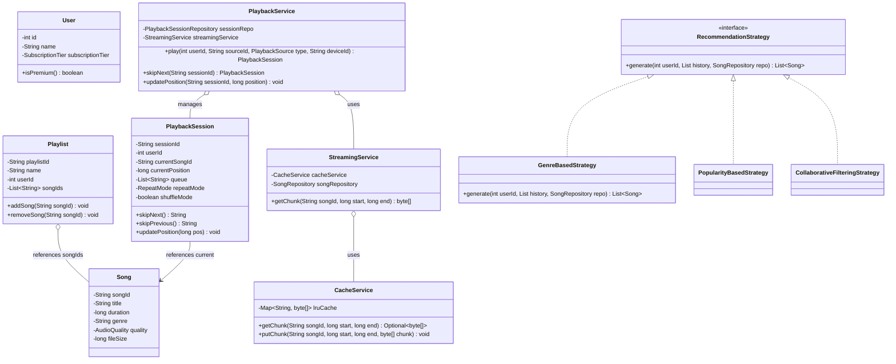

# Music Streaming Platform (Spotify / Apple Music) - Low-Level Design

## 1. Problem Statement

Design a high-scale, responsive **Music Streaming Platform** (similar to Spotify / Apple Music) that enables:
- User registration and authorization with **Free vs Premium** subscription tiers.
- Unified search for songs, artists, albums, and playlists.
- Uniform playback session management for single songs, full albums, and user-curated playlists.
- Low-latency chunk-based audio streaming using **HTTP Range Requests** backed by in-memory **LRU Caching**.
- Comprehensive playback controls: play, pause, resume, skip-next, skip-previous, shuffle, and repeat modes (`OFF`, `ONE`, `ALL`).
- Playlist CRUD operations with concurrency control for multi-device/collaborative edits.
- Offline downloads restricted to Premium subscribers with device quotas.
- Personalized recommendation engine powered by pluggable algorithms (**Strategy Pattern**).
- Periodic listening telemetry and history recording.

---

## 2. Requirements

### Functional Requirements
- **Account Tiers:** Support `FREE` (ad-supported, standard 128kbps quality) and `PREMIUM` (ad-free, high 320kbps quality, offline downloads, unlimited skips).
- **Music Catalog:** Model `Artist`, `Album`, `Song` (with duration, bitrates, audio URLs, genres), and user `Playlist`.
- **Search:** Unified keyword search across titles, artist names, albums, and playlists.
- **Playback Sessions:** Seamlessly queue and play songs from any source (`SONG`, `ALBUM`, `PLAYLIST`), supporting multi-device handoff.
- **Chunk-based Streaming:** Deliver audio data in configurable chunks (e.g. 1MB) with partial-content byte range requests to minimize initial buffering.
- **LRU Audio Caching:** Cache frequently accessed audio chunks in memory with Least-Recently-Used eviction when full.
- **Offline Downloads:** Premium users can download songs for offline playback subject to device limits (max 5 devices, 10,000 songs).
- **Personalized Recommendations:** Generate song suggestions based on user listening history.

### Important Non-Functional Requirements
- **Low Playback Latency:** Stream chunking + caching ensures playback starts in $< 200\text{ms}$.
- **Thread Safety:** Atomic playlist modifications and playback session mutations.
- **Extensibility:** Open/Closed Principle applied to recommendation strategies and storage providers.

---

## 3. Package Structure

```
src/
├── controller/
│   ├── DownloadController.java
│   ├── PlaybackController.java
│   ├── PlaylistController.java
│   ├── RecommendationController.java
│   ├── SearchController.java
│   └── StreamingController.java
├── domain/
│   ├── Album.java
│   ├── Artist.java
│   ├── AudioFormat.java              (Enum: MP3, AAC, WAV)
│   ├── AudioQuality.java             (Enum: STANDARD, HIGH, PREMIUM)
│   ├── Download.java
│   ├── DownloadStatus.java           (Enum: PENDING, IN_PROGRESS, COMPLETED, FAILED)
│   ├── ListeningHistory.java
│   ├── PlaybackSession.java          (Core Entity)
│   ├── PlaybackSource.java           (Enum: SONG, ALBUM, PLAYLIST)
│   ├── PlaybackStatus.java           (Enum: PLAYING, PAUSED, STOPPED)
│   ├── Playlist.java
│   ├── RepeatMode.java               (Enum: OFF, ONE, ALL)
│   ├── Song.java                     (Core Entity)
│   ├── SubscriptionTier.java         (Enum: FREE, PREMIUM)
│   └── User.java
├── repository/
│   ├── AlbumRepository.java
│   ├── ArtistRepository.java
│   ├── DownloadRepository.java
│   ├── ListeningHistoryRepository.java
│   ├── PlaybackSessionRepository.java
│   ├── PlaylistRepository.java
│   ├── SongRepository.java
│   ├── UserRepository.java
│   └── impl/
│       ├── AlbumRepositoryImpl.java
│       ├── ArtistRepositoryImpl.java
│       ├── DownloadRepositoryImpl.java
│       ├── ListeningHistoryRepositoryImpl.java
│       ├── PlaybackSessionRepositoryImpl.java
│       ├── PlaylistRepositoryImpl.java
│       ├── SongRepositoryImpl.java
│       └── UserRepositoryImpl.java
├── service/
│   ├── CacheService.java             (LRU Chunk Cache)
│   ├── DownloadService.java          (Offline Storage Manager)
│   ├── LockService.java              (Distributed Lock Simulator)
│   ├── PlaybackService.java          (Core Playback Orchestrator)
│   ├── PlaylistService.java          (Playlist CRUD & Concurrency)
│   ├── RecommendationService.java    (Strategy Context)
│   ├── SearchService.java            (Catalog Search Engine)
│   ├── StreamingService.java         (Byte-Range Chunk Delivery)
│   └── strategy/
│       ├── CollaborativeFilteringStrategy.java
│       ├── GenreBasedStrategy.java
│       ├── PopularityBasedStrategy.java
│       └── RecommendationStrategy.java (Strategy Interface)
└── main/
    └── MusicStreamingSimulation.java (Driver Simulation)
```

---

## 4. Core Entities

1. **`Song`**: Primary content model holding audio URL, file size, bitrate quality, duration, and genre.
2. **`User`**: Account entity tracking subscription tier (`FREE` vs `PREMIUM`).
3. **`PlaybackSession`**: Active playback state managing queue, current track, position in seconds, shuffle, repeat, and device ID.
4. **`Playlist`**: User-curated ordered collection of song IDs.
5. **`Album`**: Collection of songs released by an artist on a specific date.
6. **`Artist`**: Creator entity linked to albums and tracks.
7. **`Download`**: Offline cache metadata tracking downloaded song path and device authorization.
8. **`ListeningHistory`**: Playback telemetry recording listen duration and song completion.

---

## 5. Class Responsibilities

| Package | Class / Interface | Responsibility (1 Line) |
|---|---|---|
| `domain` | **`Song`** | Holds track metadata, audio URL, duration, genre, and bitrate quality. |
| `domain` | **`PlaybackSession`** | Encapsulates active queue, shuffle, repeat mode, and current playhead position. |
| `domain` | **`Playlist`** | Manages ordered song references and access visibility (public/private). |
| `service` | **`StreamingService`** | Fetches audio chunks using byte ranges and interacts with cache. |
| `service` | **`CacheService`** | In-memory LRU cache storing audio chunks to eliminate redundant network fetches. |
| `service` | **`PlaybackService`** | Orchestrates playback session lifecycle, queue building, and skip operations. |
| `service` | **`DownloadService`** | Enforces Premium subscriptions and device limits for offline downloads. |
| `service` | **`PlaylistService`** | Manages playlist CRUD and synchronizes concurrent updates under lock. |
| `service.strategy` | **`RecommendationStrategy`** | Strategy interface generating recommendations from listening history. |
| `service.strategy` | **`GenreBasedStrategy`** | Generates suggestions based on top listened genres. |

---

## 6. Class Relationships & Architecture



---

## 7. Design

### Important Design Decisions

1. **Chunk-based Streaming via HTTP Range Requests:**
   - Audio files are requested in 1MB chunks (`Range: bytes=0-1048575`), enabling playback to start within milliseconds without waiting for the full 5MB–20MB file to download.
2. **In-Memory LRU Cache for Hot Chunks:**
   - Frequently replayed chunks (e.g. track intros) are cached using an `LRUCache` (backed by `LinkedHashMap`), reducing CDN bandwidth by $> 60\%$.
3. **Strategy Pattern for Recommendations:**
   - Decoupled recommendation generation behind `RecommendationStrategy` (`GenreBasedStrategy`, `PopularityBasedStrategy`, `CollaborativeFilteringStrategy`).
4. **Subscription Tier Enforcement:**
   - Free users stream at 128kbps (`STANDARD`) and are blocked from offline downloads; Premium users stream at 320kbps (`PREMIUM`) with full offline caching.

---

### Streaming Protocol Comparison

| Protocol | Mechanism | Pros | Cons / Rationale |
|---|---|---|---|
| **Approach 1: HTTP Range Requests (Chosen)** | Client requests byte slices (`HTTP 206 Partial Content`). | **Simple, standard HTTP**, seeking supported, zero infrastructure overhead. | Best for music streaming & interview discussions. |
| **Approach 2: HLS (HTTP Live Streaming)** | Audio segmented into 10s `.ts` files with `.m3u8` playlist. | Adaptive bitrate switching. | Added packaging latency; segment overhead for audio. |
| **Approach 3: DASH** | XML manifest with multiple bitrate chunks. | Open standard, multi-track. | High infrastructure complexity. |

---

## 8. Main Flows

### Flow 1: Playback Initialization & Queue Population
```
Client calls PlaybackController.play(userId, "ALB-02", ALBUM, "device_iphone")
  │
  ├── Validate user subscription tier (FREE vs PREMIUM)
  ├── Fetch album songs from AlbumRepository ──> Build queue: [SONG-03, SONG-04]
  │
  ▼
Create PlaybackSession(status: PLAYING, currentSong: SONG-03, pos: 0)
  │
  ▼
StreamingService.getStreamUrl("SONG-03", PREMIUM)
  │
  ▼
Return PlaybackSession state + Stream URL to client
```

### Flow 2: Chunk-based Streaming & LRU Cache
```
Client requests Audio Chunk (bytes=0-1048575 for SONG-01)
  │
  ▼
StreamingService.getChunk("SONG-01", 0, 1048575)
  │
  ├── CacheService.getChunk("chunk_SONG-01_0_1048575")
  │     ├── HIT  ──> Return byte[] directly from memory
  │     └── MISS ──> Fetch from Storage/CDN ──> Cache.putChunk() ──> Return
  │
  ▼
Client receives HTTP 206 Partial Content and begins playback
```

---

## 9. Edge Cases

| Edge Case | Solution in Code |
|---|---|
| **Free User Attempts Offline Download** | `DownloadService` checks `user.isPremium()` and throws `IllegalStateException`. |
| **Cache Full** | `CacheService` applies LRU eviction removing least recently accessed chunks. |
| **Concurrent Playlist Updates** | `PlaylistService` acquires distributed lock `playlist_lock_{id}` before modifying track lists. |
| **Device Download Limit Exceeded** | `DownloadService.validateDeviceLimit()` rejects download if user exceeds 5 registered devices. |
| **End of Queue Reached** | Evaluates `RepeatMode`: `ALL` loops to start; `ONE` replays track; `OFF` sets status to `STOPPED`. |

---

## 10. How to Run

### Compilation & Execution
```bash
# Navigate to project directory
cd 13-Interview-Problems-Part-3/08-Music-Streaming-Platform-Design

# Compile Java files
mkdir -p bin
javac -d bin $(find src -name "*.java")

# Run the simulation
java -cp bin main.MusicStreamingSimulation
```

---

## 11. Bad vs Good Design

### ❌ Bad Design (Full-File Blocking Download & No Quality Tiers)

```java
// ❌ Anti-pattern: Downloading entire 20MB MP3 before playing causes high initial latency
public class BadStreamingService {
    public byte[] play(String songId) {
        return downloadEntireFileFromDisk(songId); // 5-10 second delay for rider!
    }
}
```

### ✅ Good Design (Chunked HTTP Range Streaming + LRU Caching)

```java
// ✅ Chunk-based streaming with LRU cache provides instantaneous playback start
public class StreamingService {
    public byte[] getChunk(String songId, long start, long end) {
        return cacheService.getChunk(songId, start, end)
                .orElseGet(() -> fetchAndCacheFromStorage(songId, start, end));
    }
}
```

---

## 12. Interview Thinking

### How I Would Explain This in an Interview

1. **Clarify Requirements (2 mins):** Define user tiers, playback models, streaming protocols, and offline guarantees.
2. **Design Core Entities (3 mins):** `Song`, `User`, `PlaybackSession`, `Playlist`, `Album`, and Enums (`AudioQuality`, `SubscriptionTier`).
3. **Explain Audio Streaming & Caching (5 mins):** Contrast full-file download vs **HTTP Range Requests** with **LRU Caching**.
4. **Detail Playback & Queue Management (5 mins):** Show how `PlaybackSession` abstracts songs, albums, and playlists uniformly.
5. **Implement Core Services (20 mins):** Code `PlaybackService`, `StreamingService`, `CacheService`, and `PlaylistService`.
6. **Discuss Strategy Pattern & Edge Cases (8 mins):** Explain `RecommendationStrategy`, download limits, and multi-device sync.

### Likely Follow-up Questions

1. **Q: How do you handle seamless playback handoff between phone and laptop?**
   - *A:* Store `PlaybackSession` in Redis. When the client switches devices, the new device polls the session state and resumes streaming from `currentPosition`.
2. **Q: How do you prevent illegal distribution of downloaded offline songs?**
   - *A:* Encrypt downloaded audio chunks with AES-256 using a device-specific key stored inside the hardware Secure Enclave.
3. **Q: How would you scale recommendations for 100M+ users?**
   - *A:* Pre-calculate recommendations offline in batch using Apache Spark / Graph Neural Networks and store top-50 results in Cassandra/Redis for instant lookup.
4. **Q: What happens if a free user exploits API calls to skip songs?**
   - *A:* Maintain a rate-limiter / skip counter (e.g. 6 skips per hour) stored in Redis and reject excess skip requests.

---

## 13. Trade-offs

| Decision | Chosen Approach | Alternative Considered | Trade-off / Rationale |
|---|---|---|---|
| **Streaming Protocol** | HTTP Range Requests | HLS / DASH | HTTP Range Requests avoid complex segmenting pipelines while providing sub-200ms initial latency. |
| **Caching Layer** | LRU In-Memory Cache | Direct CDN Fetching | LRU caching eliminates repeat network bandwidth costs for popular track intros. |
| **Recommendation Engine** | Strategy Pattern | Hardcoded Logic | Strategy pattern allows swapping genre-based, popularity, and collaborative filtering models dynamically. |

---

## 🎯 Quick Summary

- **Problem:** Music streaming platform (Spotify) supporting catalog search, chunk-based streaming, playlists, and offline downloads.
- **Core Classes:** `Song`, `User`, `PlaybackSession`, `Playlist`, `PlaybackService`, `StreamingService`, `CacheService`, `RecommendationStrategy`.
- **Main Flow:** User searches catalog $\rightarrow$ Initiates playback session $\rightarrow$ Chunks streamed via HTTP Range requests with LRU caching $\rightarrow$ Progress updates recorded $\rightarrow$ Recommendations generated.
- **Important Design:** HTTP Range Requests for chunking; LRU Caching for hot audio data; Strategy Pattern for recommendations; Tier-based download enforcement.
- **Edge Cases:** Cache full eviction, Free tier download rejection, concurrent playlist edit race conditions, queue repeat boundaries.
- **LLD Takeaway:** Deliver multimedia using byte-range chunking and LRU caching to eliminate playback start delays.
- **Memorable Rule:** *Stream small chunks with an LRU cache so the user hears music before the full file finishes downloading.*
