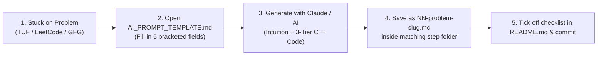

# ⚡ Striver's A2Z DSA Sheet (C++)

> Companion to [TakeUForward's Striver's A2Z DSA Course](https://takeuforward.org/dsa/strivers-a2z-sheet-learn-dsa-a-to-z)  
> **474 Problems across 18 Steps** — Solved in modern C++ with intuition-first notes, mathematical complexity derivations, visual traces, and interview follow-up Q&A.

---

## 📚 Curriculum Breakdown

| # | Step Folder | Topics Covered | Problem Count | Status |
|---|---|---|:---:|:---:|
| 01 | [**01-Learn-the-Basics**](./01-Learn-the-Basics/README.md) | C++ Basics, 22 Patterns, STL, Basic Maths, Recursion, Hashing | **54** | 🟡 In Progress |
| 02 | [**02-Sorting-Techniques**](./02-Sorting-Techniques/README.md) | Selection, Bubble, Insertion, Merge Sort, Quick Sort | **7** | ⚪ Pending |
| 03 | [**03-Arrays**](./03-Arrays/README.md) | Two Pointers, Kadane's, Moore's Voting, Dutch Flag, Hard Subarrays | **40** | 🟢 Completed (40/40) |
| 04 | [**04-Binary-Search**](./04-Binary-Search/README.md) | BS 1D, Rotated Arrays, BS on Answers, 2D Matrix Binary Search | **32** | ⚪ Pending |
| 05 | [**05-Strings-Basic**](./05-Strings-Basic/README.md) | Anagrams, Isomorphic, Roman Numerals, Nesting Depth | **15** | ⚪ Pending |
| 06 | [**06-LinkedList**](./06-LinkedList/README.md) | Singly & Doubly LL, Floyd's Cycle, Reversals, K-Group, Flattening | **31** | ⚪ Pending |
| 07 | [**07-Recursion**](./07-Recursion/README.md) | Subsequences, Power Set, Combination Sum, N-Queens, Sudoku | **25** | ⚪ Pending |
| 08 | [**08-Bit-Manipulation**](./08-Bit-Manipulation/README.md) | Bitwise Tricks, Two Odd Numbers, Power Set Bits, Sieve | **18** | ⚪ Pending |
| 09 | [**09-Stacks-and-Queues**](./09-Stacks-and-Queues/README.md) | Monotonic Stacks, Rain Water, Largest Histogram, LRU/LFU Cache | **30** | ⚪ Pending |
| 10 | [**10-Sliding-Window-Two-Pointer**](./10-Sliding-Window-Two-Pointer/README.md) | Max Consecutive Ones, Character Replacement, Min Window | **12** | ⚪ Pending |
| 11 | [**11-Heaps**](./11-Heaps/README.md) | Binary Heap Internals, Top K, Merge K Lists, Two-Heap Median | **17** | ⚪ Pending |
| 12 | [**12-Greedy**](./12-Greedy/README.md) | Activity Selection, Minimum Platforms, Job Sequencing, Candy | **15** | ⚪ Pending |
| 13 | [**13-Binary-Trees**](./13-Binary-Trees/README.md) | Traversals, Views, Diameter, LCA, Morris Traversal, Tree Burn | **38** | ⚪ Pending |
| 14 | [**14-Binary-Search-Trees**](./14-Binary-Search-Trees/README.md) | BST Invariants, Ceil/Floor, BST Iterator, Recover BST | **16** | ⚪ Pending |
| 15 | [**15-Graphs**](./15-Graphs/README.md) | BFS/DFS, Topo Sort, Dijkstra, Bellman-Ford, Floyd, DSU, MST, Tarjan | **53** | ⚪ Pending |
| 16 | [**16-Dynamic-Programming**](./16-Dynamic-Programming/README.md) | 1D, 2D Grid, Knapsack, DP on Strings, Stocks, LIS, MCM / Partition | **55** | ⚪ Pending |
| 17 | [**17-Tries**](./17-Tries/README.md) | Trie Node, Prefix Matching, Distinct Substrings, Bitwise XOR Trie | **7** | ⚪ Pending |
| 18 | [**18-Strings-Advanced**](./18-Strings-Advanced/README.md) | KMP (LPS), Rabin-Karp Rolling Hash, Z-Algorithm, Min Add Valid | **9** | ⚪ Pending |
| **Total** | | **Complete Striver A2Z DSA Sheet** | **474** ✅ | |

---

## 🎯 How to Use This Track When You're Stuck



1. **Open the problem** on [TakeUForward](https://takeuforward.org/dsa/strivers-a2z-sheet-learn-dsa-a-to-z) or [LeetCode](https://leetcode.com).
2. **Open [`AI_PROMPT_TEMPLATE.md`](./AI_PROMPT_TEMPLATE.md)**, copy the prompt block, and fill in the 5 fields (*Problem Name, Step, Link, Difficulty, Statement*).
3. **Paste into Claude / AI** to get the standardized 5-part guide:
   - 💡 **Intuition & Pattern Recognition**
   - 🛠️ **Brute Force $
ightarrow$ Better $
ightarrow$ Optimal C++ Code** (with derived Time/Space Complexity)
   - 📊 **Step-by-Step Visual Dry Run Table**
   - ⚠️ **Edge Cases & Pitfalls**
   - 💬 **Interview Follow-up Q&A**
4. **Save the response** as `NN-problem-slug.md` in the appropriate folder and commit.
5. Review [`EXAMPLE_Two_Sum.md`](./EXAMPLE_Two_Sum.md) for the benchmark quality standard.

---

## 🛠️ Automated Setup & Scaffolding

To scaffold all 18 topic folders and checklists in a new clone:
```bash
chmod +x setup_structure.sh
./setup_structure.sh
```

---

**Happy Problem Solving! 🚀**
