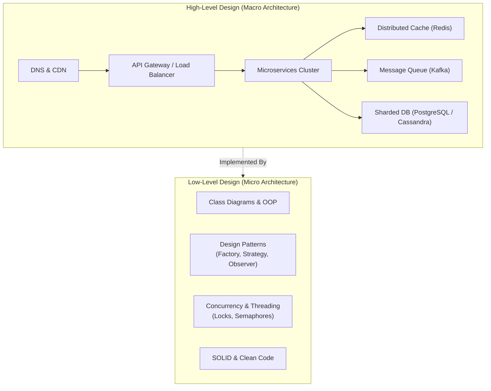
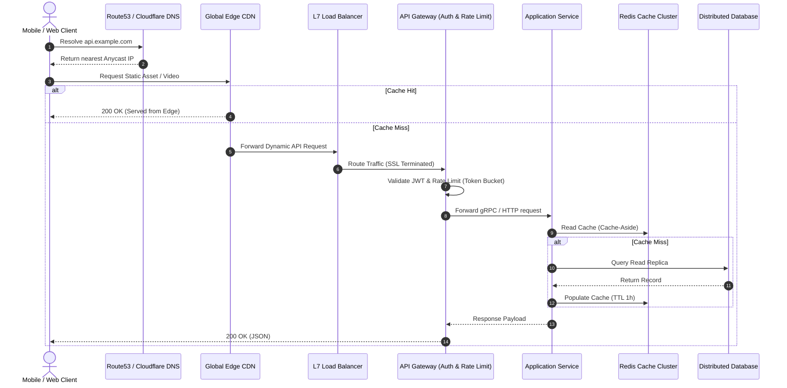

# 01 — Introduction to High-Level Design (HLD)

## 📌 1. High-Level Design (HLD) vs Low-Level Design (LLD)

System design is broadly divided into two major architectural layers:



| Dimension | High-Level Design (HLD) | Low-Level Design (LLD) |
|---|---|---|
| **Focus** | Macro architecture, distributed components, data flow | Micro architecture, class models, algorithms, code structure |
| **Scope** | Servers, DBs, Caches, Queues, CDNs, Gateways | Classes, Interfaces, Methods, Design Patterns, Data Structures |
| **Questions Answered** | How do we scale to 10M DAU? How do we prevent SPOF? | How do we structure classes? Is the code extensible and maintainable? |
| **Core Concerns** | Scalability, High Availability, Fault Tolerance, Latency | Clean Code, SOLID Principles, Modularity, Thread Safety |
| **Deliverables** | Architecture diagrams, Capacity estimations, API specs, DB schemas | UML Class diagrams, Sequence diagrams, Working code implementations |

---

## 🌐 2. The Modern Client-Server Model

In modern distributed systems, the Client-Server model has evolved from a single monolithic server to an elastic, multi-tier distributed ecosystem:



---

## 🎯 3. The 45-Minute System Design Interview Playbook

To ace any system design interview at top tech companies (FAANG / Tier-1), follow this time-tested 6-step framework:

```mermaid
gantt
    title 45-Minute System Design Interview Timeline
    dateFormat mm
    axisFormat %M min
    section Step 1
    Clarify Requirements & Scope :00, 05m
    section Step 2
    Back-of-the-Envelope Math    :05, 10m
    section Step 3
    API & Data Model Contract    :10, 15m
    section Step 4
    High-Level Architecture      :15, 30m
    section Step 5
    Deep Dives & Bottlenecks     :30, 40m
    section Step 6
    Trade-offs & Wrap-up         :40, 45m
```



### Step 1: Clarify Requirements & Scope (0–5 mins)
- **Functional Requirements (FR)**: What core actions must the user perform? (Keep to top 3–4 features).
- **Non-Functional Requirements (NFR)**:
  - Latency (e.g., `< 50ms` read latency, `< 200ms` write latency).
  - Availability vs Consistency (CAP trade-off: `99.99%` uptime vs strict ACID).
  - Scale (e.g., `100M DAU`, peak write spikes).
- **Out of Scope**: Explicitly clarify features you are intentionally not covering in 45 minutes.

### Step 2: Back-of-the-Envelope Math (5–10 mins)
- Calculate **Read QPS** and **Write QPS** (Average and Peak).
- Calculate **Storage requirements** over 5 years.
- Calculate **Memory (RAM) for Caching** (applying 80/20 Pareto rule).
- Calculate **Network Bandwidth** (Ingress & Egress).

### Step 3: API & Data Model Contract (10–15 mins)
- Define clean REST / gRPC endpoints with parameters and response payloads.
- Define relational or NoSQL database entities, primary keys, and index structures.

### Step 4: High-Level Architecture (15–30 mins)
- Draw the end-to-end data path: Client $\rightarrow$ CDN/DNS $\rightarrow$ Load Balancer $\rightarrow$ API Gateway $\rightarrow$ Microservices $\rightarrow$ Cache $\rightarrow$ DB.
- Explain the end-to-end read and write flows.

### Step 5: Deep Dives & Bottlenecks (30–40 mins)
- Dive into tricky problems: Partitioning/Sharding, Concurrency, Cache Invalidation, Race conditions, Hotkeys.
- Single Points of Failure (SPOF) and disaster recovery.

### Step 6: Trade-offs & Wrap-up (40–45 mins)
- Justify why chosen tech stack matches the NFRs (e.g., Cassandra vs Postgres, Kafka vs RabbitMQ).
- Identify future scaling optimizations.

---

## ⚡ 4. Core System Design Cheat Sheet

```
+-----------------------------------------------------------------------------------+
|  Requirement         | Recommended Solution Pattern                               |
+-----------------------------------------------------------------------------------+
| High Read QPS        | Redis/Memcached cache tier + Read Replicas + CDN           |
| High Write Throughput| Append-only logs, Kafka buffer, LSM-Tree NoSQL (Cassandra) |
| Low Latency Reads    | Geo-distributed CDN, Cache-Aside with In-memory Redis      |
| Financial Accuracy   | RDBMS with ACID transactions, 2PC/Saga, Idempotency keys   |
| Search Queries       | Elasticsearch / OpenSearch cluster with inverted index     |
| Real-time Updates    | WebSockets / SSE / Long Polling with Redis PubSub / Kafka  |
+-----------------------------------------------------------------------------------+
```
