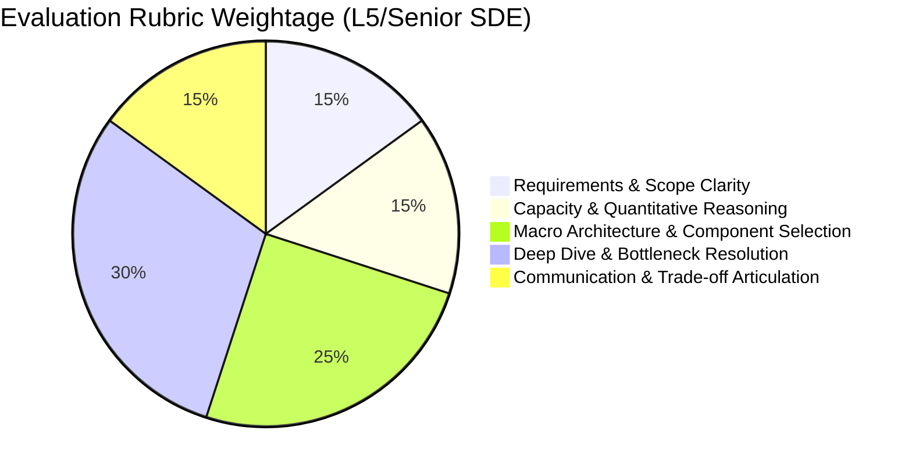

# Case Study: How Big Tech Evaluates System Design Interviews

## 🏢 Context: Senior & Staff Engineering Expectations

At Tier-1 tech firms (Google, Meta, Amazon, Netflix, Uber, Stripe), System Design is the highest-weighted round for L5+ (Senior) and L6+ (Staff/Principal) engineering roles.

Interviewers do not expect one "perfect" answer; they evaluate **how you navigate trade-offs under ambiguity**.

---

## 🔍 Evaluation Matrix: What Separates Junior, Senior, and Staff

| Dimension | Junior / Mid-Level (L3/L4) | Senior (L5) | Staff / Principal (L6+) |
|---|---|---|---|
| **Approach** | Jumps straight to drawing boxes and databases. | Asks clarifying questions, defines NFRs and scale upfront. | Drives business alignment, cost vs latency trade-offs, and operational viability. |
| **Component Choice** | "We will use Kafka and Redis" without explaining why. | Explains trade-offs (e.g. "We chose Redis over Memcached for data structure support and persistence"). | Discusses failure domains, quorum configurations, and multi-region replication lag. |
| **Failure Handling** | Assumes the network and database never fail. | Adds retries, circuit breakers, dead-letter queues, and secondary replicas. | Plans for cascading failures, thundering herd, split-brain recovery, and blast-radius reduction. |
| **Trade-offs** | Defends one single ideal design blindly. | Acknowledges CAP theorem limits and articulates pros and cons. | Quantifies dollar costs, operational complexity, and migration paths. |

---

## 🚨 Top 5 Traps That Fail Candidates

1. **Jumping directly into tools/tech without numbers**:
   - *Mistake*: "We will put Kafka, Cassandra, and ElasticSearch here."
   - *Fix*: First calculate QPS and storage size. If QPS is only 50 requests/sec, an RDBMS is much simpler and cheaper.
2. **Ignoring Data Flow**:
   - *Mistake*: Connecting boxes without showing the step-by-step sequence of read/write requests.
3. **Over-Engineering Day 1**:
   - *Mistake*: Designing a globally sharded multi-region active-active cluster for an app with 1,000 users.
4. **Monologuing without Interviewer Alignment**:
   - *Mistake*: Talking for 20 minutes straight without checking in.
   - *Fix*: "I propose using a Cache-Aside pattern here with Redis. Does that align with your expectations, or should we explore write-through caching?"
5. **No Bottleneck Analysis**:
   - *Mistake*: Assuming everything works at 100x scale without hot-partition or cache-miss mitigations.
