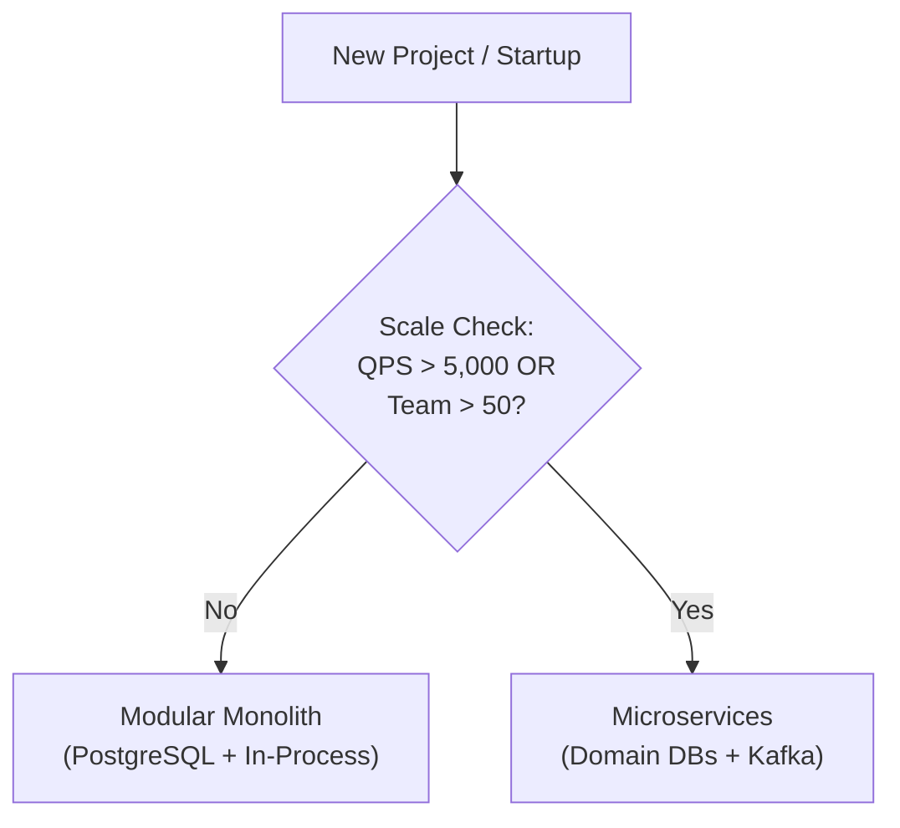

# When NOT to Use: Distributed Microservices & Over-Engineering

## 🚨 The Premature Distributed Architecture Anti-Pattern

Reaching for a 20-microservice distributed architecture with Kafka, Kubernetes, and Cassandra on Day 1 is the most common reason early-stage engineering projects fail.

---

## ❌ Scenarios Where Distributed Microservices are the WRONG Investment:

1. **Small Engineering Team ($< 15$ Engineers)**:
   - *Cost*: Distributed tracing, Kubernetes cluster maintenance, deployment pipelines, and cross-service contract testing consume 60% of engineering bandwidth.
   - *Fix*: Use a **Modular Monolith** (Ruby on Rails, Spring Boot, Next.js/Go) with strict internal package boundaries.
2. **Low Write QPS ($< 1,000 \text{ writes/sec}$)**:
   - A single modern PostgreSQL instance on AWS RDS `db.r6g.8xlarge` can easily handle $25,000 \text{ QPS}$ with proper indexing and connection pooling (PgBouncer).
3. **Ambiguous Business Domain**:
   - Decomposing microservices before understanding product-market fit creates the worst failure mode: **The Distributed Monolith** (tightly coupled services requiring coordinated multi-repo deployments).
