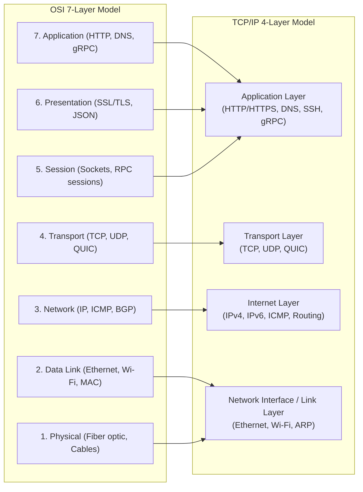
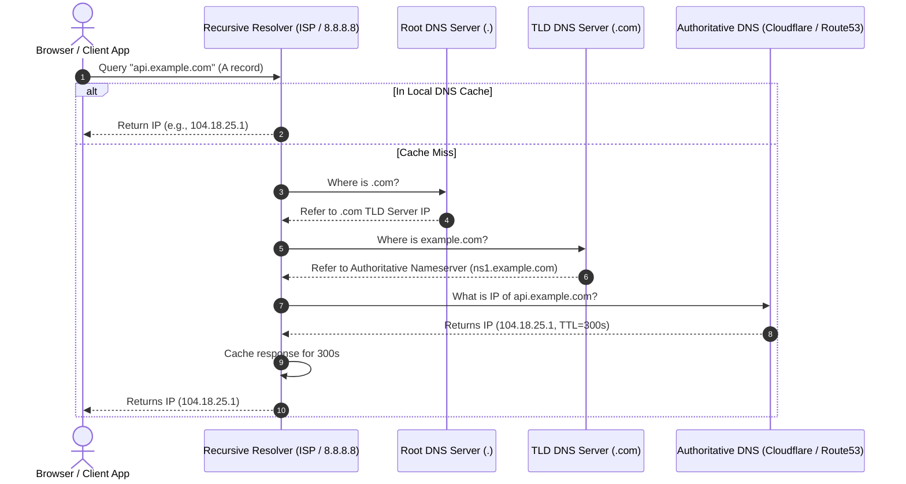
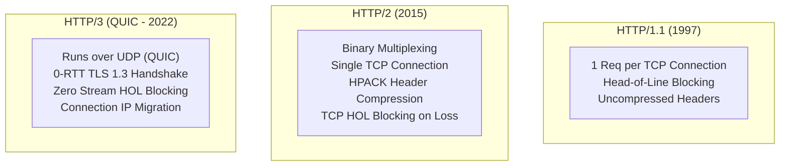
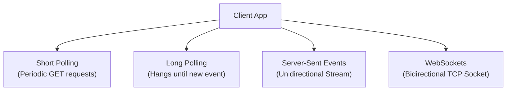
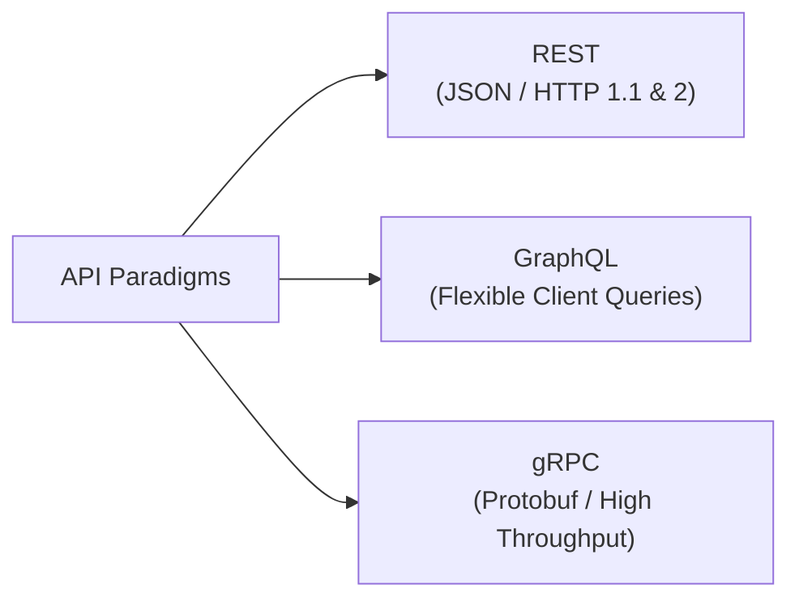

# 02 — Networking Fundamentals for System Design

## 🌐 1. OSI vs TCP/IP Protocol Stack

Distributed systems rely on standard network models to transmit data reliably across the globe.

---

## 🔍 2. DNS (Domain Name System) Resolution Flow

When a client queries `https://api.example.com`, how does it resolve the IP address in `< 20ms`?

### DNS Routing Techniques in System Design:
1. **GeoDNS**: Routes user to the nearest regional data center based on client IP geolocation.
2. **Anycast DNS**: Same IP address announced from hundreds of locations worldwide; BGP automatically routes to the topologically closest node.
3. **Round-Robin DNS**: Cycles through multiple IP addresses for basic client-side load balancing.

---

## 🚀 3. HTTP Evolution: HTTP/1.1 vs HTTP/2 vs HTTP/3 (QUIC)

| Feature | HTTP/1.1 | HTTP/2 | HTTP/3 (QUIC) |
|---|---|---|---|
| **Underlying Transport** | TCP | TCP | UDP (via QUIC) |
| **Multiplexing** | ❌ (Needs multiple TCP conns) | ✅ (Streams on single TCP conn) | ✅ (Independent UDP streams) |
| **Head-of-Line Blocking** | 🚨 Application & Transport layer | 🚨 Transport layer (Packet loss stalls all streams) | 🟢 Zero HOL Blocking across streams |
| **Connection Handshake** | TCP (1 RTT) + TLS (1-2 RTT) = 2-3 RTT | TCP + TLS 1.3 = 1-2 RTT | QUIC + TLS 1.3 = 0-1 RTT (Instant connect) |
| **Header Compression** | ❌ None | ✅ HPACK | ✅ QPACK |
| **Network Migration** | ❌ Connection dropped on IP change | ❌ Connection dropped | ✅ Connection ID persists across IP change |

---

## ⚡ 4. Real-Time Communication Protocols

How do we push real-time updates (chat, live notifications, market tickers)?

| Protocol | Direction | Overhead | Reconnection | Best Use Case |
|---|---|---|---|---|
| **Short Polling** | Client $\rightarrow$ Server | 🔴 Extremely High (constant HTTP headers) | Natural | Low-frequency status checks (e.g. build status) |
| **Long Polling** | Client $\rightarrow$ Server (delayed) | 🟡 Moderate (re-establishes HTTP connection per message) | Handled by client loop | Legacy chat fallback, notification polling |
| **Server-Sent Events (SSE)** | Server $\rightarrow$ Client only | 🟢 Low (Single HTTP connection, built-in retry) | Automatic | Live scoreboards, stock tickers, LLM streaming output |
| **WebSockets** | Client $\leftrightarrow$ Server (Bidirectional) | 🟢 Lowest (Single upgraded TCP connection, lightweight frames) | Manual handling | Online multiplayer gaming, collaborative editing, chat apps |

---

## 🔄 5. API Paradigms: REST vs GraphQL vs gRPC vs Thrift

| Dimension | REST | GraphQL | gRPC |
|---|---|---|---|
| **Protocol & Format** | HTTP 1.1/2, JSON/XML | HTTP POST, JSON | HTTP/2 / QUIC, Protocol Buffers (Binary) |
| **Data Fetching** | Over-fetching or Under-fetching common | Exact fields requested (No over/under-fetching) | Strict schema defined in `.proto` |
| **Performance / Latency** | Moderate (Text JSON parsing overhead) | Moderate (Server query resolution overhead) | 🚀 Ultra-fast (Binary serialization is 5-10x faster) |
| **Streaming Support** | Limited (Chunked transfer) | Subscriptions (over WebSockets) | Full support: Unary, Client, Server, Bidirectional streaming |
| **Best For** | Public APIs, CRUD web services | Mobile apps with complex relational UI views | Microservice-to-microservice internal RPC communication |
