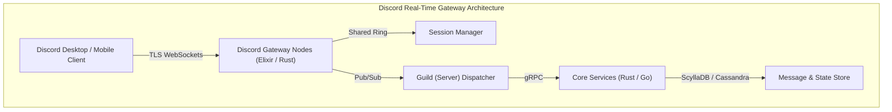

# Case Study: Real-Time Networking at Discord & WhatsApp Scale

## 🏢 Context: Millions of Concurrent Real-Time Connections

Both Discord (millions of concurrent voice & text users) and WhatsApp (2+ billion users) handle extraordinary connection density with sub-100ms message delivery worldwide.

---

## 🛠 Architectural Solutions & Protocol Decisions

### 1. Persistent WebSockets over HTTP Polling
- **Why**: Standard HTTP request-response overhead would create billions of pointless TCP handshakes every minute.
- **Discord's Choice**: Discord keeps a persistent WebSocket open per client for real-time presence, voice signaling, and message events. Heartbeats (pings) are sent every 41.25 seconds with zlib compressed payloads.

### 2. Binary Protocol Serialization (Erlang Term Format & Protobuf)
- **Problem**: JSON string serialization consumes CPU and produces bloated network payloads.
- **WhatsApp's Choice**: Uses a custom binary-encoded protocol derived from XMPP (FunXMPP), reducing message payload sizes to tens of bytes per message.
- **Discord's Choice**: Transitioned internal microservice-to-microservice communication entirely from HTTP/JSON to **gRPC over HTTP/2 with Protocol Buffers**, saving over 40% CPU across their fleet.

### 3. Handling Mobile Network Changes (QUIC & Connection Migration)
- On mobile devices, users constantly switch between Wi-Fi and 5G cellular towers.
- Under classic TCP, an IP change forces a complete TCP 3-way handshake + TLS negotiation (breaking ongoing calls and socket streams).
- Modern real-time apps leverage **HTTP/3 & QUIC Connection IDs**, allowing calls and data streams to continue uninterrupted during network handoffs.

---

## 📊 Key Architectural Takeaways

| Challenge | Classic Approach | Real-Time Scale Approach (Discord/WhatsApp) |
|---|---|---|
| **Connection Density** | 1 thread per connection (Apache) $\rightarrow$ crashes at 10k connections | Event loop / Actor model (Node/Netty/Elixir/Erlang) handling 1M+ conns per host |
| **Payload Format** | Verbose JSON string payloads | Binary protocols (Protobuf / FlatBuffers / Erlang ETF) |
| **State Tracking** | Centralized SQL queries per user check | In-memory distributed session registries with consistent hashing |
