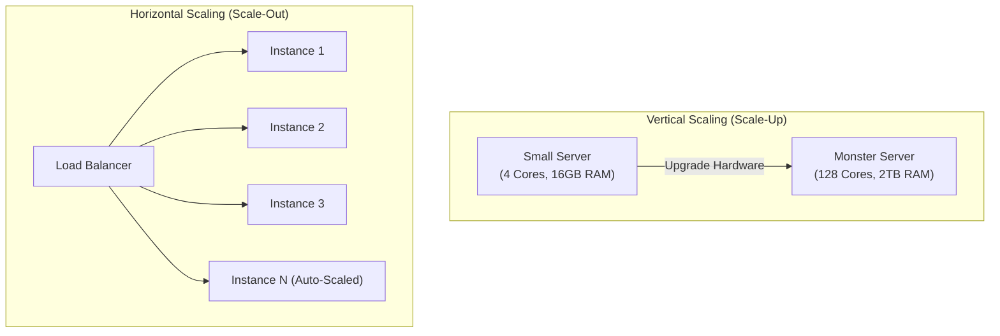
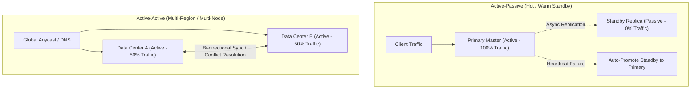
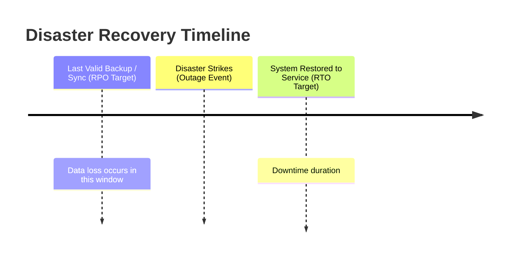

# 03 — Scalability & Reliability

## 📈 1. Vertical Scaling (Scale-Up) vs Horizontal Scaling (Scale-Out)

| Dimension | Vertical Scaling (Scale-Up) | Horizontal Scaling (Scale-Out) |
|---|---|---|
| **Hardware** | Add more CPU, RAM, NVMe SSDs to 1 machine | Add more commodity servers to the pool |
| **Downtime** | Often requires downtime/reboot | Zero downtime (seamless rolling updates) |
| **Upper Limit** | Hard physical limit (highest spec available) | Theoretically infinite scale |
| **Cost Curve** | Exponential (high-end hardware gets exponentially expensive) | Linear (cost scales predictably with commodity instances) |
| **Resilience** | 🚨 Single Point of Failure (if node crashes, everything dies) | 🟢 Highly resilient (if 1 node dies, N-1 continue serving) |
| **Architecture** | Simple (no distributed coordination needed) | Requires stateless services, distributed state, load balancers |

---

## ⏱️ 2. Availability & The "Nines of Availability"

System availability is the percentage of time a system remains operational and accessible during a specified period.

$$\text{Availability} = \frac{\text{Total Uptime}}{\text{Total Uptime} + \text{Total Downtime}} \times 100$$

| Nines of Availability | Availability % | Downtime per Year | Downtime per Month | Typical Target System |
|---|---|---|---|---|
| **2 Nines** | 99.0% | 3.65 days | 7.31 hours | Internal staging / dev environments |
| **3 Nines** | 99.9% | 8.77 hours | 43.8 minutes | Standard web apps, non-critical SaaS |
| **4 Nines** | 99.99% | 52.6 minutes | 4.38 minutes | Tier-1 E-commerce, Social Media APIs |
| **5 Nines** | 99.999% | **5.26 minutes** | **26.3 seconds** | Core Banking, Telecom, Cloud Infrastructure |
| **6 Nines** | 99.9999% | **31.5 seconds** | **2.63 seconds** | Nuclear reactor control, Aerospace systems |

---

## 🛡️ 3. Redundancy & Failover Strategies

To eliminate **Single Points of Failure (SPOF)**, every layer must have redundant instances and an automated failover mechanism.

| Strategy | Active-Passive (Failover) | Active-Active (Multi-Region) |
|---|---|---|
| **Resource Utilization** | 50% idle (standby is unused until crash) | 100% active utilization across all nodes |
| **Failover Delay** | RTO > 0 (few seconds to promote standby & switch DNS) | RTO $\approx$ 0 (instantaneous rerouting) |
| **Data Consistency** | Simple master-slave replication | Complex (requires CRDTs, Paxos/Raft, or vector clocks) |
| **Cost** | Lower operational complexity | Higher operational complexity & network sync costs |

---

## 🎯 4. Disaster Recovery: RTO vs RPO

When an outage occurs, recovery is measured by two critical business metrics:

1. **RPO (Recovery Point Objective)**: The maximum acceptable amount of **data loss** measured in time (e.g., RPO = 5 mins means at most 5 minutes of data may be lost upon disaster).
2. **RTO (Recovery Time Objective)**: The maximum acceptable **downtime** before the system is restored to operational status (e.g., RTO = 15 mins means the service must be back online within 15 minutes).

---

## 💡 5. Fault Tolerance Patterns

- **Circuit Breaker**: Detects downstream failure cascades and fails fast rather than exhausting server thread pools.
- **Bulkhead Pattern**: Isolates resources (e.g. separate connection pools for payment vs search) so one failure doesn't crash the whole service.
- **Graceful Degradation**: When under extreme load, degrade non-essential features (e.g., disable personalized recommendations, show static top items).
- **Exponential Backoff with Jitter**: Avoids thundering herd problem during service recovery by staggering client retry attempts.
