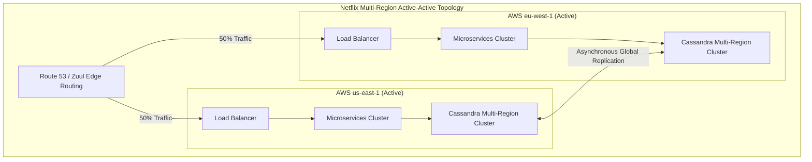

# Case Study: Netflix's Chaos Engineering & Multi-Region Active-Active Resilience

## 🏢 Context: Surviving Cloud Disasters with 250M+ Subscribers

Netflix streams millions of hours of video daily across hundreds of AWS availability zones and regions. To ensure 99.999% availability, Netflix pioneered **Chaos Engineering** and **Multi-Region Active-Active Failover**.

---

## 🛠 Architectural Resilience Principles

### 1. Chaos Engineering: The Simian Army
Instead of waiting for unexpected outages, Netflix built tools to deliberately inject failures into production:
- **Chaos Monkey**: Randomly kills EC2 instances in production during business hours to ensure microservices self-heal automatically without manual intervention.
- **Chaos Gorilla**: Simulates the total failure of an entire AWS Availability Zone (AZ).
- **Chaos Kong**: Simulates the failure of an entire AWS Region (e.g. `us-east-1` going completely dark) and tests automated cross-region traffic evacuation.

### 2. Stateless Application Tier
- All user state and session tokens (JWT) are verified statelessly or stored in distributed caches/databases.
- Any microservice instance can handle any user request anywhere on the globe without session affinity or sticky sessions.

### 3. Multi-Region Cassandra Data Replication
- Netflix chose Apache Cassandra for global active-active storage.
- Writes in `us-east-1` are committed locally with `LOCAL_QUORUM` (for sub-10ms write latency) and asynchronously replicated to `eu-west-1` in the background.

### 4. Automated Regional Evacuation (Zuul & Route 53)
- If error rates or latency spikes in one AWS region exceed thresholds, automated scripts update Route53 DNS and Zuul routing tables, draining 100% of traffic to healthy regions in under 7 minutes.

---

## 📊 Summary of Resilience Metrics

| Metric | Traditional Enterprise | Netflix Architecture |
|---|---|---|
| **Incident Discovery** | Pager alert after user complaints | Automated anomaly detection & Chaos simulations |
| **Zone Outage Impact** | Manual failover (hours of downtime) | Instantaneous auto-healing (zero user impact) |
| **Regional Disaster Recovery** | Cold backup restore (RTO > 24 hours) | Multi-Region Active-Active Drain (RTO < 7 mins) |
