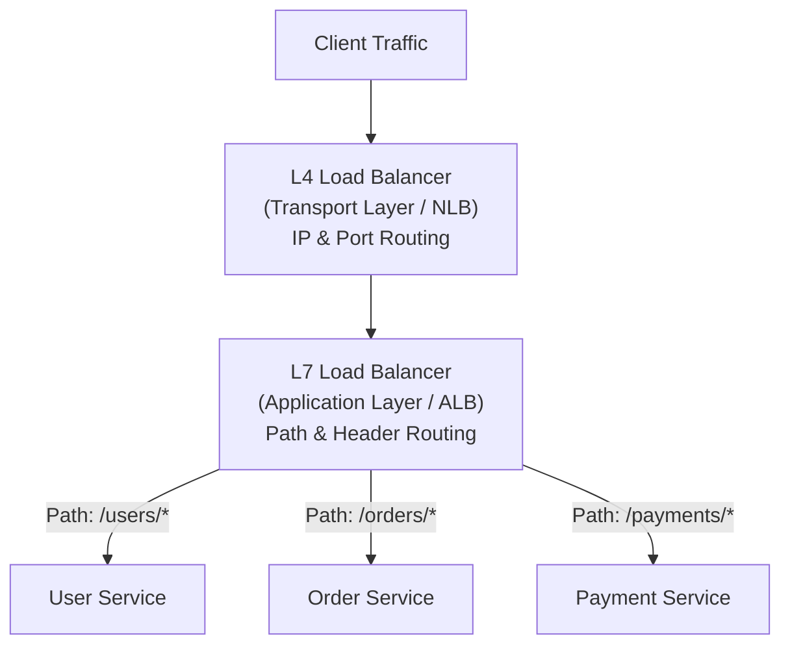
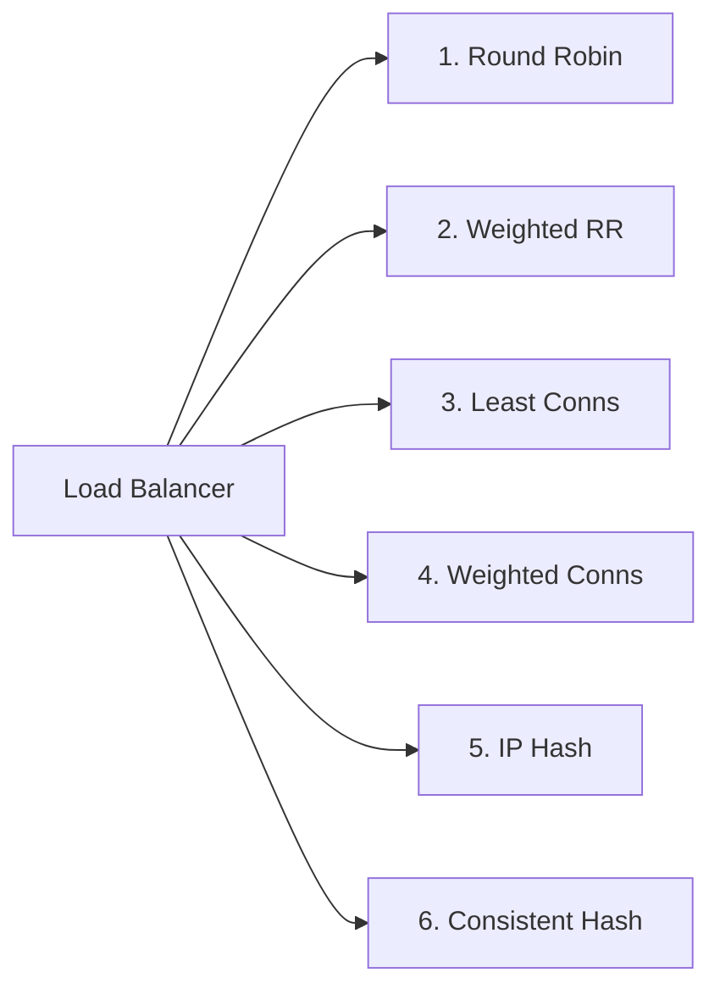
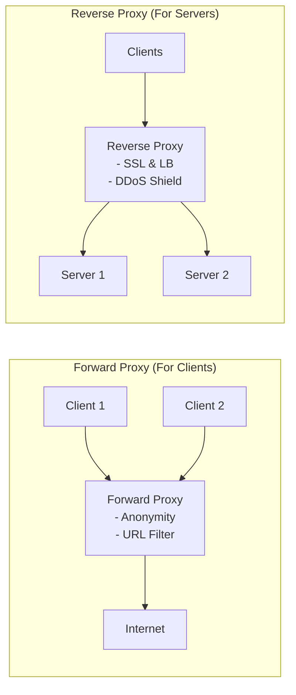
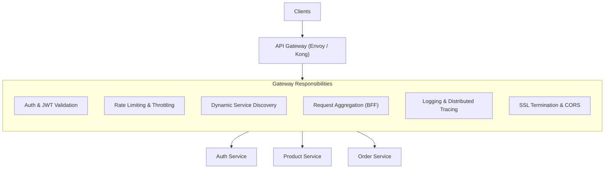

# 04 — Load Balancing & Proxies

## ⚖️ 1. Layer 4 (L4) vs Layer 7 (L7) Load Balancing

Load Balancers distribute incoming network traffic across multiple backend servers to prevent overload and ensure high availability.

| Dimension | Layer 4 (L4) Load Balancing | Layer 7 (L7) Load Balancing |
|---|---|---|
| **OSI Layer** | Layer 4 (Transport Layer: TCP / UDP) | Layer 7 (Application Layer: HTTP / HTTPS / gRPC / WebSockets) |
| **Routing Basis** | Source/Dest IP Address & TCP/UDP Port | URL Path, Host header, HTTP Headers, Cookies, Payload |
| **TLS/SSL Handling** | Passes encrypted TCP packets directly (Pass-through) | Decrypts TLS (TLS Termination) & re-encrypts if needed |
| **Throughput & Speed** | 🚀 Extremely fast, minimal CPU overhead | Moderate CPU overhead (packet parsing & SSL crypto) |
| **Smart Routing** | ❌ No content awareness | ✅ Path-based, header-based, cookie-based routing |
| **Common Examples** | AWS NLB, HAProxy (TCP mode), Linux IPVS | AWS ALB, NGINX, Envoy, Traefik, Kong |

---

## 🧮 2. Load Balancing Algorithms

1. **Round Robin**: Sequentially distributes requests to each server in order. (Best when all servers have identical hardware and requests have equal processing cost).
2. **Weighted Round Robin**: Assigns a weight to each server proportional to its hardware capacity (e.g., 8-core server gets 2x requests of a 4-core server).
3. **Least Connections**: Routes the request to the server with the fewest active TCP connections. (Best for long-lived sessions like WebSockets or heavy DB queries).
4. **Weighted Least Connections**: Considers both active connection count and server capacity weight.
5. **IP Hash (Source IP Hashing)**: Hashes the client IP to deterministically route requests from the same user to the same server (session sticky).
6. **Consistent Hashing**: Minimizes key re-mapping when backend nodes are added or removed (crucial for stateful caching clusters).

---

## 🔄 3. Forward Proxy vs Reverse Proxy

| Dimension | Forward Proxy | Reverse Proxy |
|---|---|---|
| **Acts on Behalf of** | The **Client** | The **Server** |
| **Position** | In front of internal client network | In front of backend server cluster |
| **Client Awareness** | Client explicitly configures proxy | Client is unaware (thinks proxy is the server) |
| **Primary Use Cases** | Bypassing firewalls, corporate URL filtering, client IP masking | Load balancing, SSL termination, caching, rate limiting, security |

---

## 🚪 4. The API Gateway Pattern

An **API Gateway** is a specialized Layer 7 reverse proxy that acts as the single entry point for all client traffic into a microservices architecture.

---

## ⚖️ Trade-offs: Single API Gateway vs Distributed Envoy Sidecars

| Pattern | API Gateway (Centralized) | Service Mesh / Sidecar (Envoy) |
|---|---|---|
| **Focus** | North-South traffic (Client to Services) | East-West traffic (Service to Service) |
| **Deployment** | Centralized cluster at edge | Sidecar process co-located with every container |
| **mTLS** | Edge-to-Gateway only | Zero-trust mutual TLS between every internal microservice |
| **Complexity** | Low / Moderate | High (requires control plane like Istio) |
