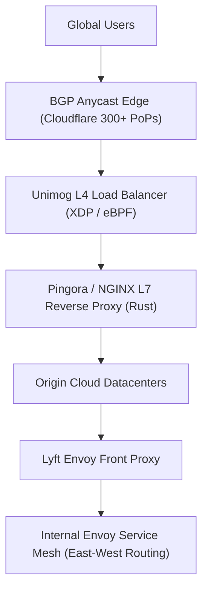

# Case Study: Global Traffic Management at Cloudflare & Lyft (Envoy)

## 🏢 Context: Routing Petabytes of Traffic Globally

Handling millions of requests per second requires intelligent traffic routing at the edge (Cloudflare) and inside internal microservice fleets (Envoy at Lyft/Google).

---

## 🛠 Engineering Innovations

### 1. Cloudflare's Edge: BGP Anycast + Unimog (eBPF / XDP)
- **BGP Anycast**: Every Cloudflare data center across 300+ cities advertises the exact same public IP addresses. The Internet’s Border Gateway Protocol (BGP) automatically routes each user packet to the physically closest edge server.
- **Unimog Layer 4 Balancer**: Built on Linux `eBPF` and `XDP` (eXpress Data Path). Packets are redirected directly inside the Linux network driver before touching kernel memory, achieving wire-speed 100Gbps throughput per node.

### 2. Transition from NGINX to Pingora (Rust)
- Cloudflare originally used NGINX for L7 reverse proxying.
- To eliminate connection reuse bottlenecks and memory safety vulnerabilities, Cloudflare engineered **Pingora**, a custom multi-threaded asynchronous proxy written in Rust, reducing CPU consumption by over 70% and origin latency by 33%.

### 3. Lyft: Creation of the Envoy Service Mesh
- **The Problem**: Lyft’s microservices suffered from unpredictable network cascading failures, missing distributed trace headers, and inconsistent connection retries across Python, Go, and PHP services.
- **The Solution**: Lyft created **Envoy**, an open-source C++ high-performance sidecar proxy. Envoy intercepts all outbound and inbound service calls, providing:
  - Dynamic service discovery via gRPC xDS API.
  - Automatic retries with exponential backoff & circuit breaking.
  - Transparent distributed tracing (propagating `x-request-id` headers).

---

## 📊 Summary of Architectural Impact

| Metric | Legacy Hardware Load Balancers | Modern Software Edge (Anycast + Envoy) |
|---|---|---|
| **Failover Time** | Minutes (DNS TTL propagation delay) | Milliseconds (BGP Anycast & dynamic health probes) |
| **Observability** | Opaque black-box SNMP counters | Rich distributed tracing & per-route p99 latency metrics |
| **Configuration** | Static manual configuration files | Dynamic configuration APIs (Envoy xDS APIs) |
