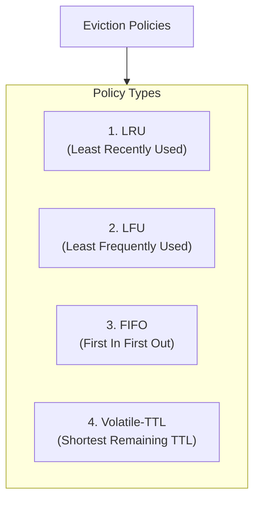
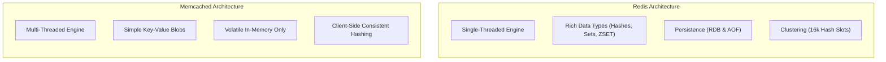
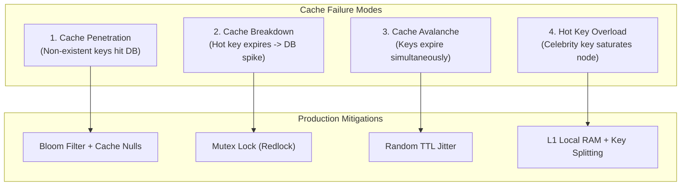
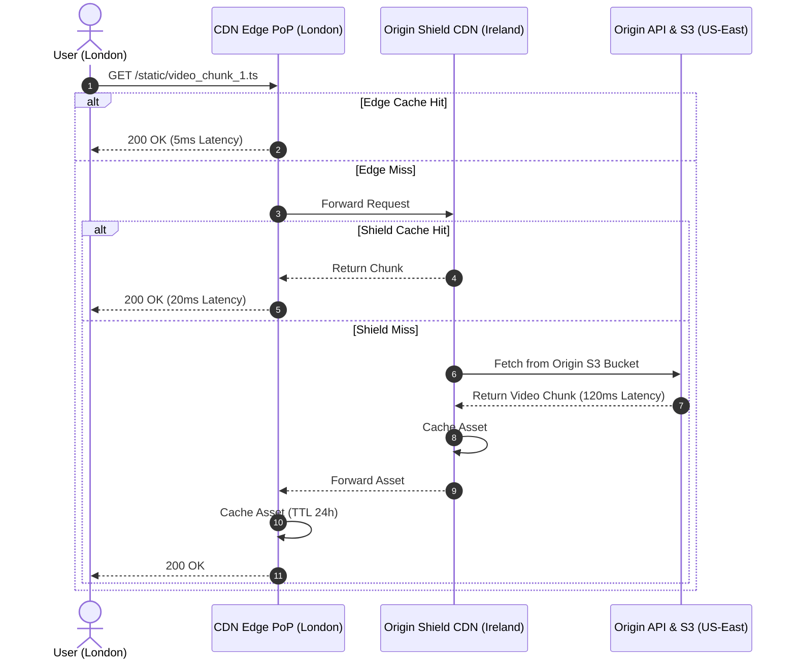

# 05 — Caching Strategies & Distributed In-Memory Systems

## ⚡ 1. Caching Access Patterns

Caching is the single most effective way to reduce database read latency from `~15ms` to `< 1ms`.

```mermaid
flowchart TD
    subgraph CacheAside["1. Cache-Aside (Lazy Loading)"]
        CA_App["Application"] -->|1. Check Cache| CA_Cache["Cache"]
        CA_App -->|2. On Miss: Query DB| CA_DB["Database"]
        CA_App -->|3. Populate Cache| CA_Cache
    end

    subgraph WriteThrough["2. Write-Through"]
        WT_App["Application"] -->|1. Write Data| WT_Cache["Cache"]
        WT_Cache -->|2. Synchronous Write| WT_DB["Database"]
    end

    subgraph WriteBack["3. Write-Back / Write-Behind"]
        WB_App["Application"] -->|1. Write to Cache (Fast Ack)| WB_Cache["Cache"]
        WB_Cache -.->|2. Async Batch Flush| WB_DB["Database"]
    end

    subgraph WriteAround["4. Write-Around"]
        WA_App["Application"] -->|1. Write directly to DB| WA_DB["Database"]
        WA_App -.->|2. Subsequent Read on Miss| WA_Cache["Cache"]
    end
```

| Pattern | Write Latency | Read Latency | Consistency | Risk / Trade-off |
|---|---|---|---|---|
| **Cache-Aside** | Fast (Writes directly to DB, invalidates cache) | Fast on Hit, Slow on initial Miss | Eventual (Cache populated lazily) | Stale data if DB updated without invalidating cache |
| **Write-Through** | Slower (Two synchronous writes: Cache + DB) | 🚀 Fastest (Cache is always warm and up-to-date) | Strong between Cache and DB | Higher write latency, caches data that may never be read |
| **Write-Back** | 🚀 Fastest (Acknowledges immediately from RAM) | 🚀 Fastest | Eventual | 🚨 **Risk of data loss** if cache node crashes before async DB flush |
| **Write-Around** | Fast (Bypasses cache, writes only to DB) | Slower for newly written items | Eventual | Good for write-heavy data that is rarely read immediately |

---

## 🧹 2. Cache Eviction Policies

When cache memory fills up to its limit (e.g. `maxmemory` in Redis), the eviction policy decides which keys to purge:



---

## ⚔️ 3. Redis vs Memcached



| Feature | Redis | Memcached |
|---|---|---|
| **Threading Model** | Single-threaded core engine (No lock contention) | Multi-threaded (Efficient multi-core CPU scaling) |
| **Data Structures** | Rich (Strings, Lists, Sets, Sorted Sets, Hashes, Streams) | Simple Strings/Blobs only |
| **Persistence** | ✅ Yes (RDB snapshots + AOF append logs) | ❌ No (Purely volatile in-memory) |
| **Pub/Sub & Streaming** | ✅ Built-in Pub/Sub & Redis Streams | ❌ No |
| **Clustering** | ✅ Native Redis Cluster (16,384 Hash Slots) | Handled by client-side consistent hashing |

---

## 🚨 4. The 4 Cache Disasters & Production Mitigations



---

## 🌍 5. Content Delivery Networks (CDN)

A **CDN** is a globally distributed network of edge proxy servers (PoPs) that delivers static and cached dynamic content (images, videos, HTML, API responses) close to users.


