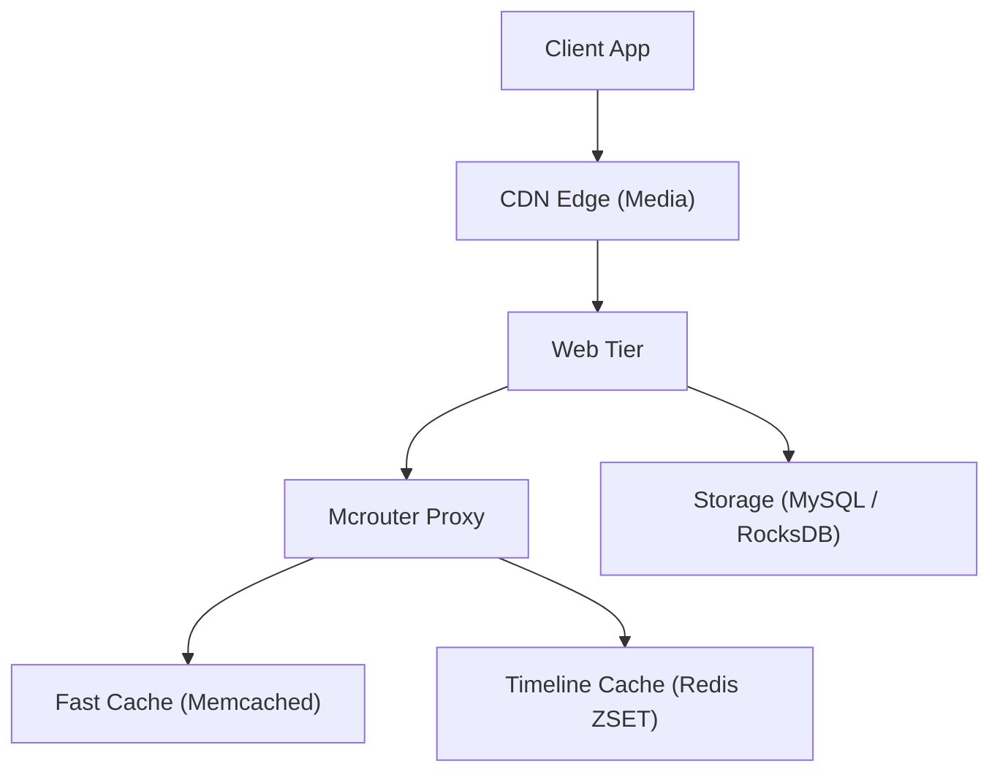

# Case Study: Multi-Tier Caching at Twitter & Meta Scale

## 🏢 Context: Billions of Cache Requests per Second

Both Meta (Facebook) and Twitter handle billions of timeline reads every hour. At this scale, 99.9% of user timeline reads must be served from cache; direct database reads would cause instant catastrophic outage.

---

## 🛠 Engineering Innovations

### 1. Meta's Mcrouter: Scaling Memcached to Millions of QPS
- **The Problem**: Opening individual TCP connections from tens of thousands of web servers to thousands of Memcached nodes caused connection starvation and memory exhaustion.
- **The Solution**: Meta engineered **Mcrouter**, an open-source Layer 7 protocol router for Memcached. Mcrouter handles:
  - Connection pooling and request pipelining.
  - Prefix routing and consistent hashing.
  - Replication across multiple geographic clusters to withstand server failures.

### 2. Twitter Timeline Caching in Redis Sorted Sets
- **Structure**: Twitter represents each user's home timeline as a **Redis Sorted Set (`ZSET`)**, where:
  - Key: `timeline:user_id`
  - Score: Tweet Snowflake ID / Creation Timestamp
  - Member: `tweet_id`
- **Read Flow**: When a user opens Twitter, the app queries `ZREVRANGEBYSCORE timeline:user_id +inf -inf LIMIT 0 20`, returning the top 20 tweet IDs in `< 2ms`.
- **Hydration**: The web tier hydrates the 20 tweet IDs with text and author metadata via a batch `MGET` against a Memcached cluster.

### 3. Mitigating the Celebrity Hotkey Problem
- When a user with 100M followers tweets, a naive write-fanout would push 100M cache updates, choking the Redis cluster.
- Twitter uses a **Hybrid Fan-out Approach**:
  - Regular users: **Fan-out on Write** (pushed to followers' timeline caches).
  - Celebrities / VIPs: **Fan-out on Read** (tweets are fetched dynamically at read time and merged in memory with the timeline cache).

---

## 📊 Summary of Performance Gains

| Architecture Layer | Direct DB Architecture | Multi-Tier Caching Architecture |
|---|---|---|
| **Timeline Read Latency** | 80ms – 250ms (Disk I/O & complex SQL JOINs) | **< 3ms** (Redis In-Memory `ZREVRANGE`) |
| **Cache Hit Ratio** | N/A | **99.4%** across global cluster |
| **DB Load Reduction** | 100% of read traffic hits DB | DB receives < 1% of read traffic |
