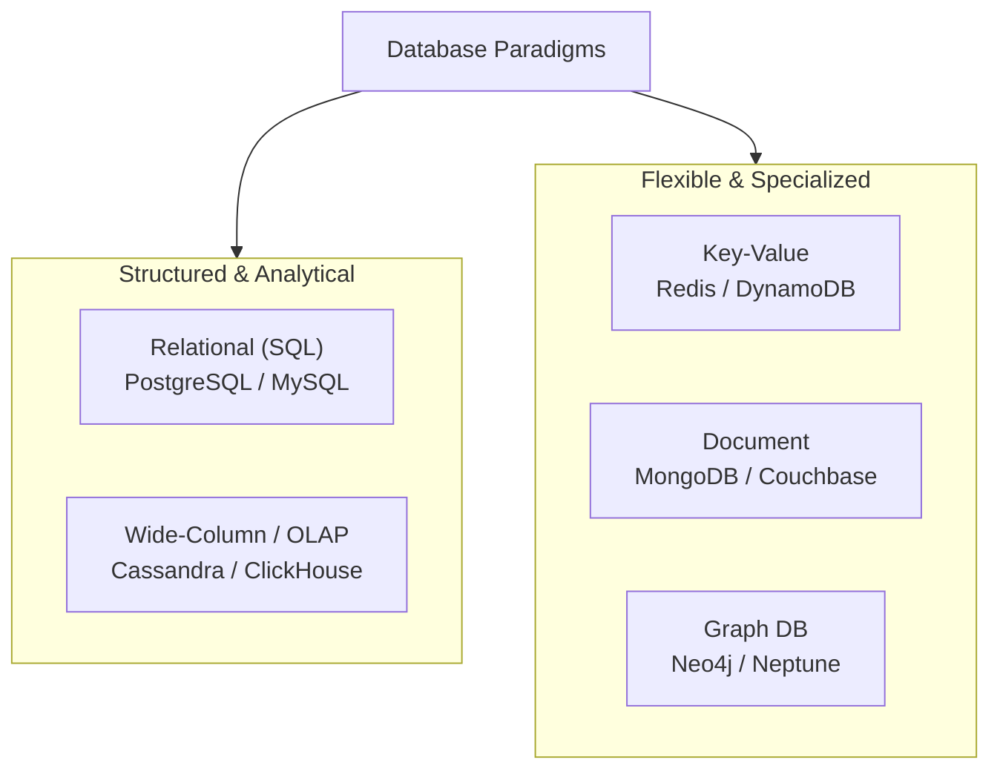
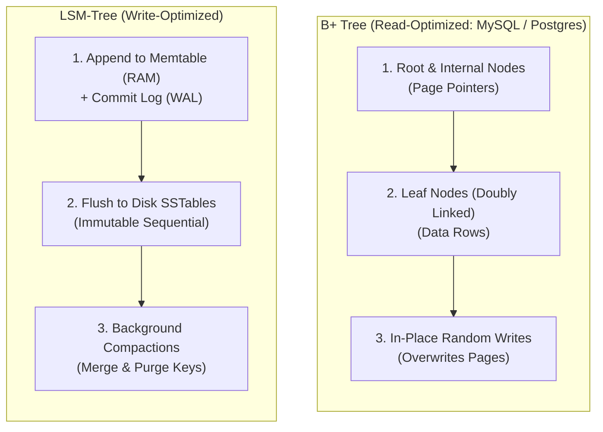
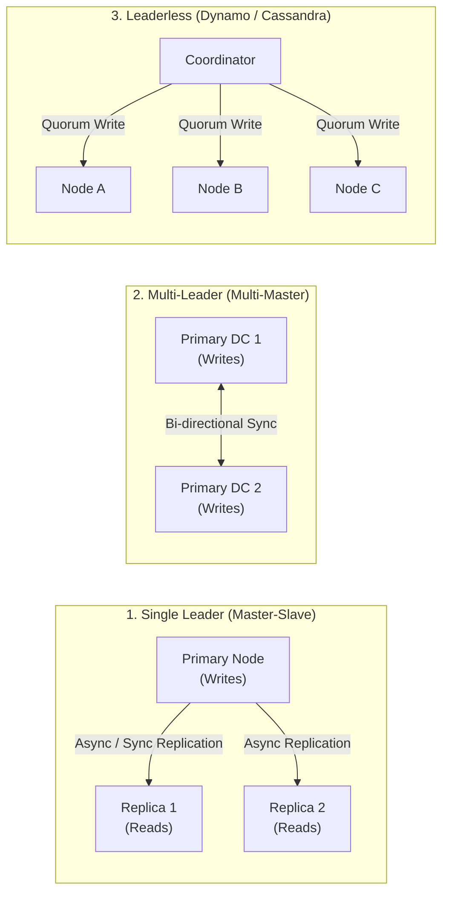
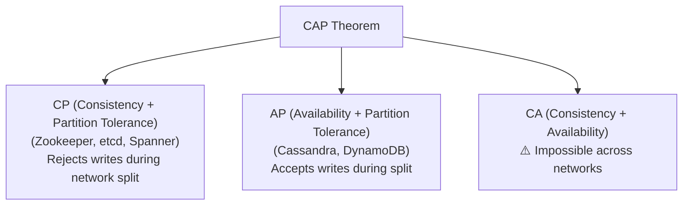

# 06 — Databases & Storage

## 🗄️ 1. SQL vs NoSQL: The Complete Decision Matrix

| Dimension | Relational (SQL) | Document / Key-Value (NoSQL) | Wide-Column (NoSQL) |
|---|---|---|---|
| **Schema** | Rigid, predefined tabular schema | Dynamic, flexible JSON/schema-less | Wide-column families with row keys |
| **Transactions** | Strict **ACID** (Multi-row/Multi-table) | Single-document ACID / Eventual consistency | Tunable consistency (Row-level atomicity) |
| **Scaling** | Vertical scale-up; Sharding requires custom logic | Native horizontal scaling out-of-the-box | Massive horizontal write scale across rings |
| **Query Flexibility**| Complex JOINs, Aggregations, Subqueries | Key lookups, filtered indexes | Queries restricted by partition key structure |
| **Ideal For** | Financial ledgers, ERP, E-commerce checkouts | User profiles, catalogs, dynamic configurations | Metrics, chat logs, time-series, IoT telemetry |

---

## 🌲 2. Storage Engines & Indexing: B+ Trees vs LSM-Trees

Understanding how storage engines write to disk is the secret to answering database scale questions.

| Dimension | B+ Tree (RDBMS) | LSM-Tree (Log-Structured Merge Tree) |
|---|---|---|
| **Write Path** | Random I/O (updates disk pages in place) | **Sequential I/O** (appends to Memtable + WAL) |
| **Write Amplification**| High (modifying 1 byte rewrites whole 16KB page) | Moderate (deferred to background compaction) |
| **Read Path** | Directly traverses balanced tree index to page | Checks Memtable $\rightarrow$ Bloom Filters $\rightarrow$ SSTables |
| **Read Amplification** | Very Low (single page fetch) | Higher (may check multiple SSTable files on disk) |
| **Best Workload** | Read-heavy workloads, transactional systems | Write-heavy workloads, append-only logs, event streaming |

---

## 🔄 3. Database Replication Models

---

## ⚖️ 4. CAP Theorem vs PACELC Theorem

### The CAP Theorem
In a distributed asynchronous network, when a **Network Partition (P)** occurs, a system must trade off between **Consistency (C)** and **Availability (A)**:

### The PACELC Theorem (The Modern Extension)
CAP only considers what happens during network partitions. PACELC explains behavior during normal operations:

$$\text{If } \mathbf{P} \text{ (Partition) } \rightarrow \mathbf{A} \text{ vs } \mathbf{C}, \quad \mathbf{E} \text{ (Else) } \rightarrow \mathbf{L} \text{ (Latency) } \text{ vs } \mathbf{C} \text{ (Consistency)}$$

- **PC/EC** (e.g. Spanner, Postgres): Consistent during partitions; chooses Consistency over Latency normally.
- **PA/EL** (e.g. DynamoDB, Cassandra with low consistency): Available during partitions; chooses Low Latency over Strong Consistency normally.

---

## 🏛️ 5. ACID vs BASE Transactions

| ACID (Traditional SQL) | BASE (Distributed NoSQL) |
|---|---|
| **Atomicity**: All or nothing transaction execution | **Basically Available**: System guarantees availability |
| **Consistency**: Enforces schema constraints & invariants | **Soft State**: State may change over time without inputs |
| **Isolation**: Concurrent transactions do not interfere | **Eventual Consistency**: Given time, all nodes converge |
| **Durability**: Committed data persists across power loss | Focuses on speed and partition tolerance over immediate sync |
