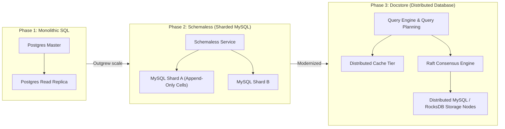

# Case Study: Database Evolution at Uber (From Postgres to Schemaless to Docstore) & Amazon Dynamo

## 🏢 Context: Scaling Beyond Single Database Limits

In its early days, Uber ran entirely on a single monolithic PostgreSQL database. As trip volumes exploded to millions of concurrent rides across hundreds of cities, database connection exhaustion, table lock contention, and replication lag threatened global availability.

---

## 🛠 Engineering Decisions & Takeaways

### 1. Uber's Phase 2: Schemaless (Append-Only Key-Value on MySQL)
- **The Insight**: Uber needed linear horizontal write scalability without complex schema migrations.
- **The Design**: Rather than updating database rows in place (which causes lock contention and row fragmentation), Uber engineered **Schemaless**, an append-only data model on top of sharded MySQL nodes:
  - Every trip modification is written as a new immutable version cell (Row Key + Column Name + Timestamp Ref).
  - Secondary indexes are maintained asynchronously in background worker queues.

### 2. Uber's Phase 3: Docstore (Modern Multi-Model DB)
- Uber consolidated Schemaless, Cassandra, and Postgres clusters into **Docstore**:
  - Provides strict ACID transactions per partition key.
  - Integrates caching directly into the database engine (transparent Redis-like caching layer).
  - Uses Raft consensus for deterministic failover.

### 3. Amazon DynamoDB: Consistent Hashing & Tunable Consistency
- Amazon's famous Dynamo paper solved shopping cart availability during Black Friday:
  - By allowing configurable read consistency (`Strongly Consistent` vs `Eventually Consistent`), DynamoDB enables applications to achieve `< 10ms` single-digit millisecond latency at petabyte scale.

---

## 📊 Summary of Database Architectural Shifts

| Strategy | Monolithic RDBMS | Schemaless / Docstore (Distributed) |
|---|---|---|
| **Scaling Limit** | Bound by vertical CPU & RAM of 1 server | Horizontally scales to thousands of nodes |
| **Schema Migration** | `ALTER TABLE` locks table for hours | Append-only JSON versioning (zero downtime) |
| **Replication Lag** | Unpredictable asynchronous lag | Local Quorum & Raft consensus with SLA guarantees |
