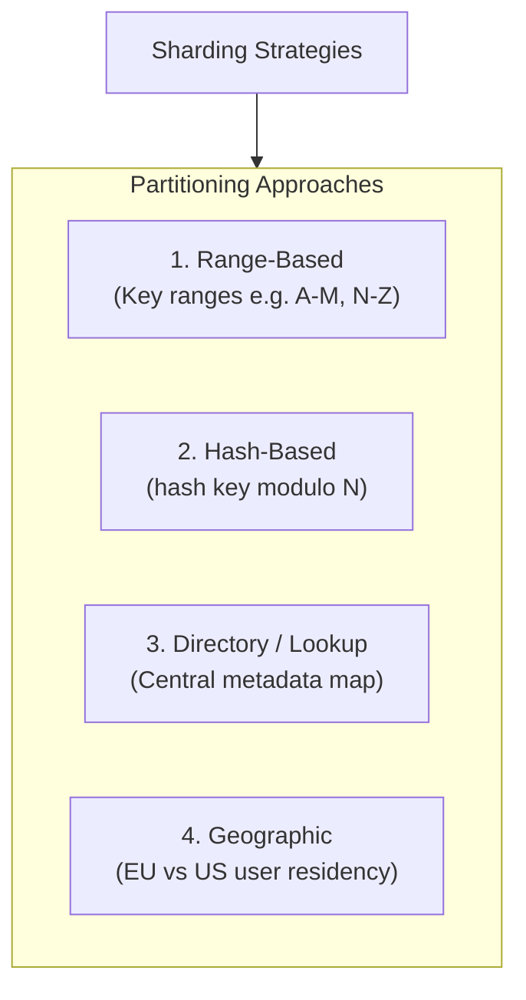
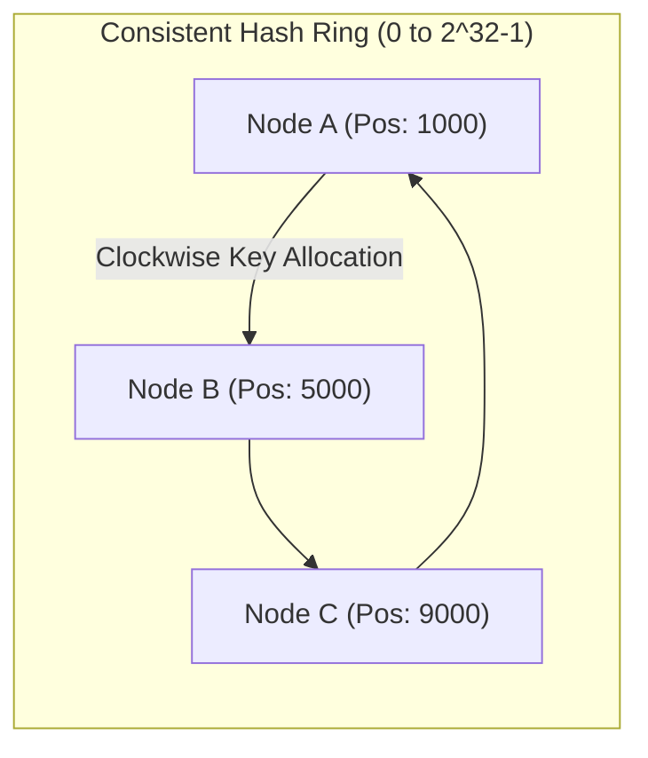
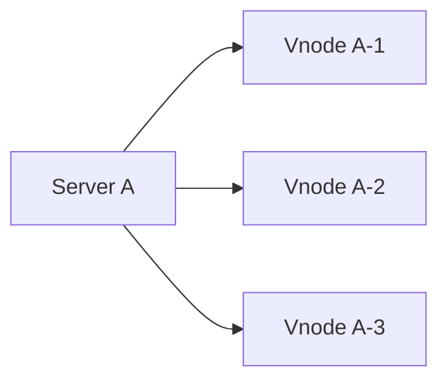
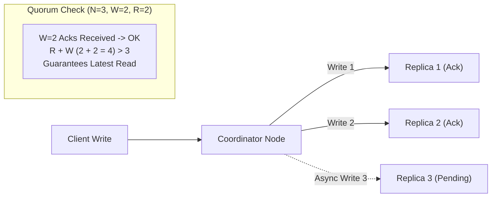
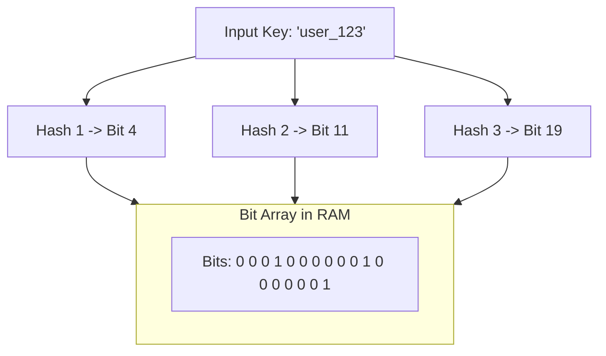

# 07 — Data Partitioning & Consistent Hashing

## 🔪 1. Database Sharding Strategies

When a dataset exceeds the storage or I/O capacity of a single database server, we partition it horizontally into **Shards**.

| Strategy | Pros | Cons | Best Use Case |
|---|---|---|---|
| **Range-Based** | Easy to perform range queries (`BETWEEN '2026-01' AND '2026-06'`) | Massive **hot spotting** (recent dates get 100% writes) | Time-series archival data |
| **Hash-Based** | Uniformly distributes records across all shards | Range queries must query *all* shards (Scatter-Gather) | User profiles, account lookups |
| **Consistent Hashing** | Adding/removing nodes moves only $K/N$ keys | Requires virtual node management | Distributed caches (Redis, Memcached), DynamoDB |

---

## ⭕ 2. Consistent Hashing & Virtual Nodes

### The Problem with Naive Modulo Hashing
If we map keys to $N$ servers using `server_index = hash(key) % N`:
- When 1 server crashes ($N \rightarrow N-1$), almost **100% of keys remap to new servers**.
- In a cache cluster, this triggers a catastrophic **Cache Avalanche**, crashing the database origin.

### Consistent Hashing Ring Solution
Consistent Hashing maps both **Servers** and **Keys** onto a circular 32-bit hash ring ($0 \text{ to } 2^{32}-1$):

- **Lookup**: To find which node owns `Key_X`, compute `hash(Key_X)` and traverse **clockwise** until encountering the first server node.
- **Node Addition / Removal**: If Node B fails, only keys between Node A and Node B are re-assigned to Node C. All other keys remain unaffected! Only $K/N$ keys move.

### Virtual Nodes (Vnodes) for Even Load Balancing
If physical servers are placed unevenly on the ring, one server might handle 70% of the data (non-uniform distribution).

- Each physical server is assigned **100–300 virtual nodes** across the ring.
- Guarantees uniform key distribution and allows heterogeneous servers (a server with 2x RAM gets 2x virtual nodes).

---

## 🗳️ 3. Quorum Consensus ($N, R, W$)

In leaderless distributed databases (Cassandra, DynamoDB), consistency is configured per query using Quorum parameters:

- **$N$**: Replication Factor (Total copies of data across the cluster, e.g., $N = 3$).
- **$W$**: Write Quorum (Number of replicas that must acknowledge a write before returning success).
- **$R$**: Read Quorum (Number of replicas that must respond to a read query before returning data).

$$\mathbf{R + W > N} \implies \text{\textbf{Strong Consistency Guarantee}}$$

---

## 🌸 4. Bloom Filters: Probabilistic Fast Lookups

A **Bloom Filter** is an ultra-compact, bit-array probabilistic data structure used to test whether an element is a member of a set.

### The Invariable Guarantees of Bloom Filters:
- **If Bloom Filter returns FALSE**: The item is **definitely NOT in the dataset** (100% guarantee $\rightarrow$ Zero False Negatives). Bypasses expensive disk I/O!
- **If Bloom Filter returns TRUE**: The item is **PROBABLY in the dataset** (Possible False Positive due to hash collisions $\rightarrow$ Query disk SSTable to verify).

### Top HLD Use Cases:
1. **LSM-Tree DBs (Cassandra / RocksDB)**: Skips reading disk SSTables if key is not present.
2. **Web Crawlers**: Avoids re-crawling billions of URLs without storing all URL strings in RAM.
3. **CDN / Cache Shielding**: Prevents cache penetration attacks by blocking non-existent keys.
