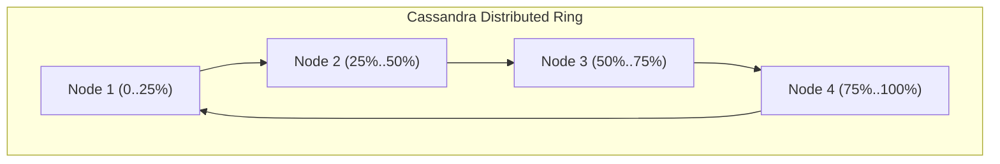

# Case Study: Apache Cassandra & Amazon Dynamo Partition Management

## 🏢 Context: Linearly Scalable Masterless Architecture

Traditional master-slave databases collapse under write-intensive petabyte workloads because all writes bottleneck at the single master node. Apache Cassandra and Amazon Dynamo eliminate this bottleneck by implementing a **decentralized masterless ring topology**.

---

## 🛠 Architectural Mechanics

### 1. Murmur3 Partitioner & Token Ranges
- Cassandra hashes every row’s **Partition Key** using the 64-bit `Murmur3Partitioner`, generating a token between $-2^{63}$ and $2^{63}-1$.
- Each physical node is assigned multiple token ranges (Virtual Nodes / Vnodes, default 128 per node).
- Any node in the cluster can act as the **Coordinator Node** for any query; it hashes the key, determines the target replica nodes on the ring, and forwards the read/write request.

### 2. Tunable Consistency in Production
Companies tune Quorum levels based on business risk:
- **Financial Balances / Inventory**: `LOCAL_QUORUM` on reads and writes ($R + W > N$) $\rightarrow$ Guaranteed strong consistency within the local datacenter.
- **Metrics / Logging / Activity Feeds**: Write with `ONE`, Read with `ONE` $\rightarrow$ Sub-millisecond latency, eventual consistency.

### 3. Read Repair & Anti-Entropy (Merkle Trees)
- When a coordinator node queries $R=2$ replicas and notices a hash mismatch, it returns the newest timestamp to the client and asynchronously issues a **Read Repair** background write to fix the stale node.
- In the background, nodes exchange **Merkle Trees** (binary cryptographic hash trees) during scheduled repairs to detect out-of-sync ranges without streaming raw data over the network.

---

## 📊 Summary of Ring Topology Advantages

| Feature | Master-Slave Architecture | Cassandra / Dynamo Ring Architecture |
|---|---|---|
| **Write Bottleneck** | Single Master limits maximum write QPS | Any node accepts writes (Linear horizontal scaling) |
| **Node Addition** | Complex resharding & data migration | Smooth re-balancing across ring via Vnodes |
| **Single Point of Failure** | Master crash requires failover elections | Zero SPOF (completely symmetric nodes) |
