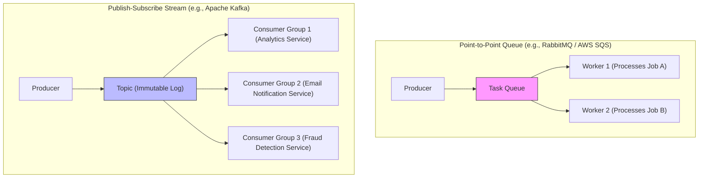
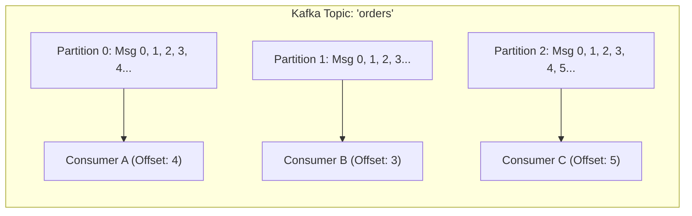
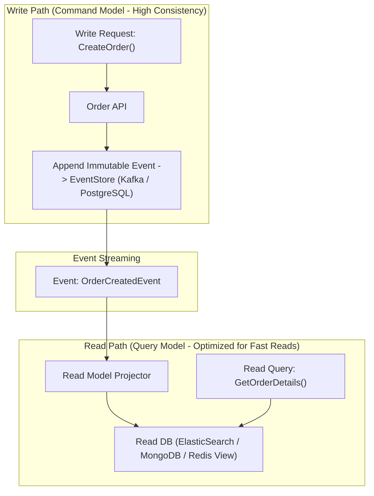
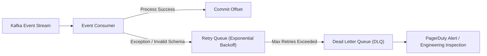

# 08 — Messaging & Event-Driven Systems

## 📬 1. Messaging Paradigms: Pub-Sub vs Point-to-Point Message Queues

| Dimension | Point-to-Point Queue (RabbitMQ / SQS) | Distributed Log Stream (Apache Kafka) |
|---|---|---|
| **Data Retention** | Message is **deleted** once acknowledged by 1 worker | Messages persist on disk for retention window (e.g., 7 days) |
| **Consumer Scaling** | Competing consumers on single queue | Parallel partitions assigned to consumer group members |
| **Replayability** | ❌ Cannot replay processed messages | ✅ Reset offset to replay past events from any timestamp |
| **Ordering** | FIFO within queue (breaks with multiple competing consumers) | **Strict FIFO ordering per partition key** |
| **Throughput** | 10k – 50k messages/sec | **Millions of messages/sec (Zero-Copy OS page cache)** |
| **Best For** | Task queues, async background jobs, complex routing | Event streaming, activity feeds, metrics, CDC (Change Data Capture) |

---

## ⚡ 2. Apache Kafka Internals & High-Throughput Secrets

Why can Apache Kafka process millions of events per second on standard commodity hardware?

### Kafka's 4 Performance Pillars:
1. **Sequential Disk I/O**: Kafka appends records to immutable commit log segments on disk. Sequential disk writes are as fast as sequential RAM writes ($\sim 600 \text{ MB/s}$ on modern NVMe SSDs).
2. **Page Cache Architecture**: Relies heavily on the Linux OS kernel page cache instead of JVM heap memory, avoiding Java Garbage Collection (GC) pauses.
3. **Zero-Copy Optimization (`sendfile` syscall)**: Data transfers directly from OS Page Cache to the Network Socket buffer via DMA (Direct Memory Access), bypassing CPU user-space context switches.
4. **Batching & Compression**: Producers batch multiple messages and compress them (LZ4, Zstandard, Snappy) before transmitting over TCP.

---

## 🏗️ 3. Event Sourcing & CQRS (Command Query Responsibility Segregation)

- **Event Sourcing**: Instead of storing current state (`balance = $500`), we store the append-only sequence of immutable events (`Deposited $1000`, `Withdrew $500`). Current state is computed by replaying events.
- **CQRS**: Separates the **Write Model** (optimized for ACID transactions and event validation) from the **Read Model** (denormalized views in Elasticsearch/Redis optimized for sub-10ms UI queries).

---

## 🛡️ 4. Handling Failures: Poison Pills, DLQs & Idempotency

- **Dead Letter Queue (DLQ)**: When a "poison pill" message repeatedly fails processing, it is redirected to a DLQ to unblock the partition while preserving the message for debugging.
- **Idempotent Consumers**: Always use an **Idempotency Key** (`order_id`, `event_id`) checked against a Redis/DB uniqueness table to ensure duplicate event deliveries do not duplicate actions.
