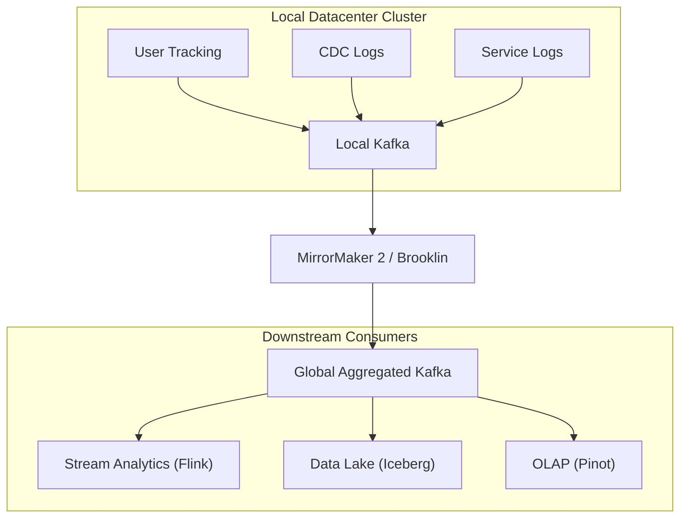

# Case Study: Trillions of Messages at LinkedIn & Uber (Kafka Event Streaming)

## 🏢 Context: The Birth and Scale of Apache Kafka

LinkedIn initially connected services with point-to-point batch ETL pipelines. As the number of microservices and data sinks (Hadoop, Elasticsearch, Oracle, In-memory caches) grew, the architecture degenerated into an unmaintainable $N \times M$ mesh of fragile integrations.

---

## 🛠 Architectural Solutions & Takeaways

### 1. Unified Real-Time Publish-Subscribe Backbone
- LinkedIn created **Apache Kafka** to serve as a single universal event pipeline.
- Every database change, user click, connection request, and system metric is published to a partitioned Kafka topic.
- Downstream consumer services independently consume streams at their own processing speed without affecting producer services.

### 2. Change Data Capture (CDC) with Debezium
- Rather than having application code write to both a database and a search engine (which causes dual-write race conditions and data divergence), databases emit **Write-Ahead Logs (WAL)**.
- Kafka Connect / Debezium streams these DB transaction logs into Kafka, which updates Elasticsearch and caches with zero data loss.

### 3. Uber's Kafka Multi-Cluster Fabric: Chaperone & Audit Loss Prevention
- Uber runs hundreds of thousands of Kafka partitions.
- To guarantee **Zero Data Loss** in real-time ride tracking and financial billing, Uber built **Chaperone**, an audit system that counts and timestamps messages in 10-minute buckets across every producer, broker, and consumer stage to guarantee complete end-to-end delivery.

---

## 📊 Summary of Impact

| Metric | Point-to-Point Architecture | Kafka Event-Driven Architecture |
|---|---|---|
| **Pipeline Complexity** | $O(N \times M)$ fragile custom connectors | $O(N + M)$ standardized streaming topics |
| **System Decoupling** | Downstream failure cascades to upstream | Upstream buffers safely into Kafka with zero backpressure on users |
| **Data Latency** | Hourly / Daily batch ETL jobs | Sub-second real-time stream processing |
