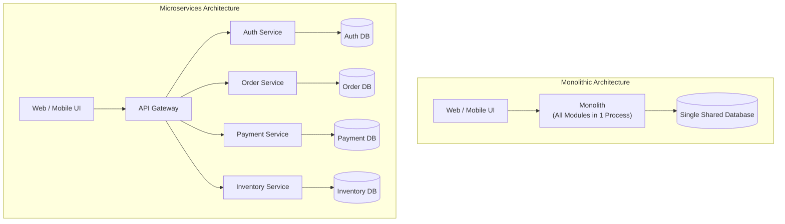
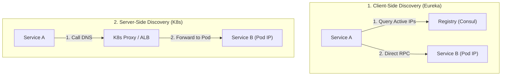
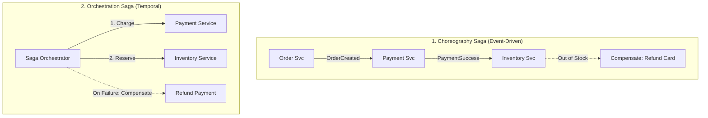

# 09 — Microservices & API Design

## 🏛️ 1. Monolith vs Microservices: Architectural Evolution



| Dimension | Monolithic Architecture | Microservices Architecture |
|---|---|---|
| **Deployment** | Single unit deployment (all-or-nothing) | Independent deployment per service |
| **Database** | Shared database (risk of coupling queries) | **Database-per-Service** (strict encapsulation) |
| **Tech Stack** | Homogeneous (one language/framework) | Heterogeneous (polyglot: Go for high QPS, Python for AI, Java for billing) |
| **Blast Radius** | High (a memory leak in one module crashes whole app) | Low (isolated failure domain with circuit breakers) |
| **Operational Overhead**| Low (simple local debugging & logging) | High (requires distributed tracing, CI/CD pipelines, K8s orchestration) |

---

## 🔍 2. Service Discovery: Client-Side vs Server-Side

In dynamic cloud environments (Kubernetes, AWS ECS), service IP addresses change constantly as pods scale and restart.



---

## ⚡ 3. The Circuit Breaker Pattern

Prevents cascading failures across a distributed microservices dependency graph.

```mermaid
stateDiagram-v2
    [*] --> Closed
    Closed --> Open : Failure Rate > 50% Threshold
    note right of Closed : Normal operation: Requests pass through.<br/>Counts successful & failed calls.
    
    Open --> HalfOpen : Sleep Window Elapsed (e.g., 30s)
    note right of Open : Fail-Fast: Immediately rejects calls with fallback response.<br/>Protects downstream service from overload.
    
    HalfOpen --> Closed : Trial Requests Succeed
    HalfOpen --> Open : Any Trial Request Fails
    note right of HalfOpen : Probes downstream with limited trial requests.
```

---

## 🔄 4. Distributed Transactions: 2PC vs The Saga Pattern

When each microservice has its own isolated database, ACID transactions across multiple databases are impossible without distributed coordination.



| Pattern | Two-Phase Commit (2PC) | Choreography Saga | Orchestration Saga |
|---|---|---|---|
| **Coordination** | Centralized Transaction Manager | Decentralized (Kafka events) | Centralized state machine (Temporal) |
| **Consistency** | Strict ACID (Strong consistency) | Eventual Consistency | Eventual Consistency |
| **Blocking / Locking**| 🔴 Heavy database row locks held until commit | 🟢 Zero cross-service locks | 🟢 Zero cross-service locks |
| **Rollback** | Automatic database engine rollback | **Compensating Transactions** (Refund/Cancel) | **Compensating Transactions** (Automated) |
| **Best For** | Banking ledger within same database cluster | Simple 2–3 step asynchronous workflows | Complex 5+ step multi-service business workflows |
