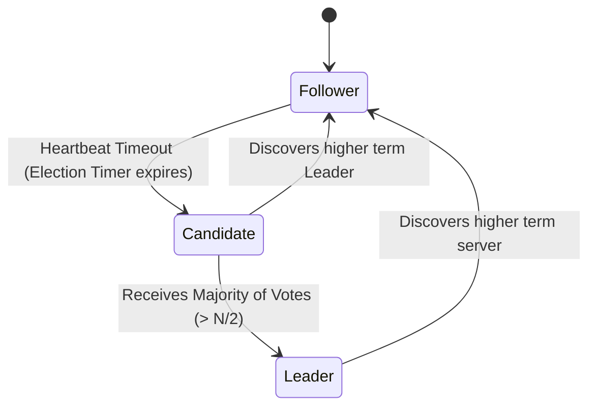
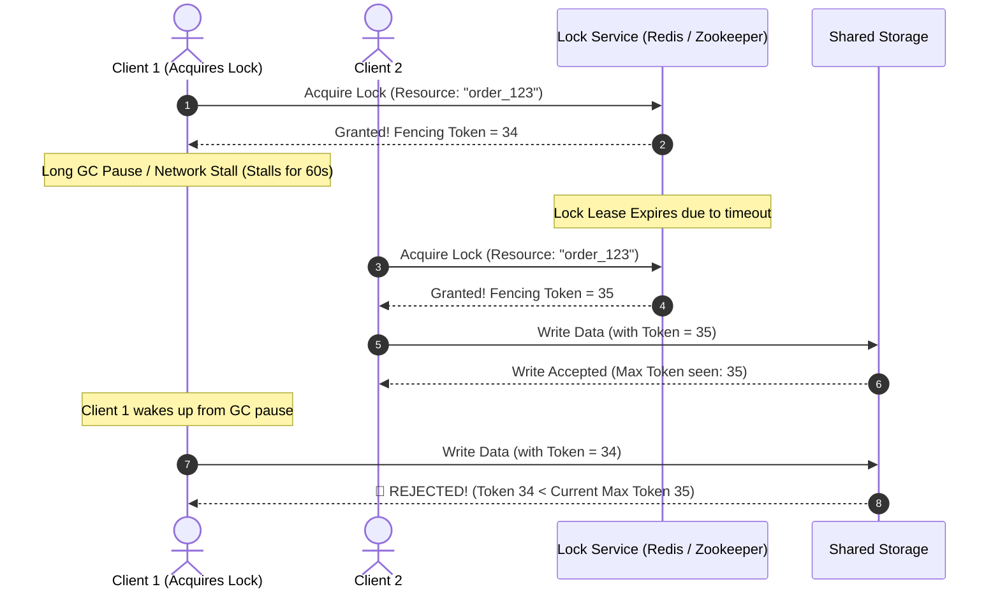
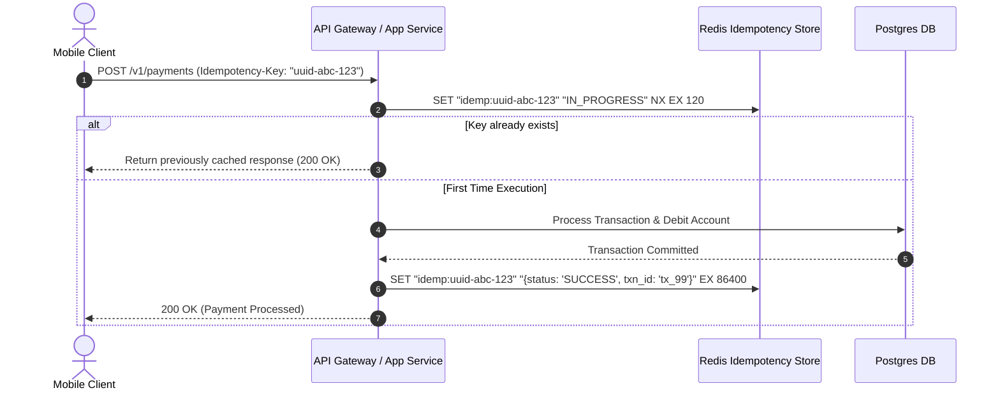
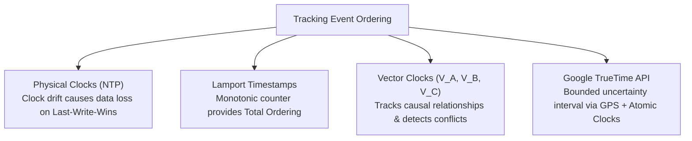

# 10 — Distributed Systems Fundamentals

## 🤝 1. Distributed Consensus: Paxos vs Raft

Distributed Consensus algorithms allow a cluster of independent nodes to agree on a sequence of values or state transitions, even when some nodes crash or network messages are delayed.

### The Raft Algorithm: 3 Core Sub-Problems
1. **Leader Election**: When the leader fails, followers start randomized election timers (150ms–300ms) to prevent split-vote ties, becoming Candidates and requesting votes. A candidate needs a majority ($\lfloor N/2 \rfloor + 1$) to become Leader.
2. **Log Replication**: The Leader accepts client writes, appends them to its log, and broadcasts `AppendEntries` RPCs. Once a majority of followers acknowledge, the entry is committed.
3. **Safety Guarantee**: If a node's log is behind the majority, it can never be elected leader, ensuring committed entries are never overwritten.

---

## 🔒 2. Distributed Locks & The Fencing Token Pattern

When multiple microservices process shared resources (e.g. inventory or payment capture), a distributed lock prevents concurrent race conditions.

### Key Locking Patterns:
- **Redis `SET key value NX PX milliseconds`**: Simple distributed lock with auto-expiry.
- **Redlock Algorithm**: Multi-node Redis lock acquiring locks on $\ge \lfloor N/2 \rfloor + 1$ independent Redis masters.
- **Fencing Tokens**: A monotonically increasing counter returned with every lock grant. The underlying storage rejects any write containing an older token number, preventing stale write corruption after garbage collection pauses.

---

## 🔑 3. Idempotency Keys in Distributed APIs

An operation is **Idempotent** if applying it multiple times yields the exact same outcome as applying it once ($f(f(x)) = f(x)$).

---

## ⏰ 4. Time, Clocks & Causality: Vector Clocks vs TrueTime

In distributed systems, physical clocks across servers drift by milliseconds due to thermal and network variations (NTP is not synchronized enough for global ordering).

| Mechanism | Description | Conflict Handling | Best For |
|---|---|---|---|
| **Last-Write-Wins (LWW)** | Overwrites based on server physical timestamp | 🚨 Silent data loss on clock drift | Cassandra non-critical rows |
| **Vector Clocks** | Array of counters per node $[Node_A: 2, Node_B: 1]$ | Detects branching concurrent writes | Dynamo shopping carts, Riak |
| **Google TrueTime** | Guarantees bounded uncertainty $\epsilon \approx 7\text{ms}$ | Wait out the uncertainty window ($2\epsilon$) | Google Spanner global ACID |
