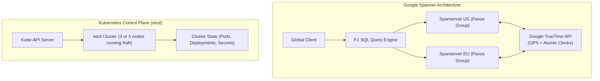

# Case Study: Google Cloud Spanner (TrueTime) & Kubernetes (etcd / Raft)

## 🏢 Context: Solving Globally Distributed Consistency

For decades, the CAP theorem suggested that a globally distributed database could not provide strict external consistency without severe performance degradation. Google broke this paradigm with **Cloud Spanner**, and the cloud-native ecosystem standardized on **etcd (Raft)** for cluster state orchestration.

---

## 🛠 Architectural Solutions

### 1. Google Spanner's TrueTime API
- **The Problem**: If node A in California commits at timestamp $T_1$, and node B in Tokyo reads at timestamp $T_2$, how can the system guarantee that $T_1 < T_2$ without expensive cross-continental locking rounds?
- **The Hardware Solution**: Google installed **GPS receivers and Rubidium atomic clocks** in every data center.
- **The TrueTime Invariant**: TrueTime returns an uncertainty interval $[t.earliest, t.latest]$ where error $\epsilon \le 7\text{ms}$.
- **Commit Wait Rule**: When Spanner writes a transaction, it waits $2\epsilon$ ($\sim 14\text{ms}$) before releasing locks. This mathematical guarantee ensures that any subsequent transaction globally will receive a timestamp strictly greater than the previous one, achieving **External Consistency (Linearizability)** at global scale.

### 2. Kubernetes & etcd: Distributed Coordination via Raft
- Kubernetes relies on **etcd** to maintain the ground truth of all running pods, secrets, and configurations.
- By utilizing the **Raft consensus algorithm**, etcd guarantees that even if 2 out of 5 control plane nodes crash, the remaining 3 nodes elect a new leader in $< 300\text{ms}$ with zero split-brain corruption.

---

## 📊 Comparison: etcd vs Google Spanner

| Dimension | etcd (Kubernetes) | Google Cloud Spanner |
|---|---|---|
| **Consensus Protocol** | Raft | Multi-Paxos + Two-Phase Commit (2PC) |
| **Clock Reliance** | Logical Raft Term Counters | Hardware TrueTime (Atomic Clocks + GPS) |
| **Scale Target** | Tens of thousands of cluster configuration keys | Petabytes of global relational business data |
| **Transaction Scope** | Single key-value / small multi-key transactions | Full ACID SQL transactions across global shards |
